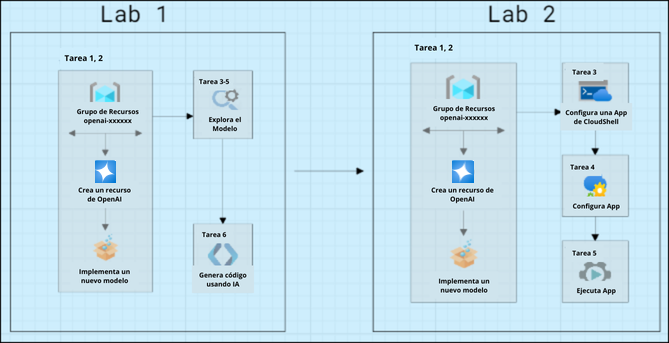
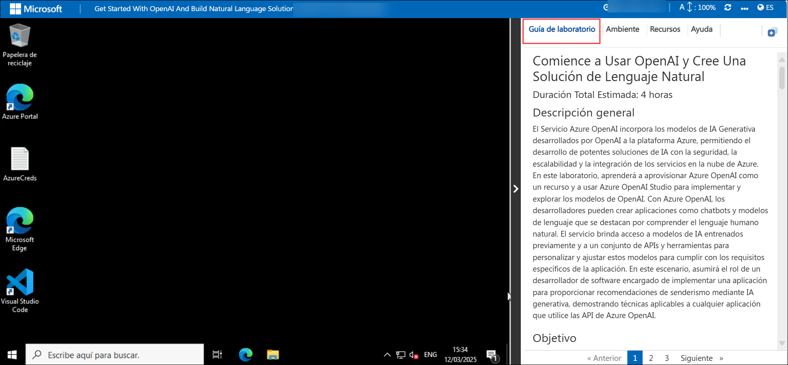
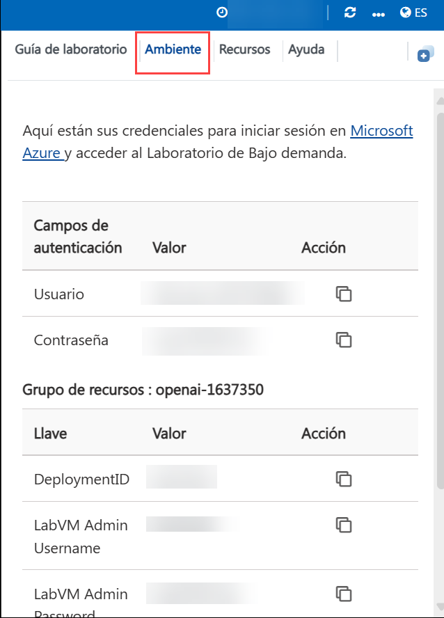
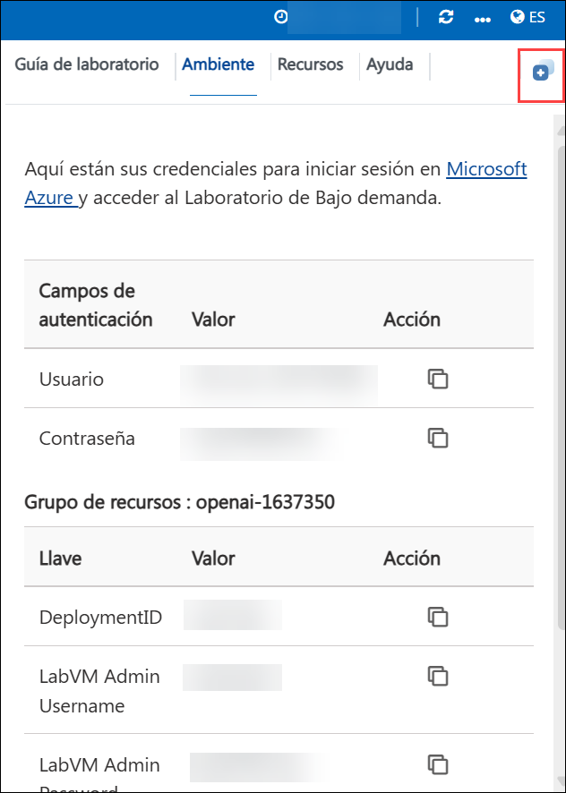
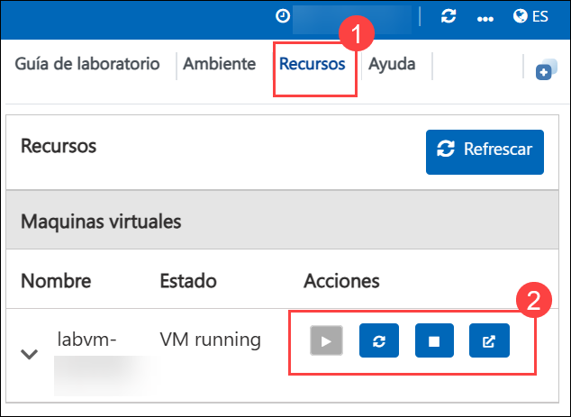

# Comience a Usar OpenAI y Cree Una Solución de Lenguaje Natural

### Duración Total Estimada: 4 horas

## Descripción general

El Servicio Azure OpenAI incorpora los modelos de IA Generativa desarrollados por OpenAI a la plataforma Azure, permitiendo el desarrollo de potentes soluciones de IA con la seguridad, la escalabilidad y la integración de los servicios en la nube de Azure. En este laboratorio, aprenderá a aprovisionar Azure OpenAI como un recurso y a usar Azure OpenAI Studio para implementar y explorar los modelos de OpenAI. Con Azure OpenAI, los desarrolladores pueden crear aplicaciones como chatbots y modelos de lenguaje que se destacan por comprender el lenguaje humano natural. El servicio brinda acceso a modelos de IA entrenados previamente y a un conjunto de APIs y herramientas para personalizar y ajustar estos modelos para cumplir con los requisitos específicos de la aplicación. En este escenario, asumirá el rol de un desarrollador de software encargado de implementar una aplicación para proporcionar recomendaciones de senderismo mediante IA generativa, demostrando técnicas aplicables a cualquier aplicación que utilice las API de Azure OpenAI.

## Objetivo

Al final de este laboratorio, será capaz de:

- **Comenzar a usar el Servicio Azure OpenAI**: Este ejercicio práctico tiene como objetivo aprovisionar un recurso de Azure OpenAI e implementar un modelo. Explore las capacidades del modelo en el área de juegos (Playground) Completions y luego interactúe con él mediante el área de juegos (Playground) Chat. Afine las respuestas mediante el ajuste de los prompts y los parámetros, y aproveche la generación de código para automatizar las tareas.
- **Utilizar los SDKs de Azure OpenAI en su aplicación**: Este ejercicio práctico tiene como objetivo aprovisionar un recurso de Azure OpenAI, implementar un modelo, establecer y configurar una aplicación en Cloud Shell y luego ejecutar la aplicación, demostrando el ciclo de vida completo desde la creación del recurso hasta la implementación y ejecución de la aplicación.

## Requisitos previos

- Familiaridad con el Servicio Azure OpenAI, Azure CLI, y las APIs REST
- Conocimiento básico de los conceptos de IA y machine learning

## Arquitectura

El flujo de arquitectura para esta tarea comienza con el aprovisionamiento de un recurso de Azure OpenAI dentro de su suscripción de Azure y la implementación de un modelo entrenado previamente mediante Azure OpenAI Studio. A continuación, explorará las capacidades del modelo en el área de juegos (Playground) Completions y probará sus capacidades de conversación en el área de juegos (Playground) Chat, experimentando con diferentes prompts y parámetros para personalizar las respuestas. También investigará las capacidades de generación de código del modelo. En la fase de desarrollo de la aplicación, configurará su entorno de aplicación en Azure Cloud Shell, configurará la aplicación para integrarla con el modelo OpenAI implementado y, por último, ejecutará la aplicación para proporcionar recomendaciones de senderismo mediante IA generativa.

## Diagrama de Arquitectura

 

## Explicación de los Componentes

1. **Azure OpenAI**: El Servicio Azure OpenAI proporciona acceso REST API a los potentes modelos de lenguaje de OpenAI y estos modelos se integran con sus datos, permitiendo interacciones personalizadas y seguras.
1. **Modelos de Azure OpenAI**: Ofrece modelos de lenguaje grande personalizables y pre-entrenados para diversas aplicaciones de IA. Estos modelos permiten crear potentes soluciones impulsadas por IA mediante la generación de contenido personalizado y contextualmente relevante basado en prompts bien diseñados.
1. **Azure CloudShell**: Azure CloudShell ofrece una experiencia shell integrada basada en navegador para administrar los recursos de Azure. Proporciona un entorno listo para usar con herramientas preinstaladas y acceso tanto a Bash como a PowerShell.

## Comenzando con el Laboratorio
 
## Accediendo a Su Ambiente de Laboratorio
 
Una vez que esté listo para comenzar, su máquina virtual y la guía de laboratorio estarán al alcance de su mano dentro de su navegador web.
 

### Guía de laboratorio Acercar/alejar

Para ajustar el nivel de zoom de la página del entorno, haga clic en el icono **A↕: 100%** ubicado junto al temporizador en el entorno del laboratorio.

   

### Máquina Virtual & Guía de Laboratorio
 
Su máquina virtual es su caballo de batalla durante todo el taller. La guía de laboratorio es su hoja de ruta hacia el éxito.
 
## Explorando Los Recursos de Su Laboratorio
 
Para obtener una mejor comprensión de sus recursos de laboratorio y credenciales, navegue a la pestaña **Ambiente**.
 

 
## Utilizando la Función de Ventana Dividida
 
Para mayor comodidad, puede abrir la guía de laboratorio en una ventana separada seleccionando el botón **Ventana Dividida** de la esquina superior derecha.
 

 
## Administrando Su Máquina Virtual
 
Siéntase libre de **iniciar, detener o reiniciar (2)** su máquina virtual cuando lo necesite desde la pestaña **Recursos (1)**. ¡Su experiencia está en sus manos!
 

## Comenzando con el Portal de Azure
 
1. En su máquina virtual, haga clic en el icono de Azure Portal como se muestra a continuación:
 
   .png)
 
2. Verá la pestaña **Iniciar sesión en Microsoft Azure**. Aquí, ingrese sus credenciales:
 
   - **Correo electrónico/Nombre de usuario:** <inject key="AzureAdUserEmail"></inject>
 
       
 
3. A continuación, proporcione su contraseña:
 
   - **Contraseña:** <inject key="AzureAdUserPassword"></inject>
 
       
 
4. Si se le solicita que permanezca conectado, puede hacer clic en "No".
 
5. Si aparece una ventana emergente de **Bienvenido a Microsoft Azure**, simplemente haga clic en **Cancelar** para omitir la visita guiada.
 
6. ¡Haga clic en "Siguiente" en la esquina inferior derecha para comenzar su recorrido de laboratorio.
 
     .png)
 
Este laboratorio le brindará las habilidades para implementar y personalizar los modelos de Azure OpenAI, permitiéndole crear aplicaciones de IA avanzadas como chatbots y sistemas de recomendación.

## Contacto de Soporte

El equipo de soporte de CloudLabs está disponible las 24 horas del día, los 7 días de la semana, los 365 días del año, por correo electrónico y chat en vivo para garantizar una asistencia perfecta en cualquier momento. Ofrecemos canales de soporte dedicados y diseñados específicamente para estudiantes e instructores, garantizando que todas sus necesidades se aborden de manera rápida y eficiente.

Contactos de Soporte para Estudiantes:

- Soporte por Correo Electrónico: cloudlabs-support@spektrasystems.com
- Soporte por Chat en Vivo: https://cloudlabs.ai/labs-support

Ahora, haga clic en Siguiente en la esquina inferior derecha para pasar a la página siguiente.

## ¡¡Feliz aprendizaje!!
