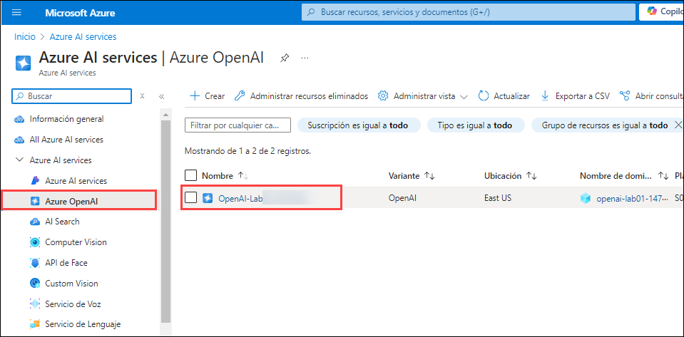
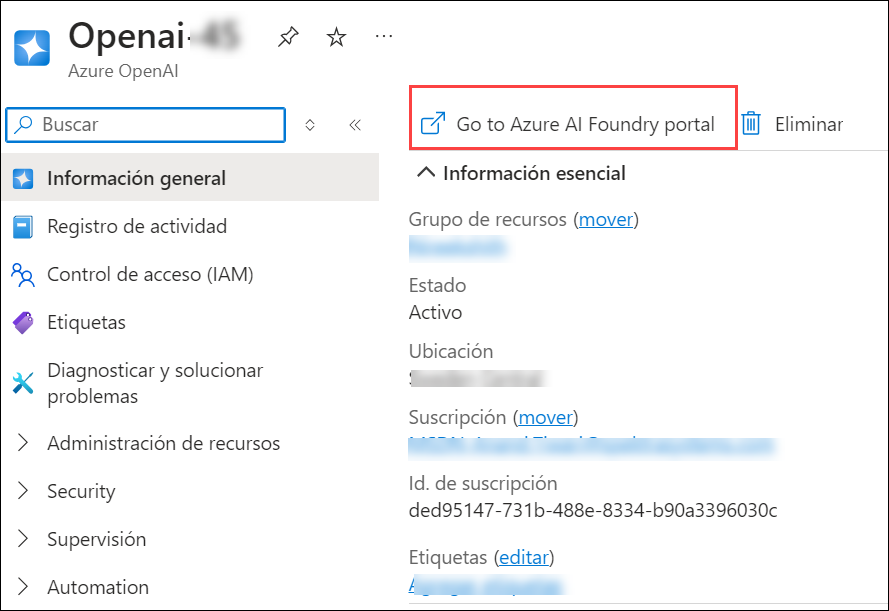
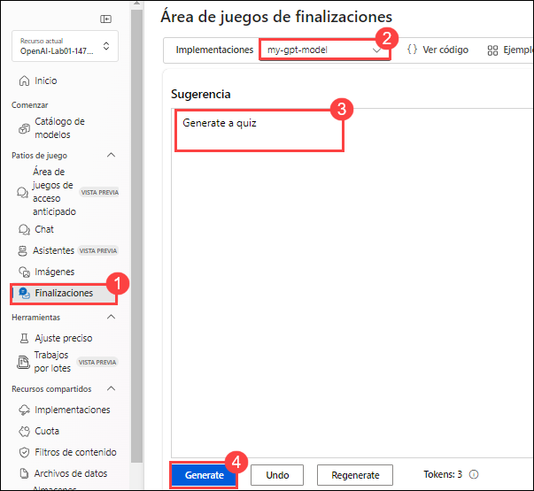
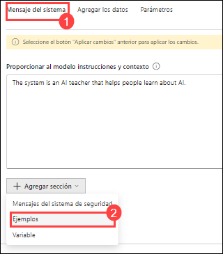
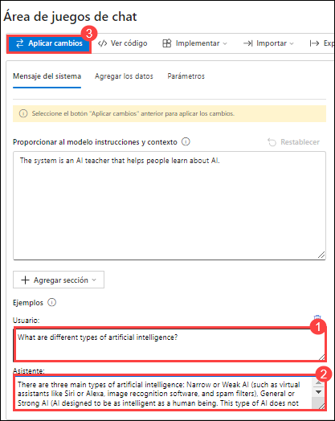
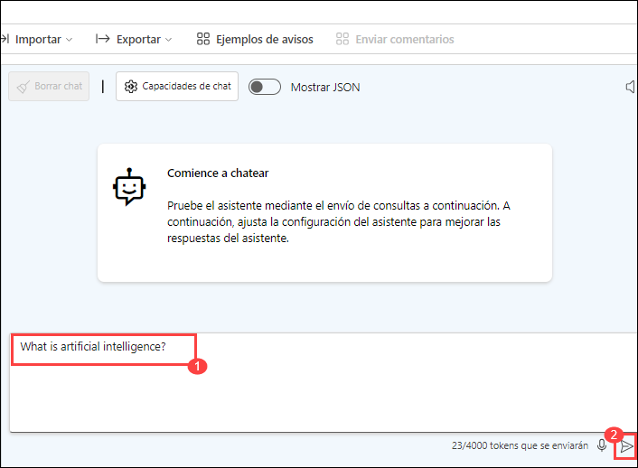
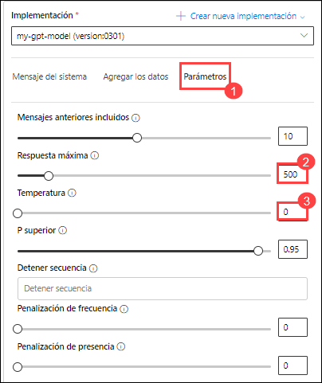
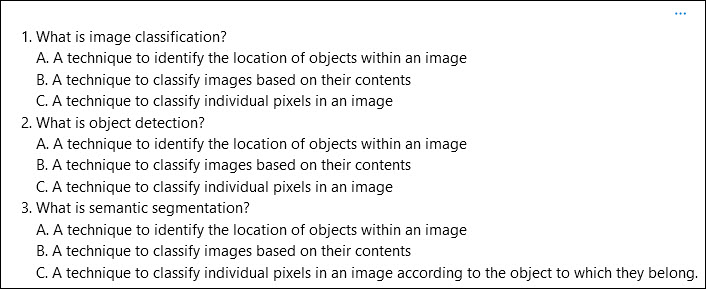
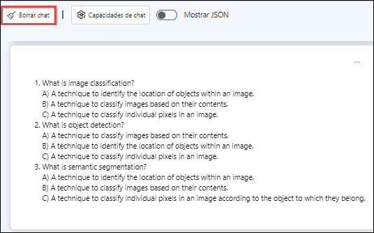

# Laboratorio 01: Comenzar a usar el Servicio Azure OpenAI

### Duración Estimada: 40 minutos

## Escenario del Laboratorio
El Servicio Azure OpenAI incorpora los modelos de IA generativa desarrollados por OpenAI a la plataforma Azure, lo que le permite desarrollar potentes soluciones de IA que se benefician de la seguridad, la escalabilidad y la integración de los servicios que ofrece la plataforma de nube de Azure. En este ejercicio, aprenderá cómo comenzar con Azure OpenAI mediante el aprovisionamiento del servicio como un recurso de Azure y el uso de Azure AI Foundry portal para implementar y explorar los modelos de OpenAI.

## Objetivos del laboratorio
En este laboratorio, completará las siguientes tareas:

- Tarea 1: Aprovisionar un recurso de Azure OpenAI
- Tarea 2: Implementar un modelo
- Tarea 3: Explorar un modelo en el Área de juegos (Playground) Completions
- Tarea 4: Utilizar el Área de juegos Chat
- Tarea 5: Explorar prompts y parámetros 
- Tarea 6: Explorar la generación de código

### Tarea 1: Aprovisionar un recurso de Azure OpenAI

Antes de poder usar modelos de Azure OpenAI, debe aprovisionar un recurso de Azure OpenAI en su suscripción de Azure.

1. En el **Portal de Azure**, busque **OpenAI** y seleccione **Azure OpenAI**.

   

2. En la hoja **Servicios de IA de Azure | Azure OpenAI**, haga clic en **+ Crear**.

   

3. Cree un recurso **Azure OpenAI** con la siguiente configuración:
   
    - **Suscripción**: Predeterminada - Suscripción preasignada.
    - **Grupo de recursos**: openai-<inject key="DeploymentID" enableCopy="false"></inject>
    - **Región**: Seleccione <inject key="Region" enableCopy="false" />
    - **Nombre**: OpenAI-Lab01-<inject key="DeploymentID" enableCopy="false"></inject>
    - **Plan de tarifa**: Standard S0
  
      

4. Haga clic en **Siguiente** tres veces y haga clic en **Crear**.

4. Espere a que se complete la implementación. Luego, vaya al recurso de Azure OpenAI implementado en el Portal de Azure.

#### Validación

> ¡**Felicitaciones** por completar la tarea! Ahora es momento de validarla. Estos son los pasos:
> - Presione el botón Validar para la tarea correspondiente. Si recibe un mensaje de éxito, puede continuar con la siguiente tarea. 
> - De lo contrario, lea atentamente el mensaje de error y vuelva a intentar el paso, siguiendo las instrucciones de la guía de laboratorio.
> - Si necesita ayuda, comuníquese con nosotros a cloudlabs-support@spektrasystems.com. Estamos disponibles las 24 horas del día, los 7 días de la semana para ayudarlo.

   <validation step="1fa0e87b-eb46-463d-b63b-edf6e2282e16" />

### Tarea 2: Implementar un modelo

Azure OpenAI ofrece un portal basado en la web llamado **Azure AI Foundry portal**, que puede usar para implementar, administrar y explorar modelos. Comenzará su exploración de Azure OpenAI usando Azure AI Foundry portal para implementar un modelo.

1. En el **Portal de Azure**, busque **OpenAI** y seleccione **Azure OpenAI**.

   

2. En la hoja **Azure AI Services | Azure OpenAI**, seleccione **OpenAI-Lab01-<inject key="DeploymentID" enableCopy="false"></inject>**

   

3. En el panel de recursos de Azure OpenAI, haga clic en **Go to Azure AI Foundry portal** para navegar a **Azure AI Foundry portal**.

    

5. Haga clic en **Implementaciones (1)** en el panel de navegación izquierdo, haga clic en **+ Implementar modelo (2)** y seleccione **Implementación del modelo base (3)**.

    

6. En la ventana **Seleccionar un modelo**, seleccione **gpt-35-turbo (1)** y haga clic en **Confirmar (2)**.

   

7. Dentro de la interfaz emergente **Implementar modelo**, ingrese los siguientes detalles:
    
    - **Nombre de implementación**: my-gpt-model (1) 
    - **Tipo de implementación**: Standard (2)
    - **Versión de modelo**: 0301(default) (3)
    - **Tokens por límite de velocidad por minuto (miles)**: 10K (4)
    - **Habilitar cuota dinámica**: Habilitado (5)
    - Haga clic en **Implementar** (6)
  
      

8. Esto implementará un modelo con el que podrá experimentar a medida que avanza.

   > **Nota**: Puede ignorar cualquier error relacionado con la asignación de roles para ver los límites de cuota.

   > **Nota**: Azure OpenAI incluye varios modelos, cada uno optimizado para un equilibrio diferente de capacidades y rendimiento. En este ejercicio, usará el modelo **GPT-35-Turbo**, que es un buen modelo general para resumir y generar lenguaje natural y código. Para obtener más información sobre los modelos disponibles en Azure OpenAI, consulte [Modelos](https://learn.microsoft.com/azure/cognitive-services/openai/concepts/models) en la documentación de Azure OpenAI.

#### Validación

   <validation step="3b4a472e-f956-45d8-b828-3e2cc01c2e88" />

> ¡**Felicitaciones** por completar la tarea! Ahora es momento de validarla. Estos son los pasos:
> - Presione el botón Validar para la tarea correspondiente. Si recibe un mensaje de éxito, puede continuar con la siguiente tarea. 
> - De lo contrario, lea atentamente el mensaje de error y vuelva a intentar el paso, siguiendo las instrucciones de la guía de laboratorio.
> - Si necesita ayuda, comuníquese con nosotros a cloudlabs-support@spektrasystems.com. Estamos disponibles las 24 horas del día, los 7 días de la semana para ayudarlo.


### Tarea 3: Explorar un modelo en el Área de juegos (Playground) Completions

Los *Playgrounds* (Patios de juego) son interfaces útiles en Azure AI Foundry portal que puede usar para experimentar con sus modelos implementados sin necesidad de desarrollar su propia aplicación cliente.

1. En Azure AI Foundry portal, en el panel izquierdo, bajo **Patios de juego**, seleccione **Finalizaciones**.

2. En la página Finalizaciones, asegúrese de que su implementación gpt-35-turbo-instruct esté seleccionada, escriba `Generar un cuestionario de 5 preguntas. Para cada pregunta, proporcione las opciones de respuesta y la respuesta correcta` en el mensaje y haga clic en **Generar**.

    

    El ejemplo de texto resumido consta de un *prompt* que proporciona un texto para indicar al modelo qué tipo de respuesta se requiere e incluye información contextual.

4. En la parte inferior de la página, observe la cantidad de *tokens* detectados en el texto. Los tokens son las unidades básicas de un prompt - esencialmente palabras o partes de palabras en el texto.

5. Use el botón **Generar** para enviar el prompt al modelo y obtener una respuesta.

   

    La respuesta consta de un cuestionario basado en el ejemplo del prompt.

    >**Nota**: Puede usar el botón **Regenerar** para volver a enviar el prompt (se han realizado nuevos cambios) y tenga en cuenta que la respuesta puede variar con respecto a la original. Un modelo de IA generativa puede producir un nuevo lenguaje cada vez que es llamado.

7. Use el botón **Ver código** para ver el código que usaría una aplicación cliente para enviar el prompt. Puede seleccionar su lenguaje de programación preferido. El aviso contiene el texto que envió al modelo. La solicitud se envía a la API *Completions* para su servicio Azure OpenAI.

   

   
   

### Tarea 4: Utilizar el Área de juegos Chat

El patio de juegos de *Chat* proporciona una interfaz de chatbot para los modelos GPT 3.5 y superiores. Utiliza la API *ChatCompletions* en lugar de la API *Completions* anterior.

1. En la sección **Patios de juego**, seleccione la página **Chat** y asegúrese de que el modelo **my-gpt-model** esté seleccionado en el panel de configuración.

2. En la sección **Configuración**, en el cuadro **Mensaje del sistema**, reemplace el texto actual con la siguiente oración: `
El sistema es un profesor de IA que ayuda a las personas a aprender sobre la IA.`.

3. Debajo del cuadro Mensaje del sistema, haga clic en + Agregar sección, seleccione ejemplos e ingrese el siguiente mensaje y respuesta en los cuadros designados:

   

    - **Usuario**: `¿Cuáles son los diferentes tipos de inteligencia artificial?`
    
    - **Asistente**: `Hay tres tipos principales de inteligencia artificial: IA estrecha o débil (como asistentes virtuales como Siri o Alexa, software de reconocimiento de imágenes y filtros de spam), IA general o fuerte (IA diseñada para ser tan inteligente como un ser humano. Este tipo de IA no existe actualmente y es puramente teórica), y la Superinteligencia Artificial (IA que es más inteligente que cualquier ser humano y puede realizar tareas que están más allá de la comprensión humana. Este tipo de IA también es puramente teórica y aún no se ha desarrollado) .`

        
  
    > **Nota**: Se utilizan algunos ejemplos para proporcionar al modelo ejemplos de los tipos de respuestas que se esperan. El modelo intentará reflejar el tono y el estilo de los ejemplos en sus propias respuestas.
  
5. Haga clic en **Guardar** y luego en **Continuar** en la pestaña emergente **Actualizar mensaje del sistema** para iniciar una nueva sesión y configurar el contexto de comportamiento del sistema de chat.

6. En el cuadro de consulta en la parte inferior de la página, ingrese el texto `What is artificial intelligence?`

    

8. Use el botón **Enviar** para enviar el mensaje y ver la respuesta.

    > **Nota**: Es posible que reciba una respuesta que indique que la implementación de la API aún no está lista. Si es así, espere unos minutos e intente nuevamente.

9. Revise la respuesta y luego envíe el siguiente mensaje para continuar la conversación: `How is it related to machine learning?`

10. Revise la respuesta y observe que se conserva el contexto de la interacción anterior (para que el modelo comprenda que "it" se refiere a la inteligencia artificial).

11. Use el botón **Ver código** para ver el código de la interacción. El mensaje consta del mensaje del *sistema*, los pocos ejemplos de mensajes del *usuario* y del *asistente*, y la secuencia de mensajes del *usuario* y del *asistente* en la sesión de chat hasta el momento.

### Tarea 5: Explorar prompts y parámetros 

Puede utilizar el mensaje y los parámetros para maximizar la probabilidad de generar la respuesta que necesita.

1. En el panel **Configuración**, seleccione **Parámetro** y configure los siguientes valores de parámetro:
    - **Temperatura**: 0
    - **Longitud máxima (tokens)**: 500

     
   
3. Envíe el siguiente mensaje en la sesión de chat

    ```
   Escribe tres preguntas de opción múltiple basadas en el siguiente texto.

   La mayoría de las soluciones de visión por computadora se basan en modelos de aprendizaje automático que se pueden aplicar a la información visual de cámaras, videos o imágenes.*
   
   - La clasificación de imágenes implica entrenar un modelo de aprendizaje automático para clasificar imágenes en función de su contenido. Por ejemplo, en una solución de monitoreo de tráfico, podría usar un modelo de clasificación de imágenes para clasificar imágenes según el tipo de vehículo que contienen, como taxis, autobuses, ciclistas, etc.*
   
   - Los modelos de aprendizaje automático de detección de objetos están entrenados para clasificar objetos individuales dentro de una imagen e identificar su ubicación con un cuadro delimitador. Por ejemplo, una solución de monitoreo de tráfico podría utilizar la detección de objetos para identificar la ubicación de diferentes clases de vehículos.*
   
   - La segmentación semántica es una técnica avanzada de aprendizaje automático en la que los píxeles individuales de la imagen se clasifican según el objeto al que pertenecen. Por ejemplo, una solución de monitoreo de tráfico podría superponer imágenes de tráfico con capas de "máscara" para resaltar diferentes vehículos usando colores específicos.
    ```

    

4. Revise los resultados, los cuales deben consistir de preguntas de opción múltiple que un maestro podría usar para evaluar a los estudiantes sobre los temas de visión artificial en el prompt. La respuesta total debe ser menor que la longitud máxima que especificó como parámetro.

    Observe lo siguiente sobre el prompt y los parámetros que utilizó:

    - El prompt indica específicamente que el resultado deseado debe ser tres preguntas de opción múltiple.
    
    - Los parámetros incluyen *Temperatura*, que controla el grado en el que la generación de respuestas incluye un elemento de aleatoriedad. El valor **0** utilizado en su envío minimiza la aleatoriedad, lo que da como resultado respuestas estables y predecibles.

### Tarea 6: Explorar la generación de código

Además de generar respuestas en lenguaje natural, puede utilizar modelos GPT para generar código.

1. En el panel **Configuración**, seleccione la plantilla **Ejemplo vacío** y luego haga clic en **Continuar** en la pestaña emergente **Actualizar mensaje de sistema** para restablecer el mensaje del sistema.

2. Ingrese el mensaje del sistema: `Eres un desarrollador de Python.` y haga clic en **Aplicar cambios** y luego haga clic en **Continuar** en la pestaña emergente **Actualizar mensaje de sistema**.

3. En el panel **Sesión de chat**, seleccione **Borrar chat** y luego haga clic en **Borrar** en la pestaña Borrar chat para borrar el historial de chat e iniciar una nueva sesión.

   

2. Envíe el siguiente mensaje de usuario:

    ```
    Write a Python function named Multiply that multiplies two numeric parameters.
    ```

5. Revise la respuesta, que debe incluir un código de Python de ejemplo que cumple con el requisito en el prompt.

   

## Resumen

En este laboratorio, ha logrado lo siguiente:
-   Aprovisionar un recurso de Azure OpenAI
-   Implementar un modelo de Azure OpenAI dentro de Azure AI Foundry portal
-   Usar el área de juegos de chat para utilizar las funcionalidades de prompts, parámetros y generación de código

### Ha completado con éxito el laboratorio
