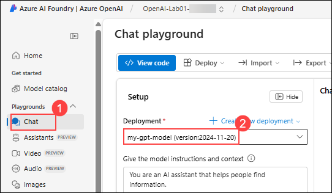
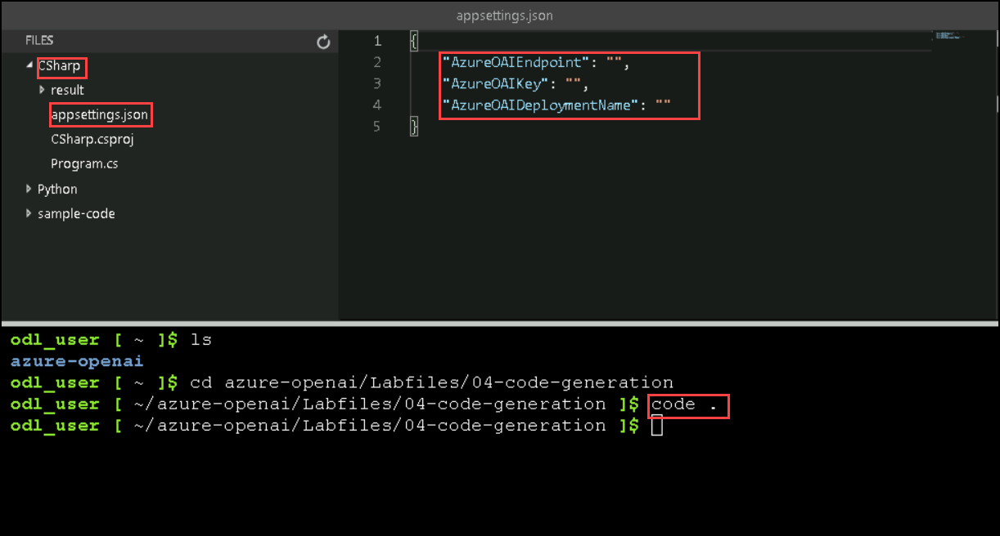
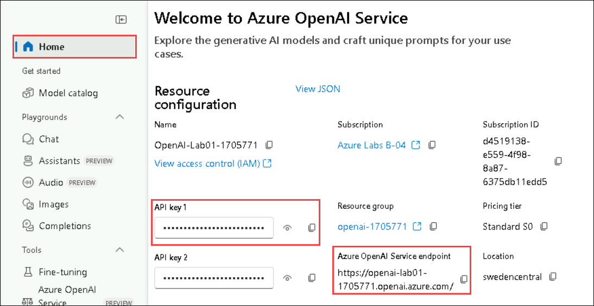

# Lab 04: Generate and improve code with Azure OpenAI Service

## Estimated Duration: 60 minutes

## Lab scenario
The Azure OpenAI Service models can generate code for you using natural language prompts, fixing bugs in completed code, and providing code comments. These models can also explain and simplify existing code to help you understand what it does and how to improve it.

## Lab objectives
In this lab, you will complete the following tasks:

- Task 1: Generate code in chat playground
- Task 2: Set up an application in Cloud Shell
- Task 3: Configure your application
- Task 4: Run your application

### Task 1: Generate code in chat playground

In this task, you will examine how Azure OpenAI can generate and explain code in the Chat playground before using it in your app.

1. In [Azure AI Foundry portal](https://oai.azure.com/?azure-portal=true), navigate to the **Chat (1)** playground in the left pane and make sure that **my-gpt-model (2)** is selected.

   
   
1. Scroll down and in the **Chat session** section, enter the following prompt and press *Enter*.

    ```code
   Write a function in python that takes a character and string as input, and returns how many times that character appears in the string
    ```
1. The model will likely respond with a function, with some explanation of what the function does and how to call it.
1. Next, send the prompt `Do the same thing, but this time write it in C#`.
1. Observe the output. The model likely responded very similarly as the first time, but this time coding in C#. You can ask it again for a different language of your choice, or a function to complete a different task such as reversing the input string.
1. Next, let's explore using AI to understand code with this example of a random function you saw written in Ruby. Send the following prompt as the user message.

    ```code
    What does the following function do?  
    ---  
    def random_func(n)
      start = [0, 1]
      (n - 2).times do
        start << start[-1] + start[-2]
      end
      start.shuffle.each do |num|
        puts num
      end
    end
    ```

8. Observe the output, which explains what the function does in natural language.

9. Submit the prompt `Can you simplify the function?`. The model should write a simpler version of the function.

10. Submit the prompt: `Add some comments to the function.` The model adds comments to the code.
    
### Task 2: Set up an application in Cloud Shell

In this task, you will use a short command-line application running in Cloud Shell on Azure to demonstrate how to integrate with an Azure OpenAI model. Open a new browser tab to access Cloud Shell.

1. In the [Azure portal](https://portal.azure.com?azure-portal=true), select the **[>_]** (*Cloud Shell*) button at the top of the page to the right of the search box. A Cloud Shell pane will open at the bottom of the portal.

    

2. Make sure the type of shell indicated on the top left of the Cloud Shell pane is switched to *Bash*. If it's *PowerShell*, switch to *Bash* by using the drop-down menu.

   > **Note**: If a **Cloud Shell timed out** pop-up 
   appears, click **Reconnect**.

3. Once the terminal opens, click on **Settings** and select **Go to Classic Version**.

   

4. Once the terminal starts, enter the following command to download the sample application and save it to a folder called `azure-openai`.

    ```bash
   rm -r azure-openai -f
   git clone https://github.com/MicrosoftLearning/mslearn-openai azure-openai
    ```

5. The files are downloaded to a folder named **azure-openai**. Navigate to the lab files for this exercise using the following command.

    ```bash
   cd azure-openai/Labfiles/04-code-generation
    ```

   > **Note**: Applications for both C# and Python have been provided, as well as sample code we'll be using in this lab.

6. Open the built-in code editor, and you can observe the code files we'll be using in `sample-code`. Use the following command to open the lab files in the code editor.

      ```bash
     code .
      ```

### Task 3: Configure your application

In this task, you will complete key parts of the application to enable it to use your Azure OpenAI resource.

1. In the code editor, expand the language folder for your preferred language.

2. Open the configuration file for your language.

    - **C#**: `appsettings.json`
    - **Python**: `.env`

3. Update the configuration values to include the **endpoint** and **key** from the Azure OpenAI resource you created, as well as the name of your deployment, `my-gpt-model`. Then save the file by right-clicking on the file from the left pane and hit **Save**.

    

    

    >**Note:** You can get the **endpoint** and **Key** details under the Home.

    
    
1. Enter the following command to add the `Azure.AI.OpenAI` NuGet package to your project, which is necessary for integrating with Azure OpenAI services.

    ```
    cd CSharp
    dotnet add package Azure.AI.OpenAI --version 2.1.0
    ```

4. Navigate to the folder for your preferred language and install the necessary packages.

4. Navigate to the folder for your preferred language and install the necessary packages.

    **Python**

      ```bash
    cd Python
    pip install openai==1.65.2
    ```
   
      > **Note:** If you receive a permission error after executing the installation command as shown in the above image, please run the below command for installation/
      > ```bash
      > pip install --user openai==1.65.2
      > ```

5. In the application code for your language, replace the comment **Format and send the request to the model..** with the following code to configuring the client.

    **C#**
    `Program.cs`

   ```csharp
    // Format and send the request to the model
    var chatCompletionsOptions = new ChatCompletionOptions()
    {
        Temperature = 0.7f,
        MaxOutputTokenCount = 800
    };

    // Get response from Azure OpenAI
    ChatCompletion response = await chatClient.CompleteChatAsync(
        [
            new SystemChatMessage(systemPrompt),
            new UserChatMessage(userPrompt),
        ],
        chatCompletionsOptions);
    ```

    **Python**
     `code-generation.py`

      ```python
    # Format and send the request to the model
    messages =[
        {"role": "system", "content": system_message},
        {"role": "user", "content": user_message},
    ]

    # Call the Azure OpenAI model
    response = client.chat.completions.create(
        model=model,
        messages=messages,
        temperature=0.7,
        max_tokens=1000
    )

    ```
    >**Note**: Make sure to indent the code by eliminating any extra white spaces after pasting it into the code editor.

6. To save the changes made to the file, right-click on the file from the left pane, and hit **Save**

### Task 4: Run your application

In this task, you will run your configured app to generate code for each use case, which is numbered in the app and can be executed in any order.

> **Note**: Some users may experience rate limiting if calling the model too frequently. If you hit an error about a token rate limit, wait for a minute then try again.

1. In the code editor, expand the `sample-code` folder and briefly observe the function and the app for your language. These files will be used for the tasks in the app.
   
2. In the Cloud Shell bash terminal, navigate to the folder for your preferred language.

4. Run the application.

    - **C#**: `dotnet run`
    - **Python**: `python code-generation.py`

      >**Note**: If you encounter any errors after running the Python script, try upgrading the OpenAI package by running the following command:
        ```
        pip install --user --upgrade openai
        ```


5. Choose option **1** to add comments to your code and enter the following prompt. Note, the response might take a few seconds for each of these tasks.

    ```prompt
    Add comments to the following function. Return only the commented code.\n---\n
    ```
6. Next, choose option **2** to write unit tests for that same function and enter the following prompt.

    ```prompt
    Write four unit tests for the following function.\n---\n
    ```

7. Next, choose option **3** to fix bugs in an app for playing Go Fish. Enter the following prompt.

    ```prompt
    Fix the code below for an app to play Go Fish with the user. Return only the corrected code.\n---\n
    ```
8. The results will replace what was in `result/app.txt`, and should have very similar code with a few things corrected.

    - **C#**: Fixes are made on line 30 and 59
    - **Python**: Fixes are made on line 18 and 31
    >**Note**: Click on Ctrl+C to stop the project.

9. To check the results, paste the following code in the terminal:

    ```
   cd result
    ```

10. Copy the below command in the terminal to see the contents of the app.txt file.

      ```
     cat app.txt
     ```

The app for Go Fish in `sample-code` can be run, if you replace the lines with bugs with the response from Azure OpenAI. If you run it without the fixes, it will not work correctly.

It's important to note that even though the code for this Go Fish app was corrected for some syntax, it's not a strictly accurate representation of the game. If you look closely, there are issues with not checking if the deck is empty when drawing cards, not removing pairs from the players hand when they get a pair, and a few other bugs that require understanding of card games to realize. This is a great example of how useful generative AI models can be to assist with code generation but can't be trusted as correct and need to be verified by the developer.

If you would like to see the full response from Azure OpenAI, you can set the `printFullResponse` variable to `True`, and rerun the app.

## Summary

In this lab, you have accomplished the following:
-   Use the functionalities of the Azure OpenAI to generate and improvise code for your production applications.

## Congratulations on successfully completing the lab! Click Next >> to continue to the next lab.
