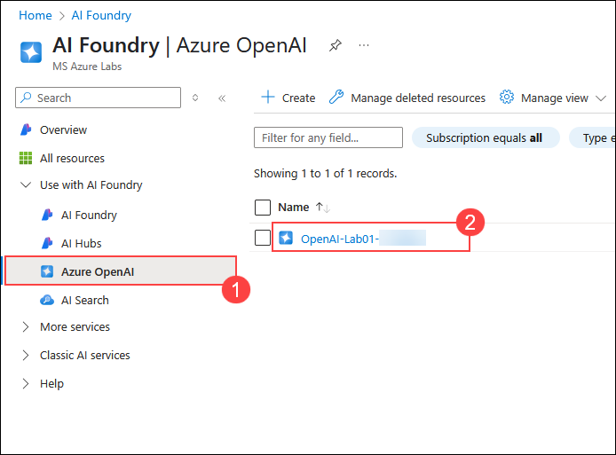
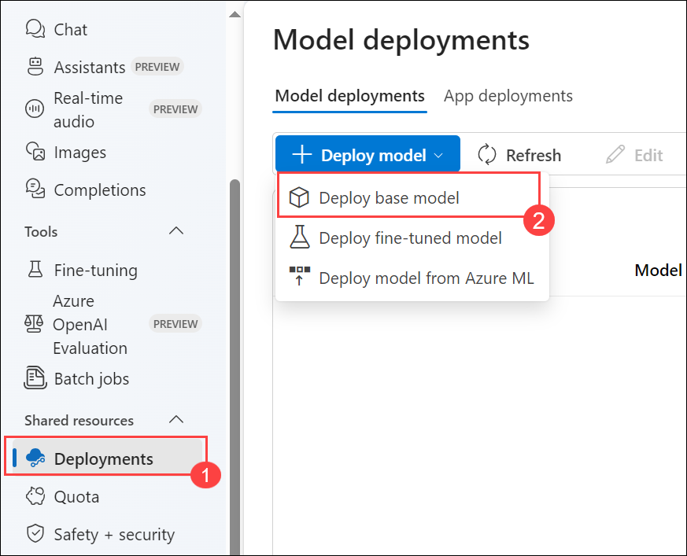
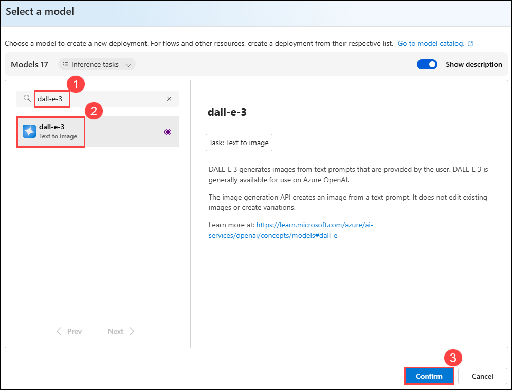
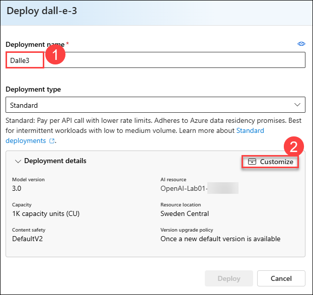
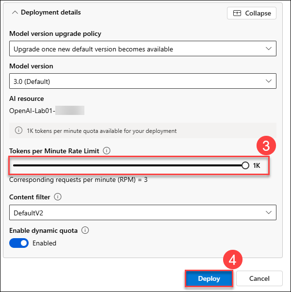
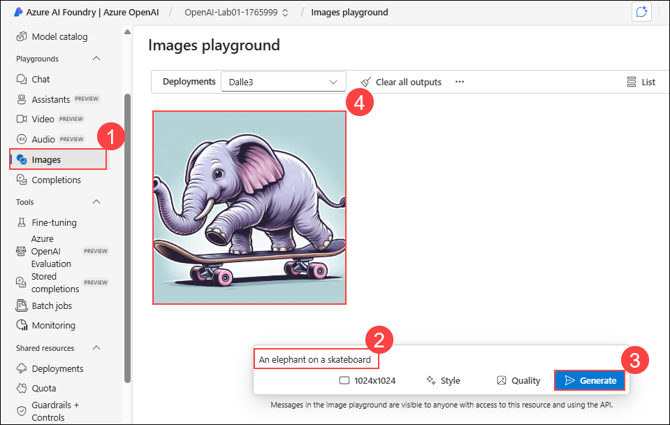
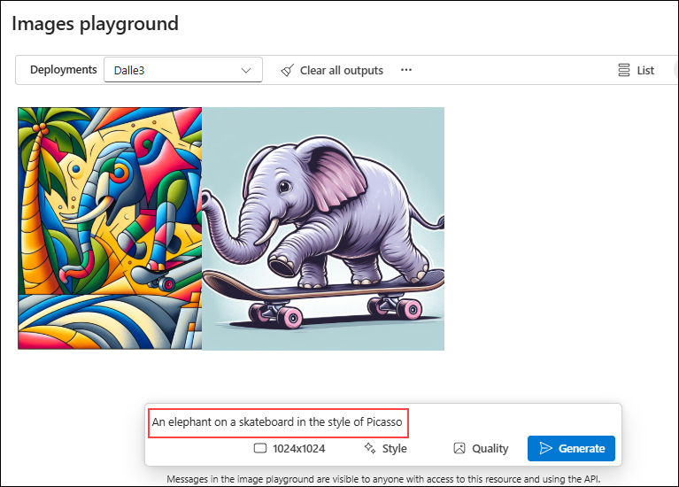
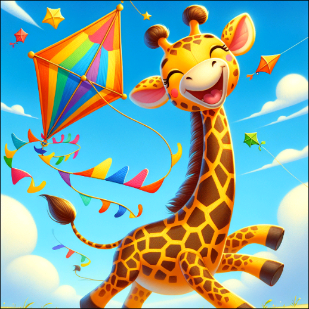

# Lab 05: Generate images with a DALL-E model (READ-ONLY)

## Estimated Duration: 75 Minutes

## Lab Overview
In this lab, you'll use a DALL-E version 3 model to generate images based on natural language prompts.

The Azure OpenAI Service includes an image-generation model named DALL-E. You can use this model to submit natural language prompts that describe a desired image, and the model will generate an original image based on the description you provide.

## Lab Objectives
In this lab, you will complete the following tasks:

- Task 1: Explore image generation in the DALL-E playground
- Task 2: Use the REST API to generate images
      - Task 2.1: Prepare the app environment
      - Task 2.2: Configure your application
      - Task 2.3: View application code
- Task 3: Run the app

## Task 1: Explore image generation in the DALL-E playground

In this task, you will use the DALL-E playground in the Azure AI Foundry portal to experiment with image generation.

> **Note:** This task relies on the DALL·E quota limit available in your Azure OpenAI resource. If the deployment fails, it may be due to quota restrictions on the existing resource. 

> To resolve this, create a new Azure OpenAI resource (as done in **Lab 01**) in a supported region such as **East US** or **Australia East**, and then attempt to deploy the DALL·E model again.

1. In the **Azure portal**, search for **Azure OpenAI** and select **Azure OpenAI**.

      

2. On the **AI Foundry** page, ensure that **Azure OpenAI (1)** is selected from the left blade. Then, select OpenAI-Lab01-<inject key="DeploymentID" enableCopy="false"></inject> **(2)**

      

3. In the Azure OpenAI resource pane, click on **Go to Azure AI Foundry portal**, which will navigate to the **Azure AI Foundry portal**.

      

4. On the **Azure AI Foundry portal** page, select **Deployments (1)** under **Shared Resources** from the left pane. Then, click **+ Deploy Model** and choose **Deploy Base Model (2)**.

      

5. In the Select a model page, search for **dall-e-3 (1)**, select **dall-e-3 (text to image) (2)** model, and click on **Confirm (3)**

      

6. Within the **Deploy model** pop-up interface, enter the *Deployment name* as **Dalle3 (1)**, Click on **customize (2)** and make the **capacity 1K(Tokens per minute) (3)** and click on **Deploy (4)**.

      

      
              
4. From the left navigation pane, select **Images (1)**, enter a description of an image you'd like to generate in the **Describe the image you want to generate (2)** box (for example, *An elephant on a skateboard*), and then select **Generate (3)** to view the **resulting image (4)**.
   
      

5. Modify the prompt to provide a more specific description. For example, *An elephant on a skateboard in the style of Picasso*. Then generate the new image and review the results.

      

      > **Note:** The image may appear differently than shown in the screenshot. 

## Task 2: Use the REST API to generate images

The Azure OpenAI service provides a REST API that you can use to submit prompts for content generation, including images generated by a DALL-E model.

### Task 2.1: Prepare the app environment

In this task, you will use a simple Python or C# app to generate images by calling the REST API and running the code in the Cloud Shell console interface within the Azure portal.

1. In the [Azure portal](https://portal.azure.com?azure-portal=true), select the **[>_]** (*Cloud Shell*) button at the top of the page to the right of the search box. A Cloud Shell pane will open at the bottom of the portal. 

    

    > **Note:** If a **Cloud Shell timed out** pop-up appears, click **Reconnect**.

2. Make sure the type of shell indicated on the top left of the Cloud Shell pane is **Switch to PowerShell**. If it's *Bash*, select **Switch to Bash** and choose **Confirm** from the pop-up box.

    

3. Once the terminal opens, click on **Settings** and select **Go to Classic Version**.

   

4. Navigate to the folder for the language of your preference by running the appropriate command.

    **C#**

    ```bash
    cd mslearn-openai/Labfiles/05-image-generation/CSharp
    ```

    **Python**

    ```bash
    cd mslearn-openai/Labfiles/05-image-generation/Python
    ```

6. Use the following command to open the built-in code editor and see the code files you will be working with.

    ```bash
   code .
    ```
   
### Task 2.2: Configure your application

In this task, you will use a configuration file in the application to store the details needed to connect to your Azure OpenAI service account.

1. In the code editor, select the configuration file for your app, depending on your language preference.

    - C#: `appsettings.json`
    - Python: `.env`
    
2. Update the configuration values to include the **Endpoint** and **Key1** for your Azure OpenAI service. Then, save the file by right-clicking the file in the left pane.

    > **Tip:** You can adjust the split at the top of the cloud shell pane to see the Azure portal and get the endpoint and key values from the **Keys and Endpoint** page for your Azure OpenAI service.

3. If you are using **Python**, you'll also need to install the **python-dotenv** package used to read the configuration file. In the console prompt pane, ensure the current folder is **~/azure-openai/Labfiles/05-image-generation/Python**. Then enter this command:

    ```bash
   pip install python-dotenv
    ```
      > **Note:** If you receive a permission error after executing the installation command as shown in the image, please run the command below for installation/
      >    
      > ```bash
      > pip install --user python-dotenv
      > ```

1. If you're using **C#**, navigate to `generate_image.csproj`, delete the existing code, then replace it with the following code and then press **Ctrl+S** to save the file.

    ```
    <Project Sdk="Microsoft.NET.Sdk">

    <PropertyGroup>
    <OutputType>Exe</OutputType>
    <TargetFramework>net8.0</TargetFramework>
    <ImplicitUsings>enable</ImplicitUsings>
    <Nullable>enable</Nullable>
    </PropertyGroup>

     <ItemGroup>
     <PackageReference Include="Azure.AI.OpenAI" Version="1.0.0-beta.14" />
     <PackageReference Include="Microsoft.Extensions.Configuration" Version="8.0.404" />
     <PackageReference Include="Microsoft.Extensions.Configuration.Json" Version="8.0.404" />
     </ItemGroup>

     <ItemGroup>
       <None Update="appsettings.json">
         <CopyToOutputDirectory>PreserveNewest</CopyToOutputDirectory>
        </None>
     </ItemGroup>

    </Project>
    ```    

         

1. Navigate to the folder for your preferred language and install the necessary packages.

     **C#:**

    ```
    export DOTNET_ROOT=$HOME/.dotnet
    export PATH=$DOTNET_ROOT:$PATH
    mkdir -p $DOTNET_ROOT
    ```     

     >**Note:** Azure Cloud Shell often does not have admin privileges, so you need to install .NET in your home directory. So here you are creating a separate `.dotnet` directory under your home directory to isolate your configuration.
     - `DOTNET_ROOT` specifies where your .NET runtime and SDK are located (in your `$HOME/.dotnet directory`).
     - `PATH=$DOTNET_ROOT:$PATH` ensures that the locally installed .NET SDK can be accessed globally by your terminal.
     - `mkdir -p $DOTNET_ROOT` This creates the directory where the .NET runtime and SDK will be installed.

1. Run the following command to install the required SDK version locally:     

     ```
     wget https://dotnet.microsoft.com/download/dotnet/scripts/v1/dotnet-install.sh
     chmod +x dotnet-install.sh
     ./dotnet-install.sh --version 8.0.404 --install-dir $DOTNET_ROOT
     ```

      >**Note:** These commands download and prepare the official `.NET` installation script, grant it execute permissions, and install the required .NET SDK version (8.0.404) in the `$DOTNET_ROOT` directory, as we don't have the admin privileges to install it globally.

1. Enter the following command to restore the workload.

    ```
    dotnet workload restore
    ```

     >**Note:** Restores any required workloads for your project, such as additional tools or libraries that are part of the .NET SDK.
    
1. Enter the following command to add the `Azure.AI.OpenAI` NuGet package to your project, which is necessary for integrating with Azure OpenAI services.

    ```
    dotnet add package Azure.AI.OpenAI --version 1.0.0-beta.14
    ```

1. For Python, run the following command to install the dependencies

    **Python**

    ```bash
   pip install requests
    ```
      > **Note:** If you receive a permission error after executing the pip install command, please use the below command to install.
      > ```
      > pip install --user requests
      > ```

### Task 2.3: View application code

In this task, you will explore the code used to call the REST API and generate an image.

1. In the code editor pane, select the main code file for your application:

    - C#: `Program.cs`
    - Python: `generate-image.py`

2. Review the code that the file contains, noting the following key features:

   >**Note:** Right-click on the file from the left pane, and hit **Save**
   
    - The code makes HTTPS requests to the endpoint for your service, including the key for your service in the header. Both of these values are obtained from the configuration file.
    - The process consists of <u>two</u> REST requests: One to initiate the image-generation request, and another to retrieve the results.
    The initial request includes the following data:
        - The user-provided prompt that describes the image to be generated
        - The number of images to be generated (in this case, 1)
        - The resolution (size) of the image to be generated.
    - The response header from the initial request includes an **operation-location** value that is used for the subsequent callback to get the results.
    - The code polls the callback URL until the status of the image-generation task is *succeeded*, and then extracts and displays a URL for the generated image.

> **Congratulations** on completing the task! Now, it's time to validate it. Here are the steps:
> - Hit the Validate button for the corresponding task. If you receive a success message, you can proceed to the next task. 
> - If not, carefully read the error message and retry the step, following the instructions in the lab guide.
> - If you need any assistance, please contact us at cloudlabs-support@spektrasystems.com. We are available 24/7 to help you out.

<validation step="0ee48188-10fe-43f5-b696-a2d993d7d714" />

## Task 3: Run the app

In this task, you will run the reviewed code to generate some images.

1. In the Cloud Shell bash terminal, navigate to the folder for your preferred language.

1. In the console prompt pane, enter the appropriate command to run your application:

    **C#**

    ```bash
   dotnet run
    ```

    **Python**

    ```bash
    python generate-image.py
    ```
1. When prompted, enter a description for an image. For example, *A giraffe flying a kite*.
    
1. Wait for the image to be generated - a hyperlink will be displayed in the console pane. Then select the hyperlink to open a new browser tab and review the image that was generated.

   

   

1. Close the tab containing the generated image and re-run the app to generate a new image with a different prompt.

## Summary

In this lab, you have accomplished the following:
-   Understand the concepts of image generation via the DALL-E model.
-   Implement image generation into your applications using this model

### Congratulations on successfully completing the lab! Click Next >> to continue to the next lab.
   
   
