## Lab 06: Add your data for RAG with Azure OpenAI Service

## Lab scenario
The Azure OpenAI Service enables you to use your own data with the intelligence of the underlying LLM. You can limit the model to only use your data for pertinent topics, or blend it with results from the pre-trained model.

## Lab objectives
In this lab, you will complete the following tasks:

- Task 1: Provision an Azure OpenAI resource
- Task 2: Deploy a model
- Task 3: Observe normal chat behavior without adding your own data
- Task 4: Connect your data in the chat playground
- Task 5: Chat with a model grounded in your data
- Task 6: Set up an application in Cloud Shell
- Task 7: Configure your application
- Task 8: Run your application

## Estimated time: 60 minutes

### Task 1: Provision an Azure OpenAI resource

In this task , you'll create an Azure resource in the Azure portal, selecting the OpenAI service and configuring settings such as region and pricing tier. This setup allows you to integrate OpenAI's advanced language models into your applications.

1. In the **Azure portal**, search for **Azure OpenAI** and select **Azure OpenAI**.

   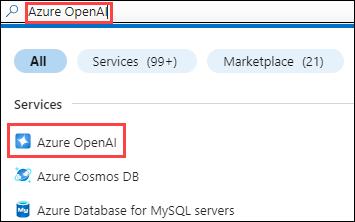

1. On the **Microsoft Foundry | Azure OpenAI** page, Click on **+ Create (1)** from the list, select **Azure OpenAI (2)**

   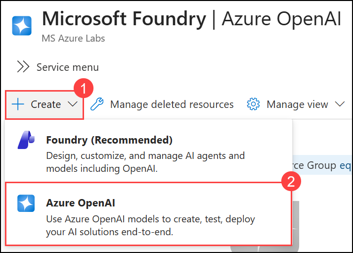

1. Create an **Azure OpenAI** resource with the following settings click on **Next** three times and subsequently click on **Create**:
   
    - **Subscription**: Default - Pre-assigned subscription.
    - **Resource group**: openai-<inject key="DeploymentID" enableCopy="false"></inject>
    - **Region**: <inject key="Region" enableCopy="false" />
    - **Name**: OpenAI-Lab06-<inject key="DeploymentID" enableCopy="false"></inject>
    - **Pricing tier**: Standard S0

      

1. Wait for deployment to complete. Then go to the deployed Azure OpenAI resource in the Azure portal.

1. If you are not able to see the left menu, click on **Service menu**.

   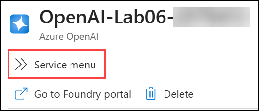 

1. To capture the Keys and Endpoints values, on **openai-<inject key="DeploymentID" enableCopy="false"></inject>** blade:
      - Select **Keys and Endpoint (1)** under **Resource Management**.
      - Click on **Show Keys (2)**.
      - Copy **Key 1 (3)** and ensure to paste it in a text editor such as notepad for future reference.
      - Finally copy the **Endpoint (4)** API URL by clicking on copy to clipboard. Paste it in a text editor such as notepad for later use.

        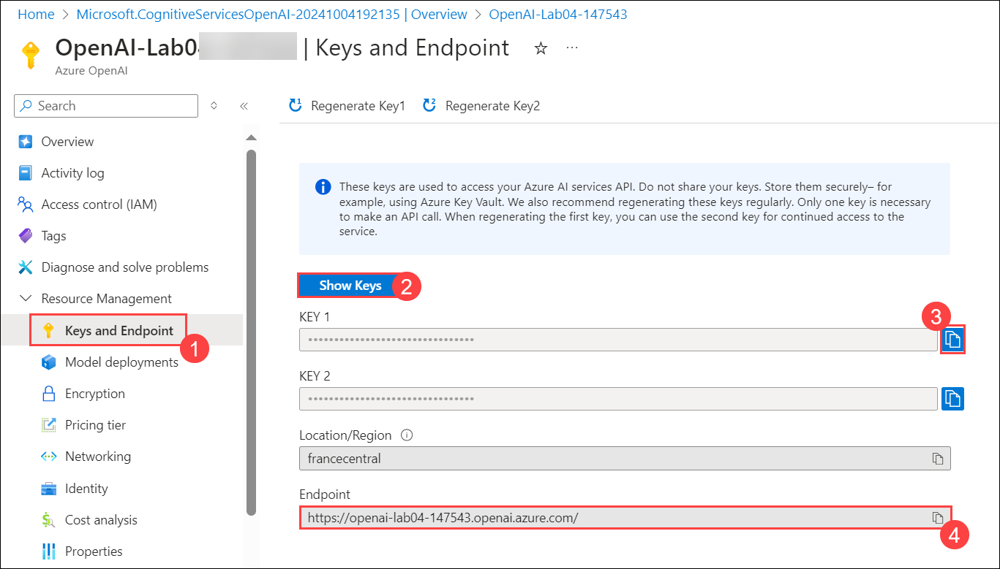

<validation step="cafb7718-6bf1-4fe9-88b8-d1ed6d7c4c58" />

> **Congratulations** on completing the task! Now, it's time to validate it. Here are the steps:
> - Hit the Validate button for the corresponding task. If you receive a success message, you can proceed to the next task. 
> - If not, carefully read the error message and retry the step, following the instructions in the lab guide.
> - If you need any assistance, please contact us at cloudlabs-support@spektrasystems.com. We are available 24/7 to help you out.

### Task 2: Deploy a model

In this task, you'll deploy a specific AI model instance within your Azure OpenAI resource to integrate advanced language capabilities into your applications.

1. On **Microsoft Foundry | Azure OpenAI** blade, select **OpenAI-Lab06-<inject key="DeploymentID" enableCopy="false"></inject>**

   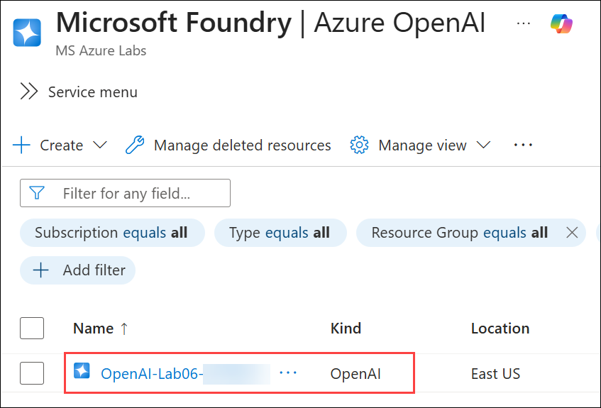

1. In the Azure OpenAI resource pane, click on **Go to Foundry portal** it will navigate to **Microsoft Foundry portal**.

   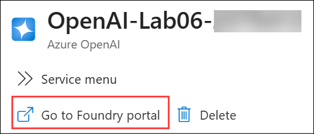

1. Click on **Deployments (1)** under **Shared 
   Resources**, then select **+ Deploy Model (2)**. Next, choose **Deploy Base Model (3).**

      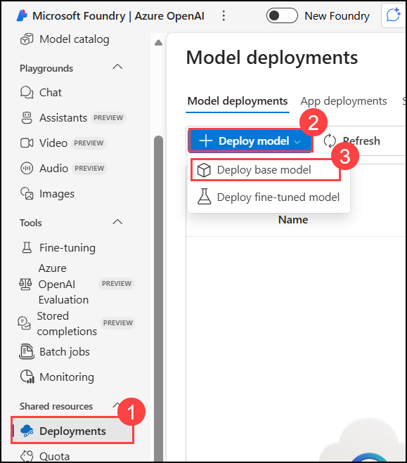

1. Search for **gpt-4.1-mini (1)**, click on **Confirm (2)**

      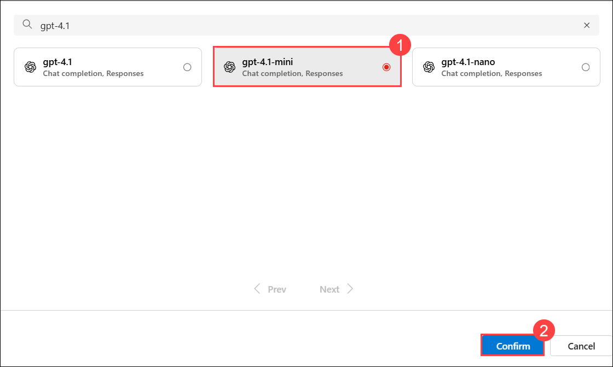
   
1. Within the Deploy model pop-up interface, enter the following details:
      - **Deployment name:** text-turbo **(1)**
      - **Deployment type:** Standard **(2)**
      - Click on **Customize**
      - Tokens per Minute Rate Limit (thousands): **20K (3)**
      - Click on **Deploy (4)**
  
           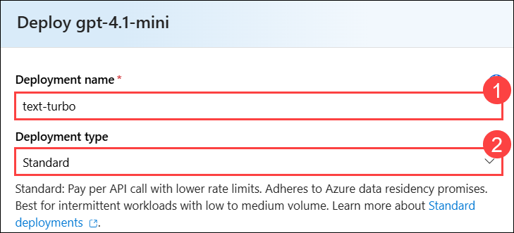
           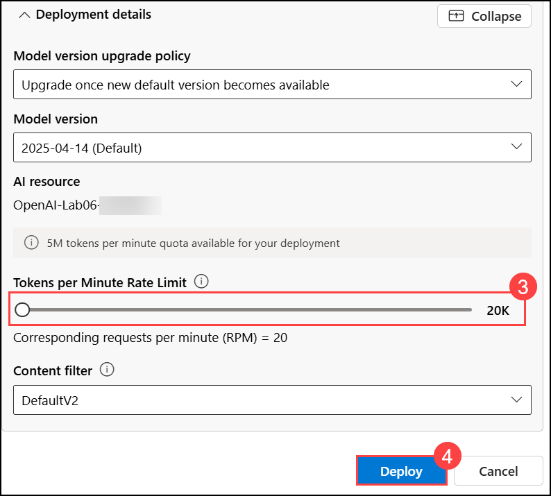 

1. Click on the **Create** button to deploy a model which you will be playing around with as you proceed.

<validation step="863492e4-6930-40bf-ab9f-e1ffb7e21a95" />

> **Congratulations** on completing the task! Now, it's time to validate it. Here are the steps:
> - Hit the Validate button for the corresponding task. If you receive a success message, you can proceed to the next task. 
> - If not, carefully read the error message and retry the step, following the instructions in the lab guide.
> - If you need any assistance, please contact us at cloudlabs-support@spektrasystems.com. We are available 24/7 to help you out.

### Task 3: Observe normal chat behavior without adding your own data

Before connecting Azure OpenAI to your data, first observe how the base model responds to queries without any grounding data.

1. In the **Playground** section, select the **Chat** page. The **Chat** playground page consists of three main sections:
     - **Setup** - used to configure settings for the model deployment.
     - **Give the model instructions and context** - used to set the context for the model's responses.
    - **Chat session** - used to submit chat messages and view responses.

      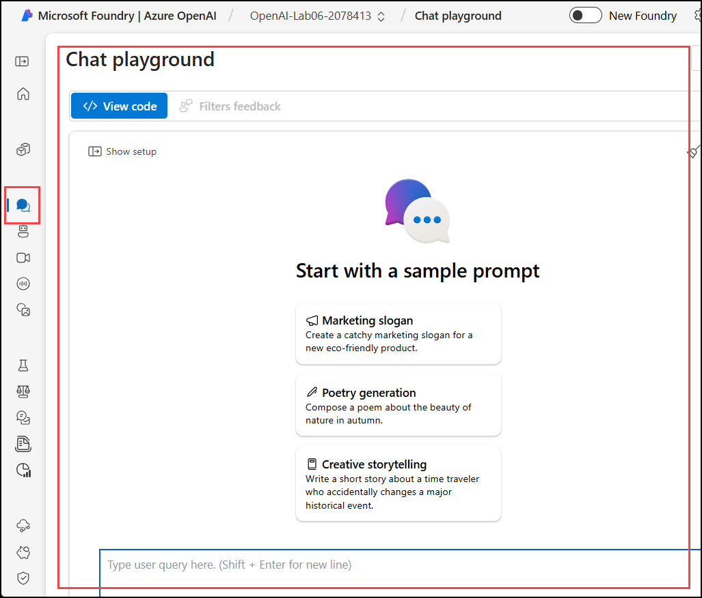

1. In the **Chat session**, submit the following queries, and review the responses:

    ```
    I'd like to take a trip to New York. Where should I stay?
    ```

    ```
    What are some facts about New York?
    ```

    Try similar questions about tourism and places to stay for other locations that will be included in our grounding data, such as London, or San Francisco. You'll likely get complete responses about areas or neighborhoods, and some general facts about the city.

### Task 4: Connect your data in the chat playground

In this task, you will observe how the base model responds to queries without any grounding data before connecting Azure OpenAI to your data.

1. Copy and paste the following URL into the browser to open the dataset in **GitHub**:

    ```
    https://github.com/CloudLabsAI-Azure/mslearn-openai-data/blob/5d0e51c7c8d42b90612a0c4809bb7582a721acd0/Labfiles/02-use-own-data/data/brochures.zip
    ```

1. Once the **GitHub** page opens, click the **Download** button as shown in the image below to download the **brochures.zip** dataset to your **Lab VM**.

   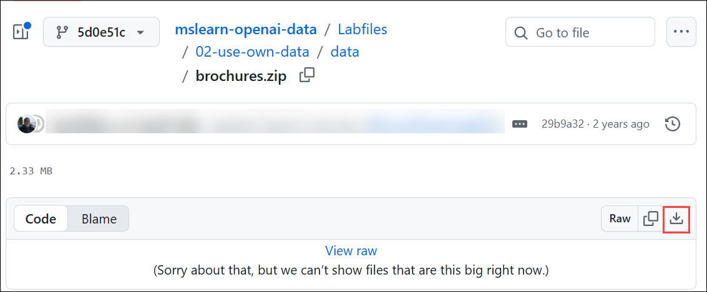

1. In **File Explorer**, navigate to **Downloads (1)**, right-click the **brochures (2)** compressed folder that you downloaded earlier, and select **Extract All… (3)**.

   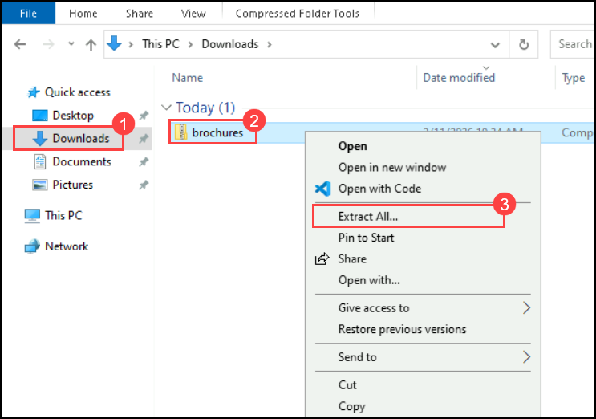

1. In the **Extract Compressed (Zipped) Folders** window, keep the default extraction location and click **Extract (4)** to extract the files.

   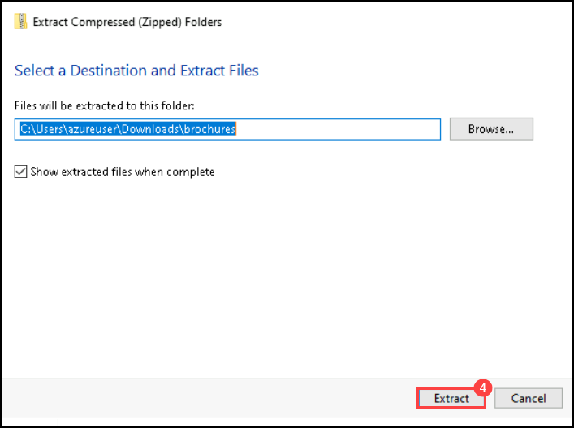
   
1. Navigate back to the **Azure portal**, search for **Storage Account (1)**, and select **Storage accounts (2)**.

   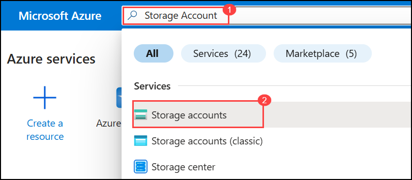

1. On **Storage Account** page, click on **Create**.

   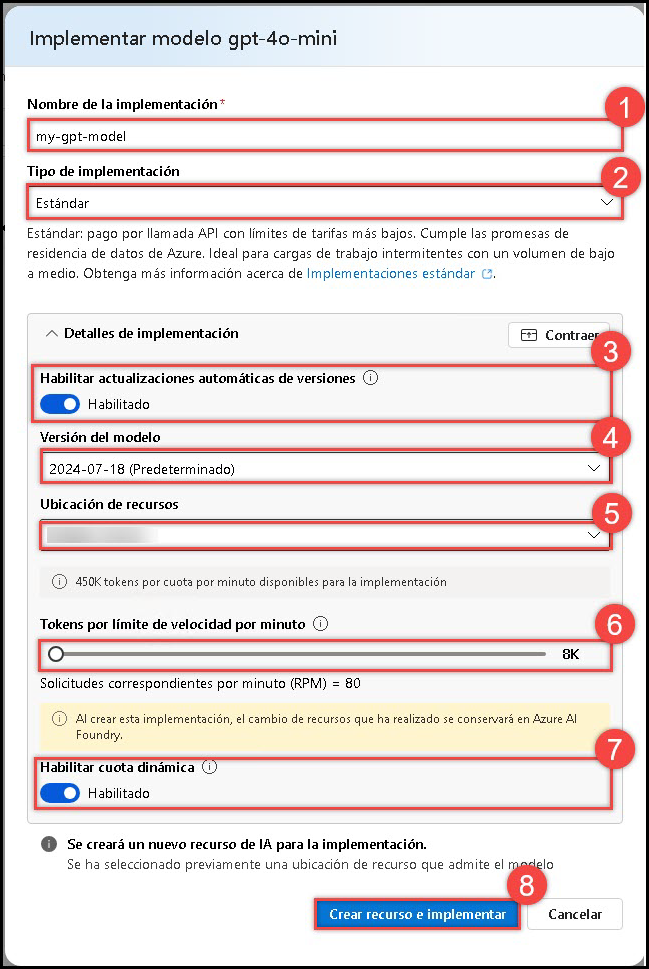

1. Create a **Storage Account** resource with the following settings:

    - **Subscription**: Default - Pre-assigned subscription
    - **Resource group**: openai-<inject key="DeploymentID" enableCopy="false"></inject> **(1)**
    - **Storage account name**: storage<inject key="DeploymentID" enableCopy="false"></inject> **(2)**
    - **Region**: Select <inject key="Region" enableCopy="false" /> **(3)**
    - **Preffered storage type**: Azure Blob Storage or Azure Lake Storage Gen 2 **(4)**
    - **Redundancy**: Locally-redundant storage (LRS) **(5)**
    - Click **Next (6)**.
  
      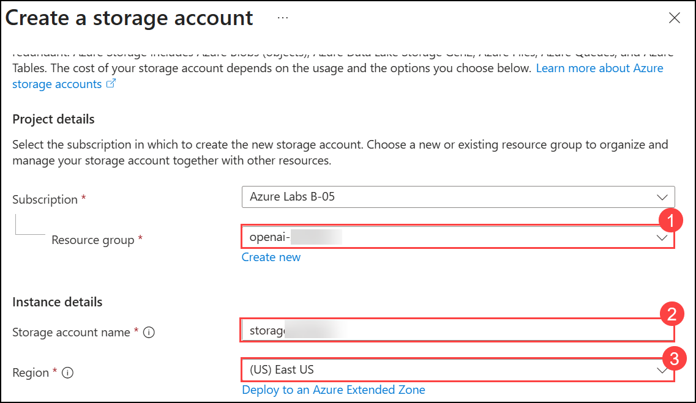
      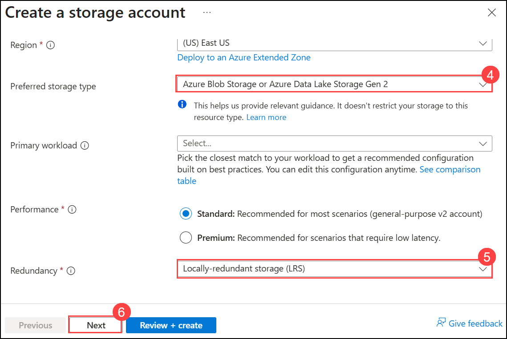

    - **Allow enable anonymous access on individual containers**: check in the box to enable under **Advanced** section. Click on **Review + Create**  and subsequently click on **Create**

      

1. Wait until the storage account is created before you proceed to the next task. This should take about a minute.

1. On the deployment blade, click **Go to resource**.

    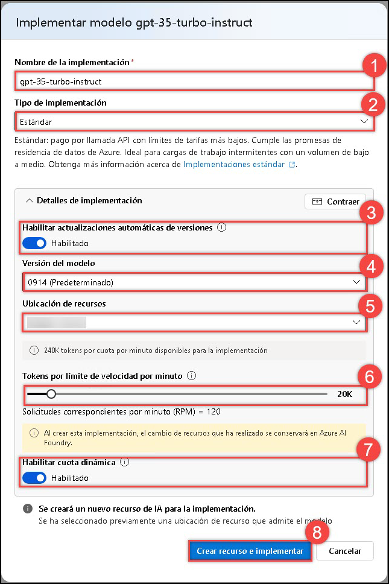

1. In the **Storage account** page, expand **Data storage (1)**, select **Containers (2)**, and then click **+ Add container (3)**.

     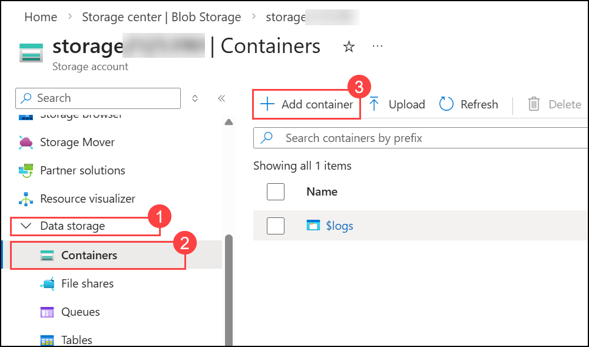

1. In the **New container** pane, enter **openaidatasource (1)** in the **Name** field, set the **Anonymous access level (2)** to **Container (anonymous read access for containers and blobs)**, and then click **Create (3)**.

      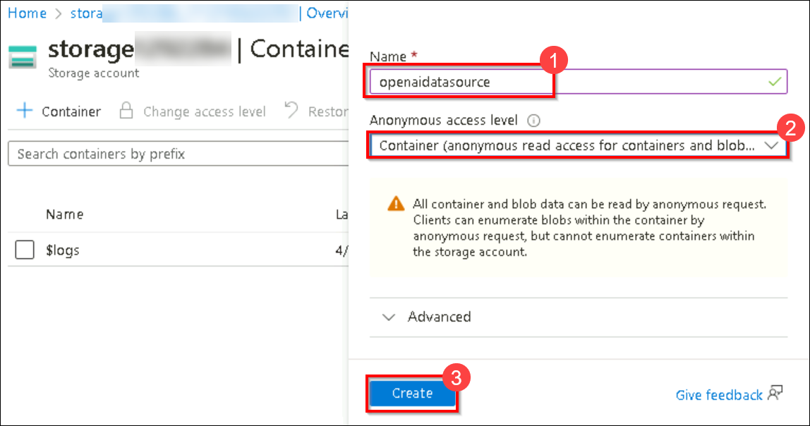

1. In the **Containers** page of the **Storage account**, locate and select the **openaidatasource (1)** container that was created in the **previous task**.

      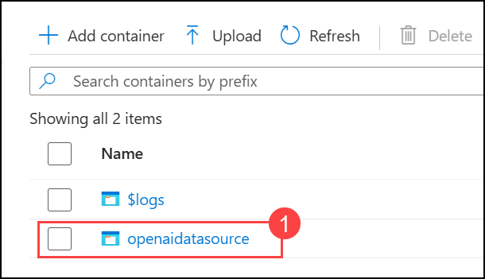

1. In the **openaidatasource** container page, click **Upload (2)** from the top menu. In the **Upload blob** pane that appears, select **Browse for files (3)**, locate the file you downloaded earlier, and select it to upload.

      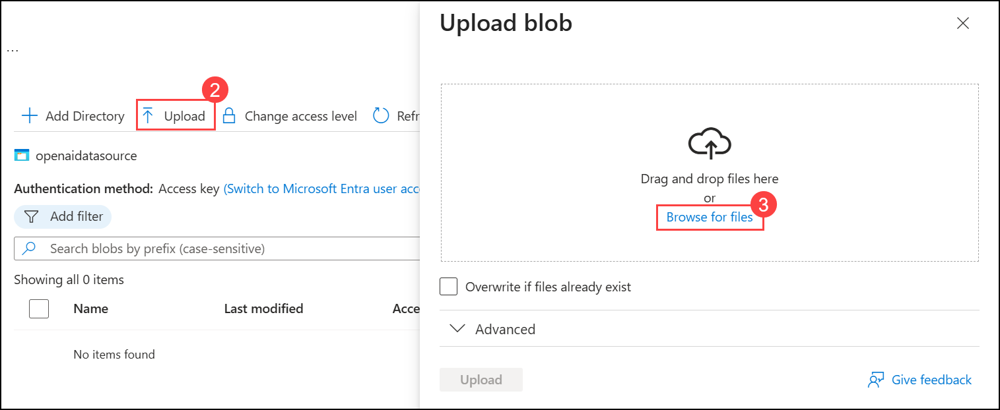

1. In the **Upload blob** file explorer window, navigate to **Downloads (1)** and open the **brochures (2)** folder that was downloaded and extracted during **Step 4 of Task 4**.

      

1. Select **all the brochure files (3)** in the folder and click **Open (4)** to upload them to the **openaidatasource** container.

      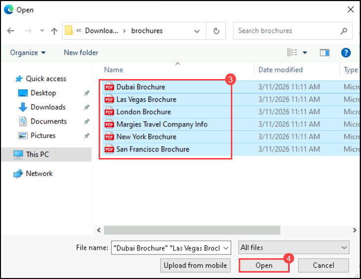

1. Verify that all **6 files (5)** are selected in the **Upload blob** pane, and then click **Upload (6)** to upload the files to the container.

     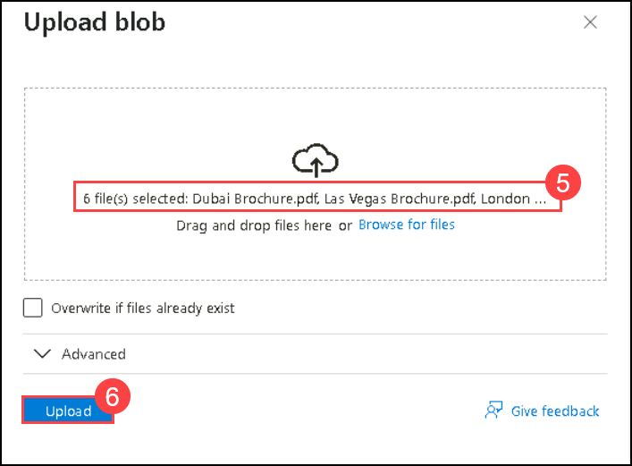

1. Verify the **openaidatasource container** after all files are **uploaded**.

      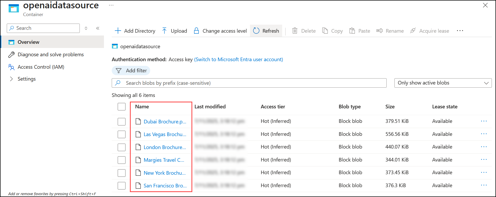

1. On the Azure portal, type **AI Search (1)** in the search box and select **AI Search (2)** from the results.

    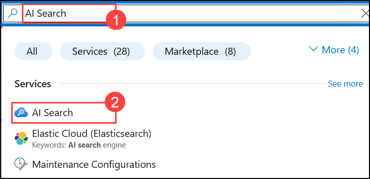

1. On **Microsoft Foundry | AI search** blade, click on **+ Create**.

    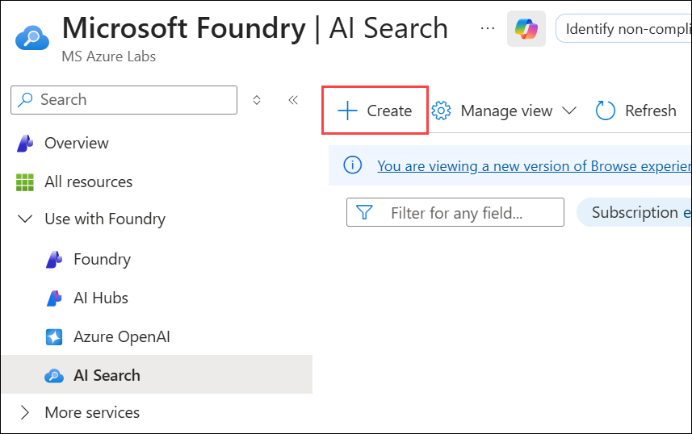

1. On the **Create an AI Search** resource page, enter the following settings under the **Basics** tab and click on **Review + create (5)**.

   | Settings | Action |
   | -- | -- |
   | **Subscription** | Default - Pre-assigned subscription |
   | **Resource group** | **openai-<inject key="DeploymentID" enableCopy="false"></inject> (1)** |
   | **Service name** | **cognitive-search-<inject key="DeploymentID" enableCopy="false"></inject> (2)** |
   | **Location** | Select **<inject key="Region" enableCopy="false" /> (3)** |
   | **Pricing tier** | Change the Pricing tier to **Basic (4)** |

   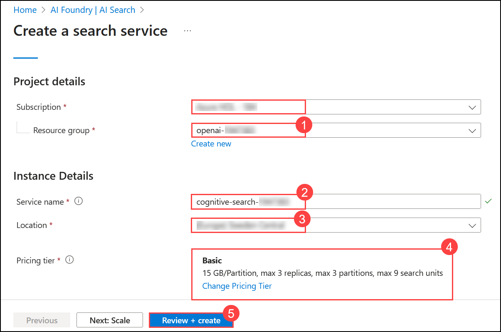
   
    > **Note:** If **East US** is not available due to high demand, select **East US 2**, **Australia East**, or any other available supported region.

1. Then click on **Create**.

    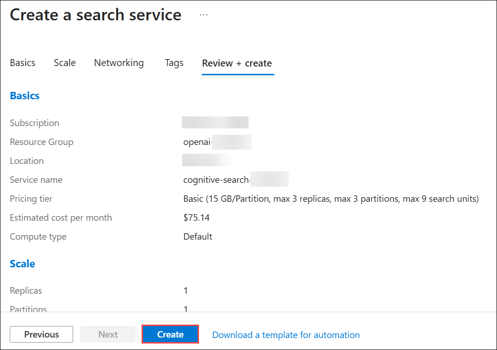

1. Once the deployment is successful, click on **Go to resource** to go to the deployed search service. 

   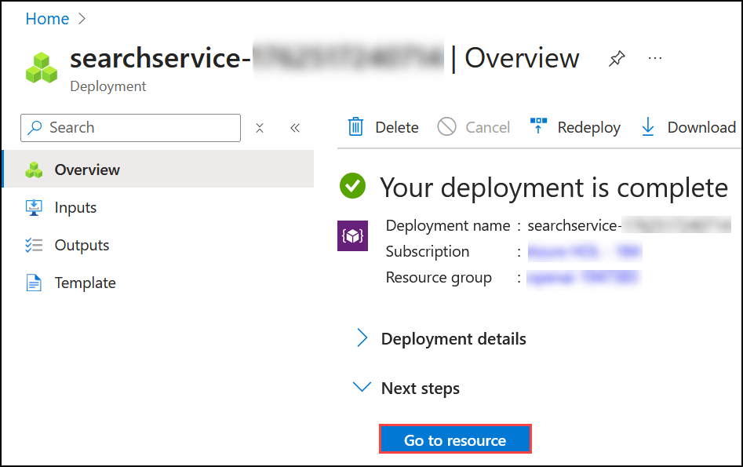

1. Navigate to the **cognitive-search-<inject key="DeploymentID	" enableCopy="false"></inject>** and in the overview page, copy the URL and paste it in a text editor such as Notepad for later use.

    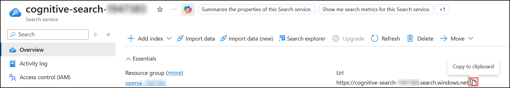

1. From the left navigation pane, under **Settings (1)** click on **Keys (2)** and **copy the primary key or secondary key (3)** and paste it into a notepad for later use.

    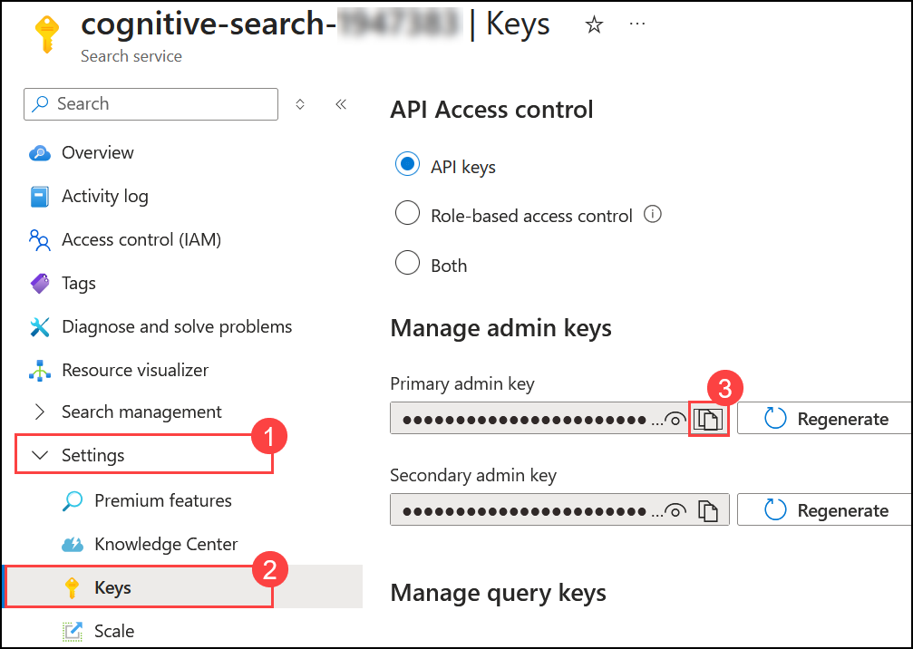

1. In **Microsoft Foundry portal**, navigate to the **Chat (1)** section under **Playgrounds** followed by select **Add your data (2)** in the setup pane and click on **+ Add a data source (3)**.

    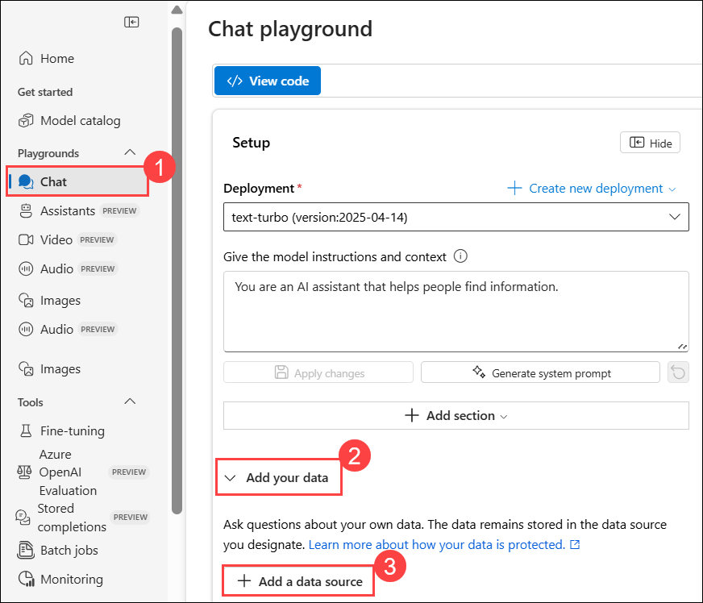
   
1. On the **Add data** window, enter the following values for under the **Data source** and then click on **Next (7)** to proceed with **Data Management**.

   | Setting | Action |
   | -- | -- |
   | **Select data source** | Azure Blob Storage (preview) **(1)** |
   | **Select Azure Blob storage resource** | *Choose the storage resource **storage<inject key="DeploymentID" enableCopy="false"></inject> (2)** you created* (If it isn’t visible, try clicking Refresh next to the storage account) |
   | **Select Storage container** | **openaidatasource (3)** |
   | **Select Azure AI Search resource** | *Choose **cognitive-search-<inject key="DeploymentID	" enableCopy="false"></inject> (4)** search resource you created* |
   | **Enter the index name** | **margiestravel (5)** |
   | **Indexer schedule** | **Once (6)** |
   
    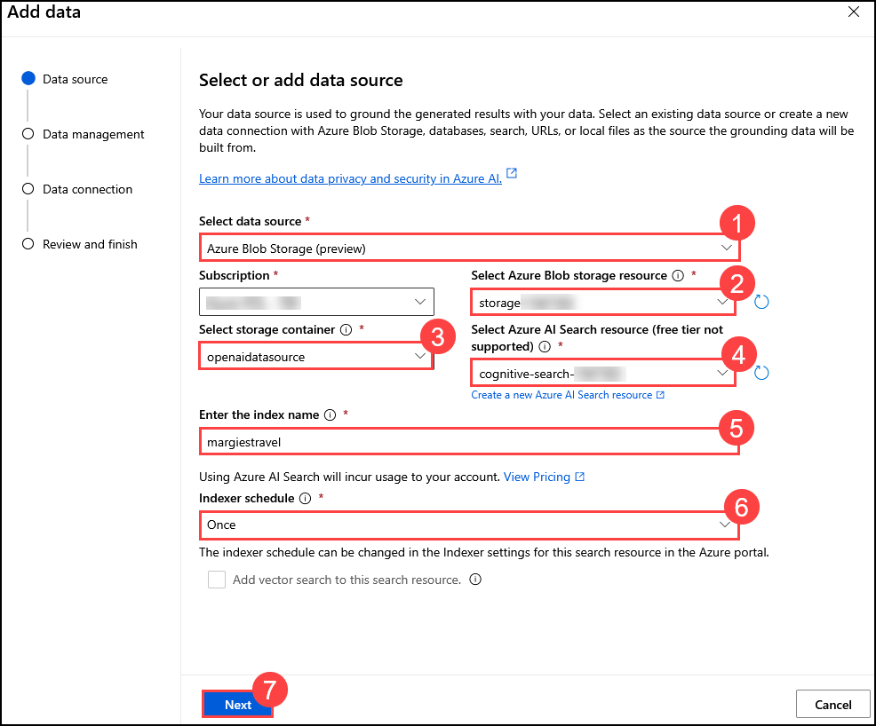

     > **Note:** If the created **Storage Account**, **Storage Container**, or other required resources are not visible in the list, click the **Refresh** icon as shown in the image to reload the available options.

      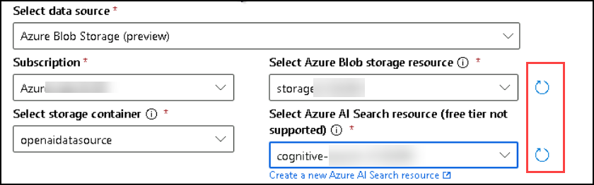
   
1. On the **Data management** page select the **Keyword (1)** search type from the drop-down, and then select **Next (2)**.

    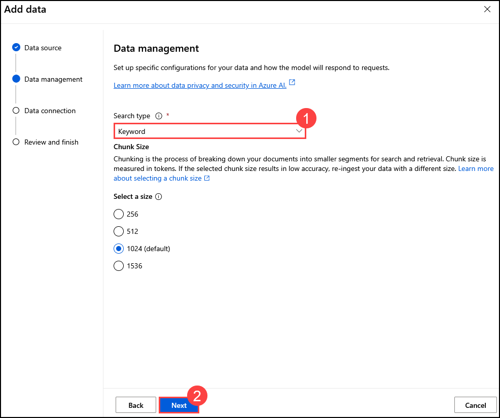

1. On the **Data connection** page select the **API key (1)** , Click on the **Next (2)**

    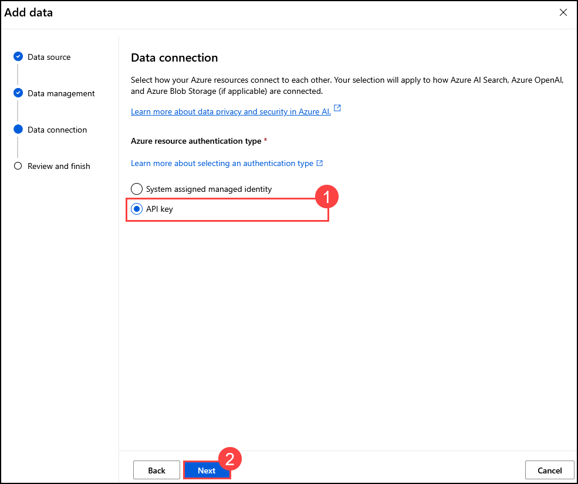
   
1. On the **Review and finish** page select **Save and close**, which will add your data.

    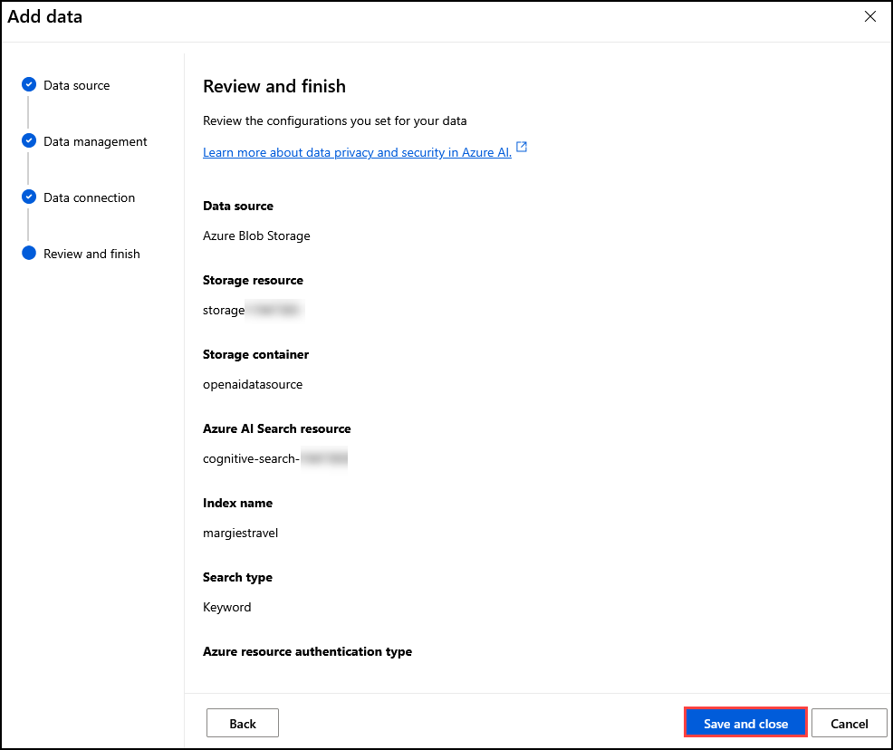

1. This may take a few minutes, during which you need to keep your window open.
       
    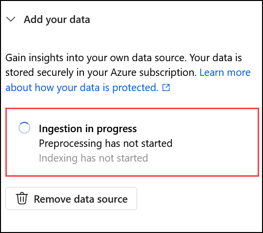
  
1. Once completed, verify if the data source, search resource, and index specified **margiestravel** are present under the **Add your data** tab in the  **Assistant setup** pane.

    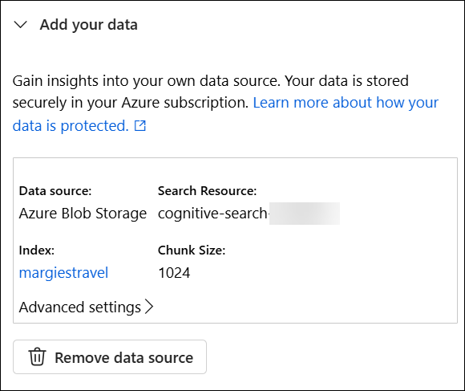   

<validation step="cf9a74ba-2501-47a6-a819-b42218c0a9da" />

> **Congratulations** on completing the task! Now, it's time to validate it. Here are the steps:
> - Hit the Validate button for the corresponding task. If you receive a success message, you can proceed to the next task. 
> - If not, carefully read the error message and retry the step, following the instructions in the lab guide.
> - If you need any assistance, please contact us at cloudlabs-support@spektrasystems.com. We are available 24/7 to help you out.


## Task 5: Chat with a model grounded in your data

In this task, you will ask the same questions as before in the chat section after adding your data, and observe how the responses differ.

1. In the **Chat** session on the right side, submit the following queries, and review the responses:

   ```
   I'd like to take a trip to New York. Where should I stay?
   ```

   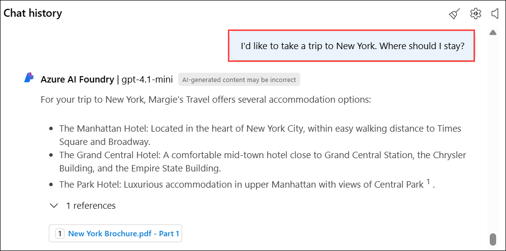

   ```
   What are some facts about New York?
   ```

   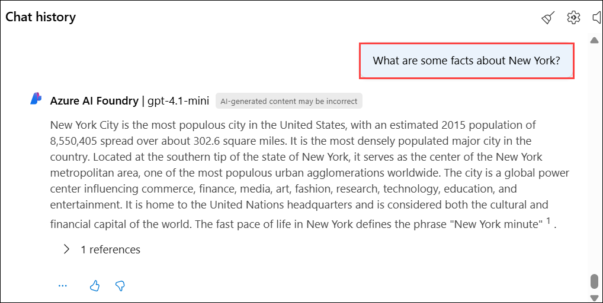

1. You'll notice a very different response this time, with specifics about certain hotels and a mention of Margie's Travel, as well as references to where the information provided came from. If you open the PDF reference listed in the response, you'll see the same hotels as the model provided. Try asking it about other cities included in the grounding data, which are Dubai, Las Vegas, London, and San Francisco.

    >**Note:** **Add your data** is still in preview and might not always behave as expected for this feature, such as giving the incorrect reference for a city not included in the grounding data.

## Task 6: Set up an application in Cloud Shell

In this task, you will use a short command-line application running in Cloud Shell on Azure to demonstrate integration with an Azure OpenAI model. Open a new browser tab to access Cloud Shell.

1. In the [Azure portal](https://portal.azure.com?azure-portal=true), select the **[>_] (Cloud Shell)** button at the top of the page to the right of the search box. A Cloud Shell pane will open at the bottom of the portal.

    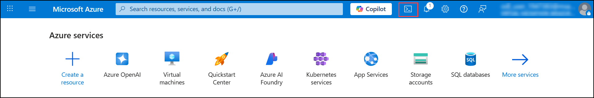

    >**Note:** If you can't find Cloud Shell, click on the **ellipsis (...) (1)** and then select **Cloud Shell (2)** from the menu.

    1.png)

1. The first time you open the Cloud Shell, you may be prompted to choose the type of shell you want to use (*Bash* or *PowerShell*). Select **Bash**. If you don't see this option, skip the step.

     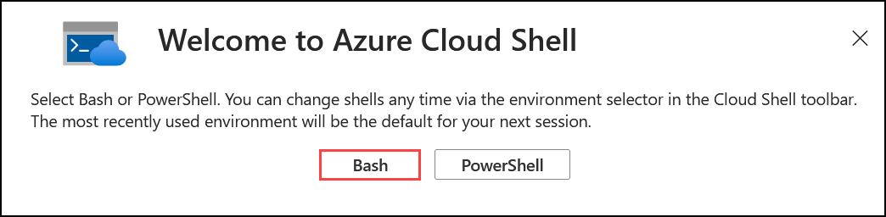

1. Within the **Getting started** page, select **Mount storage account (1)**, select your **Subscription (2)** from the dropdown and click **Apply (3)**.

     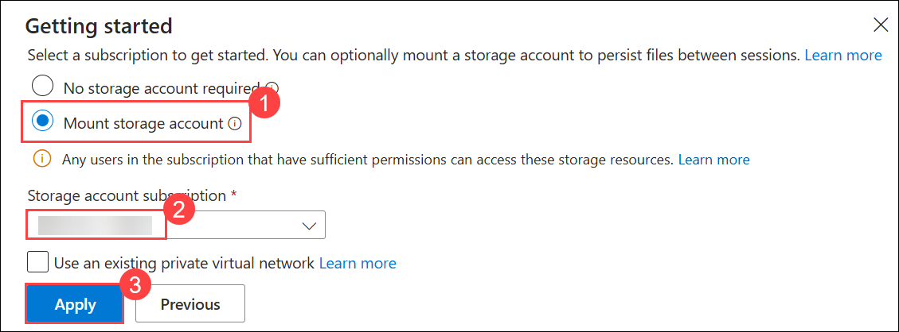

1. Within the **Mount storage account** page, select **I want to create a storage account (1)** and click **Next (2)**.

    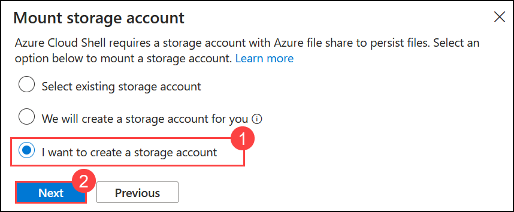

1. Within the **Create storage account** page, enter the following details:

    - **Subscription:** Default - Pre-assigned subscription **(1)**.
    - **Resource group:** **openai-<inject key="DeploymentID" enableCopy="false"></inject> (2)**
    - **Region:** Select **<inject key="Region" enableCopy="false" /> (3)**
    - **Storage account name:** **stg<inject key="DeploymentID" enableCopy="false"></inject> (4)**
    - **File share:** none **(5)**
    - Click **Create (6)**

      

1. Once the terminal opens, click on **Settings (1)** and select **Go to Classic version (2)**.

   

1. In the cloud shell pane, enter the following commands to clone the GitHub repo containing the code files for this exercise.

     ```
     rm -r mslearn-openai -f
     git clone https://github.com/microsoftlearning/mslearn-openai mslearn-openai
     ```

1. After the repo has been cloned, navigate to the folder containing the chat application code files
   
    ```bash
    cd mslearn-openai/Labfiles/02-use-own-data
    ```

    Applications for both C# and Python have been provided, as well as sample code we'll be using in this lab.

1. Open the built-in code editor, and you can observe the code files we'll be using in `sample-code`. Use the following command to open the lab files in the code editor.

    ```bash
   code .
    ```

## Task 7: Configure your application

In this task, you will complete key parts of the application to enable it to use your Azure OpenAI resource.

1. In the code editor, expand the language folder for your preferred language.

1. Open the configuration file for your language.

    - **C#**: `appsettings.json`
    - **Python**: `.env`

1. Update the configuration file for your chosen language with the following values:

    - **Azure OpenAI endpoint**: Paste the endpoint URL from your Azure OpenAI resource (found on the Keys and Endpoint page in the Azure portal).
    - **Azure OpenAI key**: Paste the key from your Azure OpenAI resource (also on the Keys and Endpoint page).
    - **Deployment name**: Enter the name of your model deployment (e.g., `text-turbo` from the Deployments page in the Azure Microsoft Foundry portal).
    - **Azure AI Search endpoint**: Paste the endpoint URL for your AI Search service (copied earlier or found in the overview page for your AI Search resource).
    - **Azure AI Search key**: Paste the admin key for your AI Search resource (available on the Keys page).
    - **Search index name**: Enter `margiestravel` as the index name.
    - Save your changes after updating these values.

        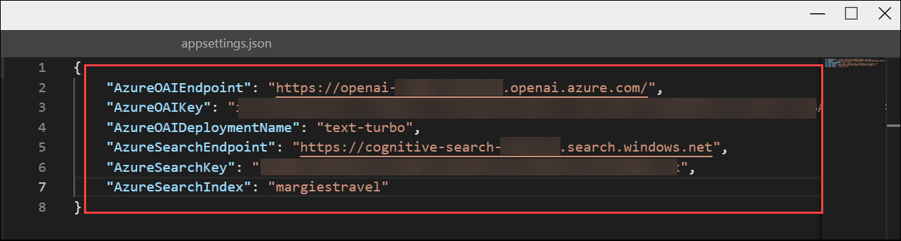

1. If you're using **C#**, navigate to `CSharp.csproj`, delete the existing code, then replace it with the following code, and then press **Ctrl+S** to save the file.

    ```
    <Project Sdk="Microsoft.NET.Sdk">

    <PropertyGroup>
        <OutputType>Exe</OutputType>
        <TargetFramework>net8.0</TargetFramework>
        <ImplicitUsings>enable</ImplicitUsings>
        <Nullable>enable</Nullable>
        <LangVersion>12</LangVersion>
    </PropertyGroup>

    <ItemGroup>
        <PackageReference Include="Azure.AI.OpenAI" Version="2.1.0" />
        <PackageReference Include="Azure.Search.Documents" Version="11.6.0" />
        <PackageReference Include="Microsoft.Extensions.Configuration" Version="8.0.0" />
        <PackageReference Include="Microsoft.Extensions.Configuration.Json" Version="8.0.0" />
        <PackageReference Include="Newtonsoft.Json" Version="13.0.3" />
    </ItemGroup>

    <ItemGroup>
        <None Update="appsettings.json">
        <CopyToOutputDirectory>PreserveNewest</CopyToOutputDirectory>
        </None>
    </ItemGroup>

    </Project>
    ```    

    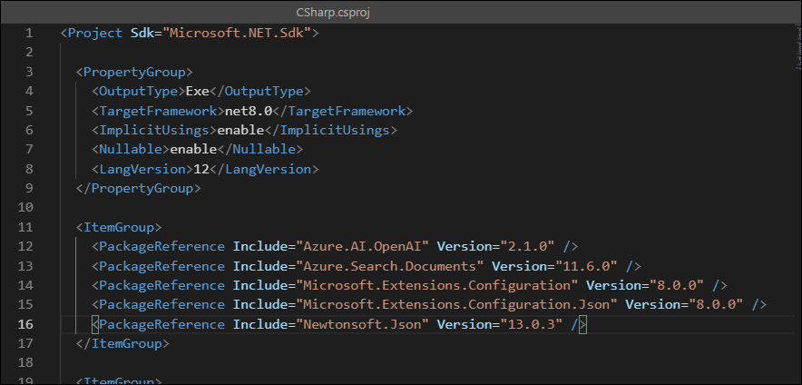    

1. Navigate to the **CSharp** folder and install the necessary packages. These commands set up the environment for a local installation of the .NET SDK in Cloud Shell.

    ```
    cd CSharp
    export DOTNET_ROOT=$HOME/.dotnet
    export PATH=$DOTNET_ROOT:$PATH
    mkdir -p $DOTNET_ROOT
    ```   

    - `DOTNET_ROOT` specifies where your .NET runtime and SDK are located (in your `$HOME/.dotnet directory).
    - `PATH=$DOTNET_ROOT:$PATH` ensures that the locally installed .NET SDK can be accessed globally by your terminal.
    - `mkdir -p $DOTNET_ROOT` This creates the directory where the .NET runtime and SDK will be installed.

1. Run the following command to install the required SDK version locally. These commands download and prepare the official `.NET` installation script, grant it execute permissions, and install the required .NET SDK version (8.0.404) in the `$DOTNET_ROOT` directory, as we don't have the admin privileges to install it globally.    

     ```
     wget https://dotnet.microsoft.com/download/dotnet/scripts/v1/dotnet-install.sh
     chmod +x dotnet-install.sh
     ./dotnet-install.sh --version 8.0.404 --install-dir $DOTNET_ROOT
     ``` 

1. Enter the following command to restore any required workloads for your project, such as additional tools or libraries that are part of the .NET SDK.

    ```
    dotnet workload restore
    ```

1. Enter the following command to add the `Azure.AI.OpenAI` NuGet package to your project, which is necessary for integrating with Azure OpenAI services.

    ```
    dotnet add package Azure.AI.OpenAI --version 2.1.0
    dotnet add package Azure.Search.Documents --version 11.6.0
    ```

1. If you prefer **Python**, navigate to the **Python** folder and install the necessary packages using the commands below:

    ```
    cd Python
    python -m venv labenv
    ./labenv/bin/Activate.ps1
    pip install --user python-dotenv openai==1.65.2
    ```

1. In the code editor, replace the comment **Configure your data source** with code to your index as a data source for chat completion:

    For **C#**: OwnData.cs

    ```csharp
    // Configure your data source
    // Extension methods to use data sources with options are subject to SDK surface changes. Suppress the warning to acknowledge this and use the subject-to-change AddDataSource method.
    #pragma warning disable AOAI001
     
    ChatCompletionOptions chatCompletionsOptions = new ChatCompletionOptions()
    {
       MaxOutputTokenCount = 600,
       Temperature = 0.9f,
    };
     
    chatCompletionsOptions.AddDataSource(new AzureSearchChatDataSource()
    {
       Endpoint = new Uri(azureSearchEndpoint),
       IndexName = azureSearchIndex,
       Authentication = DataSourceAuthentication.FromApiKey(azureSearchKey),
    });
    ```

    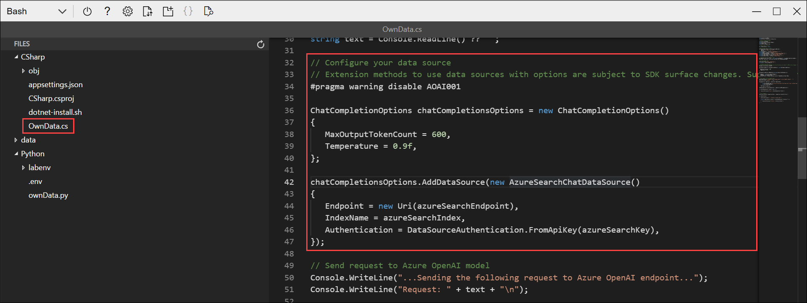

    For **Python**: ownData.py

    ```python
    # Configure your data source
    text = input('\nEnter a question:\n')
     
    completion = client.chat.completions.create(
        model=deployment,
        messages=[
            {
                "role": "user",
                "content": text,
            },
        ],
        extra_body={
            "data_sources":[
                {
                    "type": "azure_search",
                    "parameters": {
                        "endpoint": os.environ["AZURE_SEARCH_ENDPOINT"],
                        "index_name": os.environ["AZURE_SEARCH_INDEX"],
                        "authentication": {
                            "type": "api_key",
                            "key": os.environ["AZURE_SEARCH_KEY"],
                        }
                    }
                }
            ],
        }
    )
    ```

    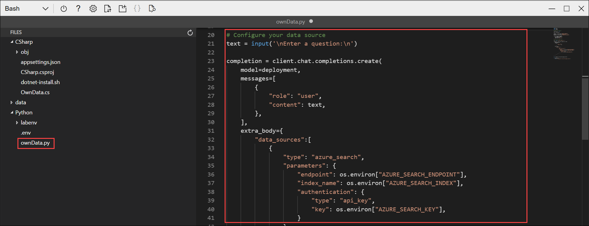

1. Save the changes to the code file.

## Task 8: Run your application

In this task, you will run your configured app to send a request to your model and observe the response, noting that the only difference between options is the prompt content while all other parameters (such as token count and temperature) remain consistent.

In this task, you will run the reviewed code to generate some images.

1. In the **Cloudshell** bash terminal, navigate to the folder for your preferred language.

2. In the interactive terminal pane, ensure the folder context is the folder for your preferred language. Then enter the following command to run the application.

    - **C#**: `dotnet run`
    - **Python**: `python ownData.py`

        >**Note**: If you encounter any errors after running the Python script, try upgrading the OpenAI package by running the following command:
        
        ```
        pip install --user --upgrade openai
        ```

3. Review the response to the prompt `Tell me about London`, which should include an answer as well as some details of the data used to ground the prompt, which was obtained from your search service.

    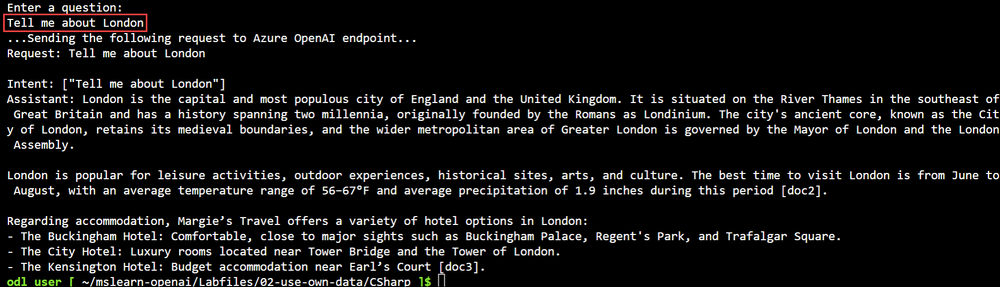

## Summary

In this lab, you have accomplished the following:
-   Provisioned an Azure OpenAI resource
-   Deployed an OpenAI model within the Microsoft Foundry portal
-   Used the power of OpenAI models to generate responses limited to a custom ingested data.

### You have successfully completed the lab.
