## Lab 06: Add your data for RAG with Azure OpenAI Service

## Lab scenario
The Azure OpenAI Service enables you to use your own data with the intelligence of the underlying LLM. You can limit the model to only use your data for pertinent topics, or blend it with results from the pre-trained model.

## Lab objectives

In this lab, you will complete the following tasks:

- Task 1: Provision a Microsoft Foundry resource
- Task 2: Deploy a model
- Task 3: Observe normal chat behavior without adding your own data
- Task 4: Create an AI Assistant with your own data
- Task 5: Chat with a model grounded in your data
- Task 6: Set up an application in Cloud Shell
- Task 7: Configure your application
- Task 8: Run your application

## Estimated time: 60 minutes

### Task 1: Provision a Microsoft Foundry  resource

In this task , you'll create an Azure resource in the Azure portal, selecting the Microsoft Foundry service and configuring settings such as region and pricing tier. This setup allows you to integrate OpenAI's advanced language models into your applications.

1. In the **Azure portal**, search for **Microsoft Foundry (1)** and select **Microsoft Foundry (2)** from the results.

   

1. On the **Microsoft Foundry** overview pane, select **Create a resource**

   

1. Create an **Foundry** resource using the settings below, then click **Review + create (6)** , leaving all other options at their defaults.
    
    - Subscription: **Default Subscription (1)**
    
    - Resource group: **openai-<inject key="DeploymentID" enableCopy="false"></inject> (2)**
    
    - Name: **OpenAI-Lab06-<inject key="DeploymentID" enableCopy="false"></inject> (3)**

    - Region: **<inject key="Region" enableCopy="false"></inject> (4)**
    
    - Default project name: **proj-default (5)**
  
      

1. Under the **Review + create** tab, click on **Create**.

1. Wait for deployment to complete. Click on **Go to resource** to navigate to the deployed foundry resource in the Azure portal.

      

1. To capture the Keys and Endpoints values, on **OpenAI-Lab06-<inject key="DeploymentID" enableCopy="false"></inject>** blade:

    - On the left navigation menu, expand **Resource Management** and select **Keys and Endpoint (1)**.
    
    - Copy **Key 1 (2)** and ensure to paste it in a text editor such as notepad for future reference.
    
    - Select **OpenAI (3)**, copy the **Endpoint (4)** API URL by clicking on copy to clipboard. Paste it in a text editor such as notepad for later use.
    
        

<validation step="cafb7718-6bf1-4fe9-88b8-d1ed6d7c4c58" />

> **Congratulations** on completing the task! Now, it's time to validate it. Here are the steps:
> - Hit the Validate button for the corresponding task. If you receive a success message, you can proceed to the next task. 
> - If not, carefully read the error message and retry the step, following the instructions in the lab guide.
> - If you need any assistance, please contact us at cloudlabs-support@spektrasystems.com. We are available 24/7 to help you out.

### Task 2: Deploy a model

In this task, you'll deploy a specific AI model instance within your Azure OpenAI resource to integrate advanced language capabilities into your applications.

1. In the Foundry resource pane, click on **Go to Foundry portal**, which will navigate to **Microsoft Foundry**.

    

1. Click **View deployments** under Use a model.

    
   
1. On Deployments tab, click **Deploy (1)**, and choose **Deploy a base model (2)**.

     

1. Search for **gpt-5-mini (1)** in the search bar, select **gpt-5-mini (2)**.

      

1. On **gpt-5-mini** details page, click on **Custom deploy**.

   

      >**Note:** If the **Custom Deploy** option is not visible, click **Deploy**, then select **Custom settings**.

      >

1. Within the **Deploy gpt-5-mini** pop-up interface, enter the following details:

    - **Deployment name**: **text-turbo (1)**

    - **Deployment type**: **Global Standard (2)**

    - **Tokens per Minute Rate Limit**: **15K (3)**

    - **Guardrails**: **DefaultV2 (4)**

    - Click on **Deploy (5)**

         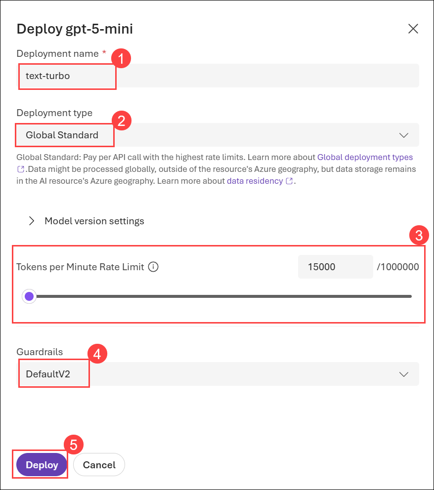

1. This will deploy a model that you will use as you proceed.

<validation step="863492e4-6930-40bf-ab9f-e1ffb7e21a95" />

> **Congratulations** on completing the task! Now, it's time to validate it. Here are the steps:
> - Hit the Validate button for the corresponding task. If you receive a success message, you can proceed to the next task. 
> - If not, carefully read the error message and retry the step, following the instructions in the lab guide.
> - If you need any assistance, please contact us at cloudlabs-support@spektrasystems.com. We are available 24/7 to help you out.

### Task 3: Observe normal chat behavior without adding your own data

Before connecting Azure OpenAI to your data, first observe how the base model responds to queries without any grounding data.

1. In the **Chat session**, submit the following queries, and review the responses:

    ```
    I'd like to take a trip to New York. Where should I stay?
    ```

    ```
    What are some facts about New York?
    ```

    Try similar questions about tourism and places to stay for other locations that will be included in our grounding data, such as London, or San Francisco. You'll likely get complete responses about areas or neighborhoods, and some general facts about the city.

### Task 4: Connect your data in the chat playground

In this task, you will observe how the base model responds to queries without any grounding data before connecting Azure OpenAI to your data.

1. In your VM, **Search (1)** and select **Windows Powershell (2)**. 

     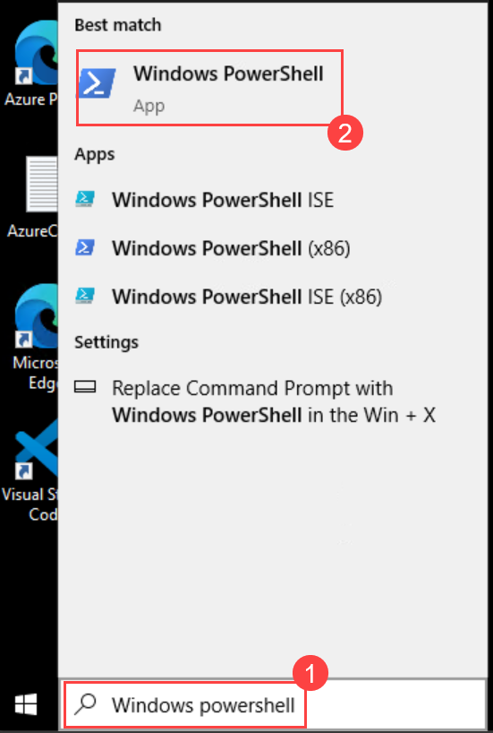

1. Copy and paste the following URL into the powershell window to download the dataset:

    ```
    curl.exe -L -o "$HOME\Downloads\brochures.zip" https://github.com/MicrosoftLearning/mslearn-openai/raw/main/Labfiles/02-use-own-data/data/brochures.zip
    ```
  
    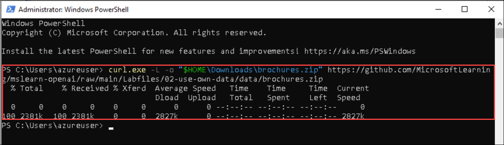

1. In **File Explorer**, navigate to **Downloads (1)**, right-click the **brochures (2)** compressed folder that you downloaded earlier, and select **Extract All… (3)**.

   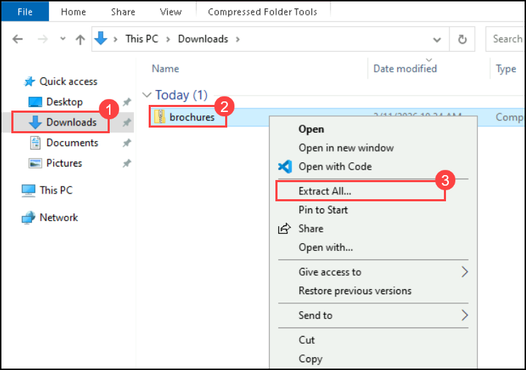

1. In the **Extract Compressed (Zipped) Folders** window, keep the default extraction location and click **Extract (4)** to extract the files.

   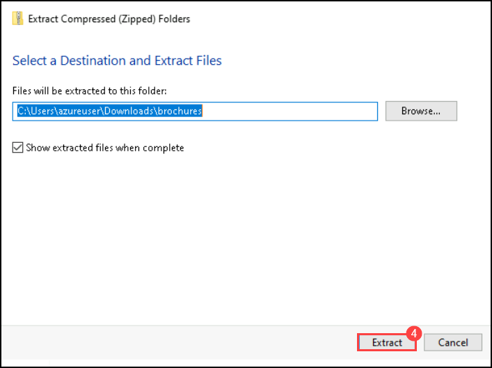

1. Navigate back to foundry portal, open your deployed model, select **Save as agent**.

     

    >**Note:** If foundry user role is not assigned, click **Assign me**. Wait for 5 minutes and refresh the page. If **Save as agent** is locked, navigate to agent tab from left navigation and assign from there.

     

1. On **Create an agent** pop-up, enter the Agent name as **text-turbo-agent (1)** and click **Create (2)**.

    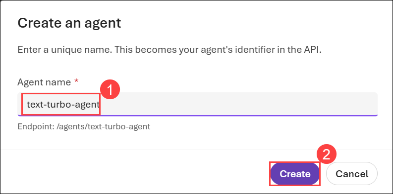

1. On Playgorund tab, under **tool** section click **Upload files**.

    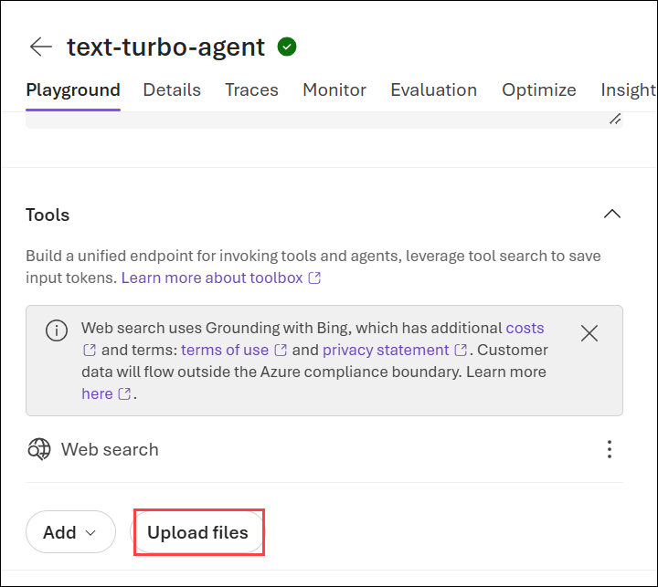

1. On the **Attach files** page, click on **Drag and drop files here or browse for files**.

    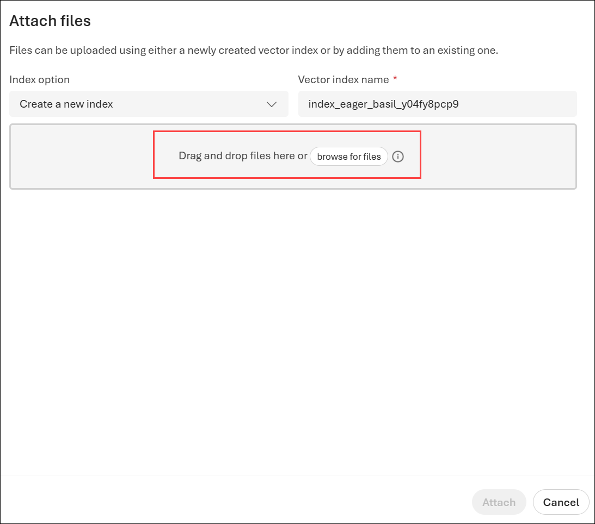

1. In the **Open** window, navigate to the extracted **data** folder **(1)**. Select all the brochure PDF files **(2)** and then click **Open (3)** to upload them.

    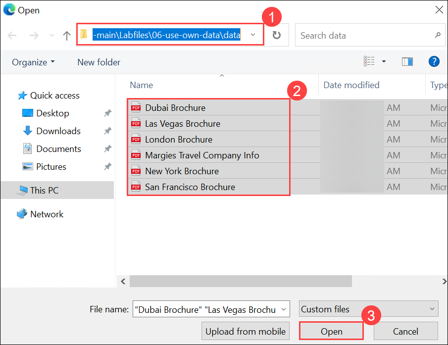

1. Once all the files have been uploaded successfully and the status changes to Success, click **Attach**.

    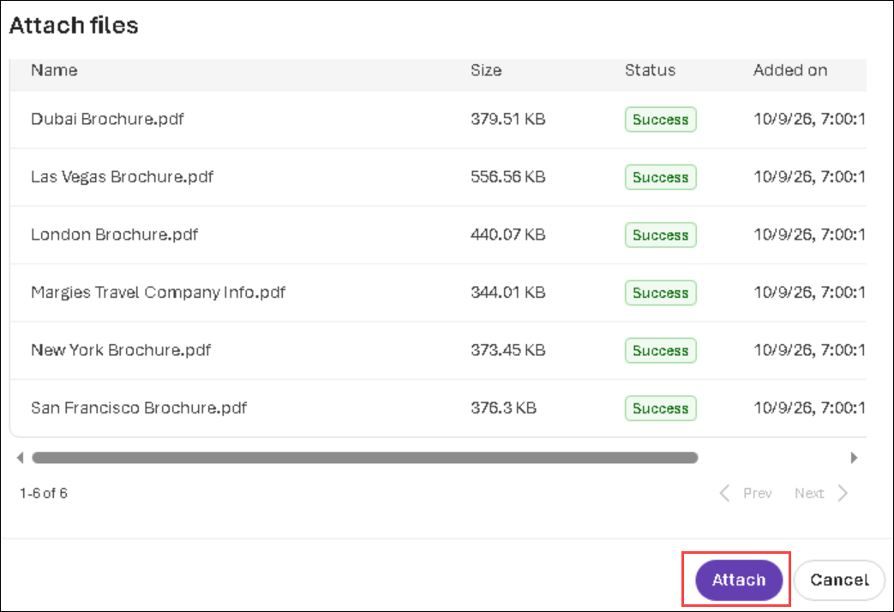

1. After attaching the files to the agent, click **Save**.

## Task 5: Chat with a model grounded in your data

In this task, you will ask the same questions as before in the chat section after adding your data, and observe how the responses differ.

1. In the Agent **Chat** session on the right side, submit the following queries, and review the responses:

   ```
   I'd like to take a trip to New York. Where should I stay?
   ```

   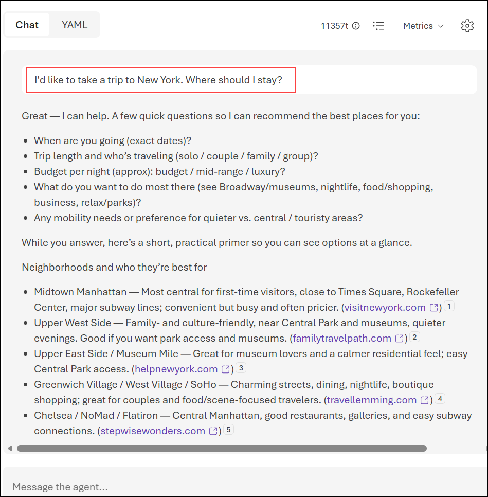

   ```
   What are some facts about New York?
   ```

   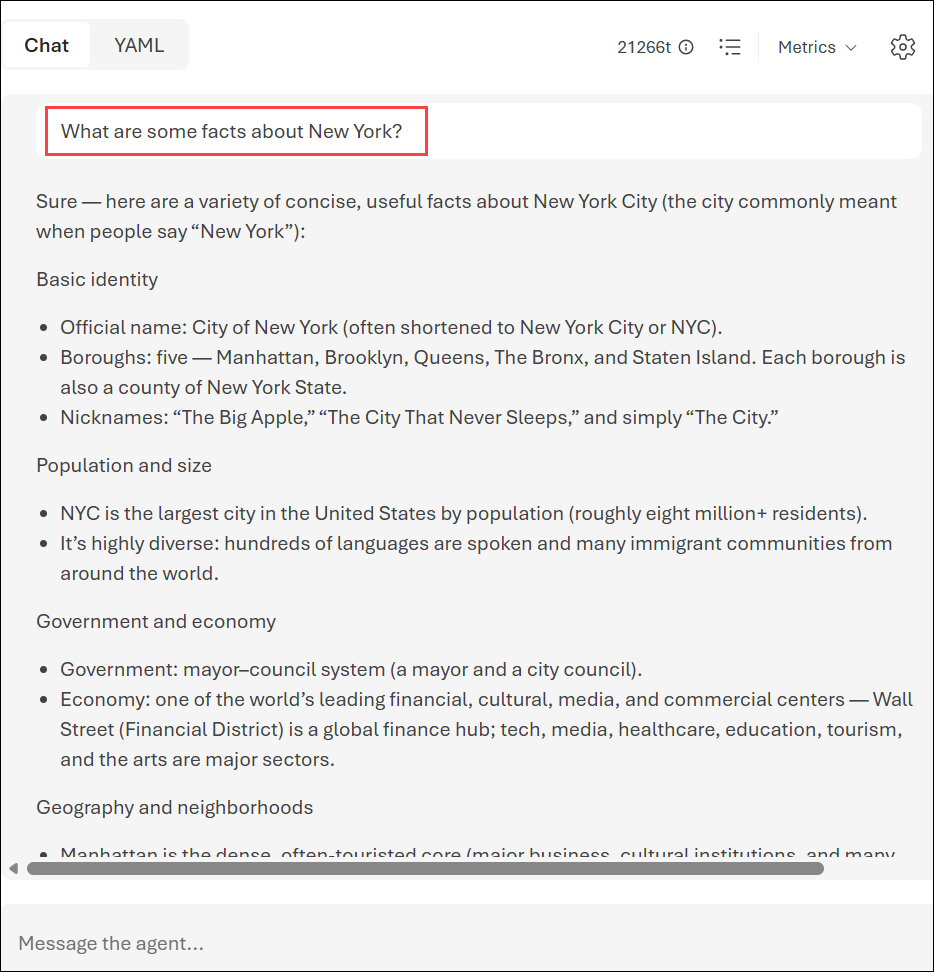

1. You'll notice a very different response this time, with specifics about certain hotels and a mention of Margie's Travel, as well as references to where the information provided came from. If you open the PDF reference listed in the response, you'll see the same hotels as the model provided. Try asking it about other cities included in the grounding data, which are Dubai, Las Vegas, London, and San Francisco.

    >**Note:** **Add your data** is still in preview and might not always behave as expected for this feature, such as giving the incorrect reference for a city not included in the grounding data.

## Task 6: Set up an application in Cloud Shell

In this task, you will use a short command-line application running in Cloud Shell on Azure to demonstrate integration with an Azure OpenAI model. Open a new browser tab to access Cloud Shell.

1. In the [Azure portal](https://portal.azure.com?azure-portal=true), select the **[>_] (Cloud Shell)** button at the top of the page to the right of the search box. A Cloud Shell pane will open at the bottom of the portal.

    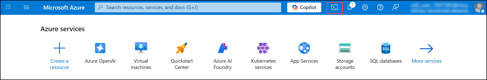

    >**Note:** If you can't find Cloud Shell, click on the **ellipsis (...) (1)** and then select **Cloud Shell (2)** from the menu.

    1.png)

1. The first time you open the Cloud Shell, you may be prompted to choose the type of shell you want to use (*Bash* or *PowerShell*). Select **Bash**. If you don't see this option, skip the step.

     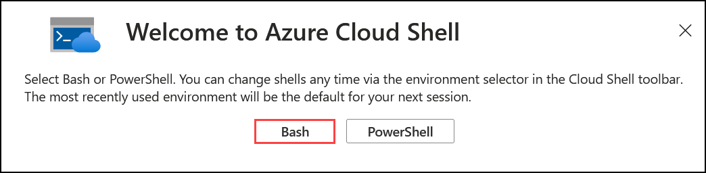

1. Within the **Getting started** page, select **Mount storage account (1)**, select your **Subscription (2)** from the dropdown and click **Apply (3)**.

     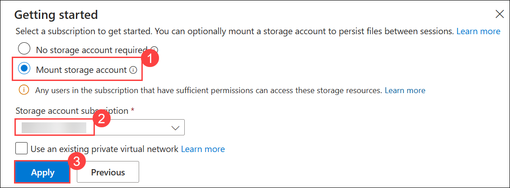

1. Within the **Mount storage account** page, select **I want to create a storage account (1)** and click **Next (2)**.

    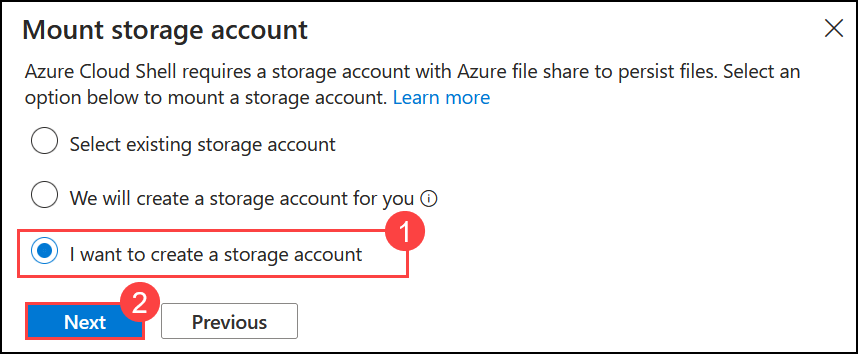

1. Within the **Create storage account** page, enter the following details:

    - **Subscription:** Default - Pre-assigned subscription **(1)**.
    - **Resource group:** **openai-<inject key="DeploymentID" enableCopy="false"></inject> (2)**
    - **Region:** Select **<inject key="Region" enableCopy="false" /> (3)**
    - **Storage account name:** **stg<inject key="DeploymentID" enableCopy="false"></inject> (4)**
    - **File share:** none **(5)**
    - Click **Create (6)**

       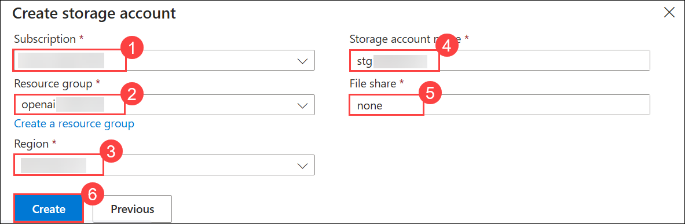

4. In the cloud shell pane, enter the following commands to clone the GitHub repo containing the code files for this exercise.

     ```
     rm -r mslearn-openai -f
     git clone https://github.com/microsoftlearning/mslearn-openai mslearn-openai
     ```

5. After the repo has been cloned, navigate to the folder containing the chat application code files.
   
    ```bash
    cd mslearn-openai/Labfiles/02-use-own-data
    ```

    Applications for both C# and Python have been provided, as well as sample code we'll be using in this lab.

5. Open the built-in code editor, and you can observe the code files we'll be using in `sample-code`. Use the following command to open the lab files in the code editor.

    ```bash
   code .
    ```

## Task 7: Configure your application

In this task, you will complete key parts of the application to enable it to use your Azure OpenAI resource.

1. In the code editor, expand the language folder for your preferred language.

1. Open the configuration file for your language and update the code.

    - **C#**: `appsettings.json`

        ```json
        {
        "AzureOAIEndpoint": "Your OpenAI endpoint",
        "AzureOAIKey": "Azure OpenAI Key",
        "AzureOAIDeploymentName": "text-turbo"
        }
        ```

    - **Python**: `.env`

        ```
        AZURE_OAI_ENDPOINT=<Your OpenAI endpoint>
        AZURE_OAI_KEY=<Azure OpenAI Key>
        AZURE_OAI_DEPLOYMENT=text-turbo
        ```

1. Update the configuration file for your chosen language with the following values:

    - **Azure OpenAI endpoint**: Paste the endpoint URL from your Azure OpenAI resource (found on the Keys and Endpoint page in the Azure portal).
    - **Azure OpenAI key**: Paste the key from your Azure OpenAI resource (also on the Keys and Endpoint page).
    - **Azure OpenAI Model**: Enter the name of your model that you created in Task 2.
    - Save your changes after updating these values.

        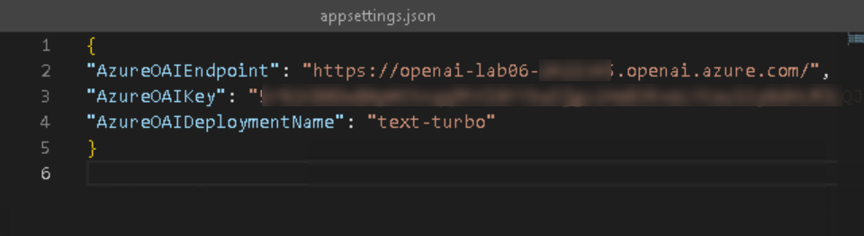

        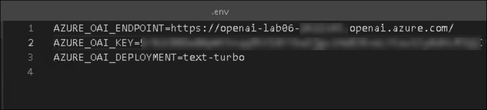

1. If you're using **C#**, navigate to `CSharp.csproj`, delete the existing code, then replace it with the following code, and then press **Ctrl+S** to save the file. If you prefer python navigate to step 9.

    ```
    <Project Sdk="Microsoft.NET.Sdk">

    <PropertyGroup>
        <OutputType>Exe</OutputType>
        <TargetFramework>net8.0</TargetFramework>
        <ImplicitUsings>enable</ImplicitUsings>
        <Nullable>enable</Nullable>
    </PropertyGroup>

    <ItemGroup>
        <PackageReference Include="OpenAI" Version="2.14.0" />
        <PackageReference Include="Microsoft.Extensions.Configuration.Json" Version="8.0.1" />
    </ItemGroup>

    <ItemGroup>
        <None Update="appsettings.json">
        <CopyToOutputDirectory>PreserveNewest</CopyToOutputDirectory>
        </None>
    </ItemGroup>

    </Project>
    ```   

1. Navigate to the **CSharp** folder and install the necessary packages. These commands set up the environment for a local installation of the .NET SDK in Cloud Shell.

   For **C#:**

    ```
    cd CSharp
    ```

    ```
    export DOTNET_ROOT=$HOME/.dotnet
    mkdir -p $DOTNET_ROOT
    ```

     >**Note:** Azure Cloud Shell often does not have admin privileges, so you need to install .NET in your home directory. So here you are creating a separate `.dotnet` directory under your home directory to isolate your configuration.
     >- `DOTNET_ROOT` specifies where your .NET runtime and SDK are located (in your `$HOME/.dotnet directory`).
     >- `mkdir -p $DOTNET_ROOT` This creates the directory where the .NET runtime and SDK will be installed.

1. Run the following command to install the required SDK version locally:     

    ```
    curl -fsSL https://dot.net/v1/dotnet-install.sh -o dotnet-install.sh
    chmod +x dotnet-install.sh
    ``` 

    ```
    ./dotnet-install.sh --channel 8.0 --install-dir $DOTNET_ROOT
    ```

    ```
    export PATH=$DOTNET_ROOT:$PATH
    ```

1. Enter the following command to restore any required workloads for your project, such as additional tools or libraries that are part of the .NET SDK.

    ```
    dotnet workload restore
    ```

1. Enter the following command to add the `Azure.AI.OpenAI` NuGet package to your project, which is necessary for integrating with Azure OpenAI services.

    ```
    dotnet add package Azure.AI.OpenAI --version 2.1.0
    dotnet add package Azure.Search.Documents --version 11.6.0
    ```

    ```
    dotnet add package Azure.AI.OpenAI --prerelease
    dotnet add package OpenAI --prerelease
    ```

1. If you prefer **Python**, navigate to the **Python** folder and install the necessary packages using the commands below:

    ```
    cd Python
    python -m venv labenv
    ./labenv/bin/Activate.ps1
    pip install --user python-dotenv openai==1.65.2
    ```

1. In the code editor, replace your entire file code.

    For **C#**: OwnData.cs

    ```csharp
    using System.ClientModel;
    using Microsoft.Extensions.Configuration;
    using OpenAI;
    using OpenAI.Files;
    using OpenAI.Responses;
    using OpenAI.VectorStores;

    #pragma warning disable OPENAI001

    // Get configuration settings
    IConfiguration config = new ConfigurationBuilder()
        .AddJsonFile("appsettings.json")
        .Build();

    string oaiEndpoint = config["AzureOAIEndpoint"] ?? "";
    string oaiKey = config["AzureOAIKey"] ?? "";
    string oaiDeploymentName = config["AzureOAIDeploymentName"] ?? "";
    string vectorStoreId = config["VectorStoreId"] ?? "";

    // Initialize client using the Azure OpenAI v1 endpoint
    OpenAIClient client = new(
        new ApiKeyCredential(oaiKey),
        new OpenAIClientOptions { Endpoint = new Uri(oaiEndpoint.TrimEnd('/') + "/openai/v1/") });

    OpenAIFileClient fileClient = client.GetOpenAIFileClient();
    VectorStoreClient vectorStoreClient = client.GetVectorStoreClient();
    ResponsesClient responsesClient = client.GetResponsesClient();

    // Create a vector store from the brochure PDFs (first run only)
    if (string.IsNullOrEmpty(vectorStoreId))
    {
        Console.WriteLine("Uploading brochures and creating vector store...");
        List<string> fileIds = new();
        foreach (string path in Directory.GetFiles("../data", "*.pdf"))
        {
            OpenAIFile file = fileClient.UploadFile(path, FileUploadPurpose.Assistants).Value;
            fileIds.Add(file.Id);
            Console.WriteLine($"  Uploaded {Path.GetFileName(path)}");
        }

        VectorStore vectorStore = vectorStoreClient.CreateVectorStore(
            new VectorStoreCreationOptions { Name = "margies-travel-brochures" }).Value;
        VectorStoreFileBatch batch = vectorStoreClient.AddFileBatchToVectorStore(vectorStore.Id, fileIds).Value;

        while (batch.Status == VectorStoreFileBatchStatus.InProgress)
        {
            Thread.Sleep(2000);
            batch = vectorStoreClient.GetVectorStoreFileBatch(vectorStore.Id, batch.BatchId).Value;
        }

        vectorStoreId = vectorStore.Id;
        Console.WriteLine($"\nVector store ID: {vectorStoreId}");
        Console.WriteLine("Add this value as VectorStoreId in appsettings.json to reuse it on the next run.\n");
    }

    // Get input
    Console.WriteLine("Enter a question:");
    string text = Console.ReadLine() ?? "";

    // Ask the model, grounded in the brochures with the file search tool
    CreateResponseOptions options = new()
    {
        Model = oaiDeploymentName,
        InputItems = { ResponseItem.CreateUserMessageItem(text) },
        Tools = { ResponseTool.CreateFileSearchTool(new[] { vectorStoreId }) }
    };

    ResponseResult response = responsesClient.CreateResponse(options).Value;

    // Print response and the source files it cited
    Console.WriteLine($"\nResponse:\n{response.GetOutputText()}\n");

    foreach (MessageResponseItem message in response.OutputItems.OfType<MessageResponseItem>())
    {
        foreach (ResponseContentPart part in message.Content)
        {
            foreach (FileCitationMessageAnnotation citation in part.OutputTextAnnotations.OfType<FileCitationMessageAnnotation>())
            {
                Console.WriteLine($"Source: {citation.Filename}");
            }
        }
    }

    ```

    For **Python**: ownData.py

    ```python
    import os
    import glob
    import dotenv
    from openai import OpenAI

    dotenv.load_dotenv()

    endpoint = os.environ.get("AZURE_OAI_ENDPOINT")
    api_key = os.environ.get("AZURE_OAI_KEY")
    deployment = os.environ.get("AZURE_OAI_DEPLOYMENT")
    vector_store_id = os.environ.get("VECTOR_STORE_ID")

    # Initialize client using the Azure OpenAI v1 endpoint
    client = OpenAI(
        api_key=api_key,
        base_url=endpoint.rstrip("/") + "/openai/v1/"
    )

    # Create a vector store from the brochure PDFs (first run only)
    if not vector_store_id:
        print("Uploading brochures and creating vector store...")
        file_ids = []
        for path in glob.glob("../data/*.pdf"):
            with open(path, "rb") as f:
                uploaded = client.files.create(file=f, purpose="assistants")
            file_ids.append(uploaded.id)
            print("  Uploaded", os.path.basename(path))

        vector_store = client.vector_stores.create(name="margies-travel-brochures")
        client.vector_stores.file_batches.create_and_poll(
            vector_store_id=vector_store.id,
            file_ids=file_ids
        )

        vector_store_id = vector_store.id
        print("\nVector store ID:", vector_store_id)
        print("Add this value as VECTOR_STORE_ID in .env to reuse it on the next run.\n")

    # Get user input
    text = input("Enter a question:\n")

    # Ask the model, grounded in the brochures with the file search tool
    response = client.responses.create(
        model=deployment,
        input=text,
        tools=[{"type": "file_search", "vector_store_ids": [vector_store_id]}]
    )

    # Print response and the source files it cited
    print("\nResponse:\n" + response.output_text + "\n")

    for item in response.output:
        if item.type == "message":
            for part in item.content:
                for annotation in getattr(part, "annotations", []) or []:
                    if annotation.type == "file_citation":
                        print("Source:", annotation.filename)

    ```


1. Save the changes to the code file.

## Task 8: Run your application

In this task, you will run your configured app to send a request to your model and observe the response, noting that the only difference between options is the prompt content while all other parameters (such as token count and temperature) remain consistent.

In this task, you will run the reviewed code to generate some images.

1. In the **Cloudshell** bash terminal, navigate to the folder for your preferred language.

2. In the interactive terminal pane, ensure the folder context is the folder for your preferred language. Then enter the following command to run the application.

    - **C#**: `dotnet run`
    - **Python**: `python ownData.py`

        >**Note**: If you encounter any errors after running the Python script, try upgrading the OpenAI package by running the following command:
        
        ```
        pip install --user --upgrade openai
        ```

3. Review the response to the prompt `Tell me about London`, which should include an answer as well as some details of the data used to ground the prompt, which was obtained from your search service.

    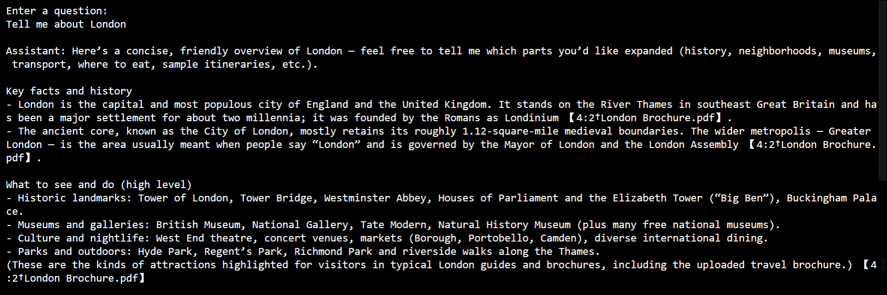

## Summary

In this lab, you have accomplished the following:
-   Provisioned an Azure OpenAI resource
-   Deployed an OpenAI model within the Microsoft Foundry portal
-   Used the power of OpenAI models to generate responses limited to a custom ingested data.

### You have successfully completed the lab.
