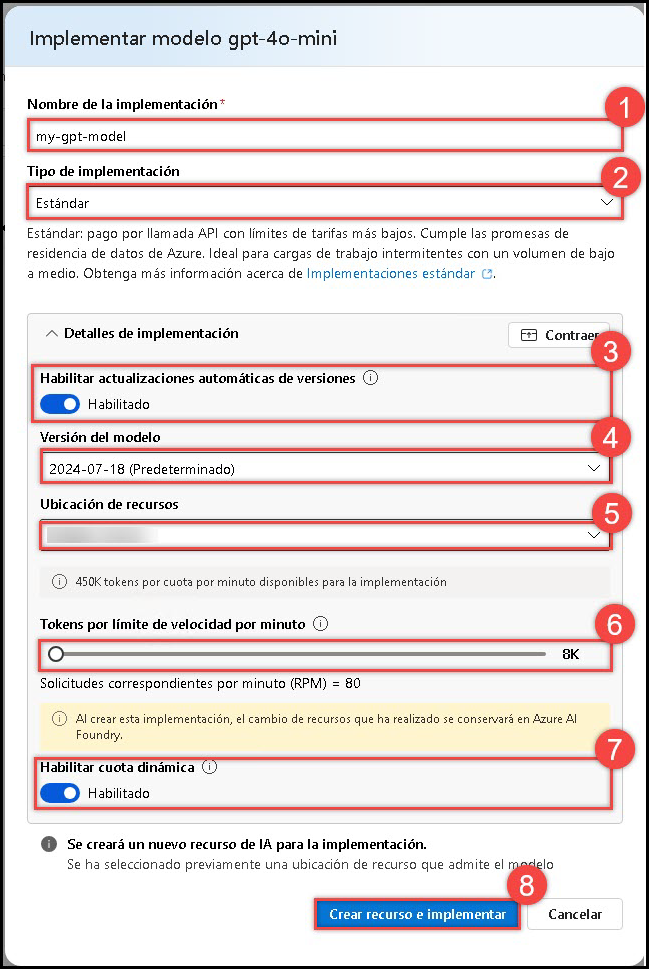
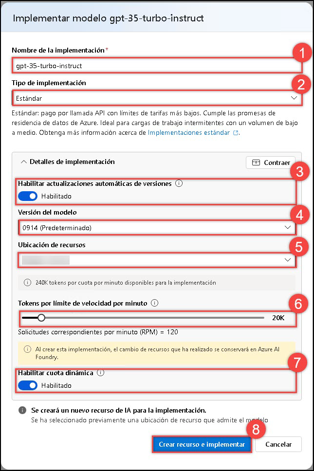
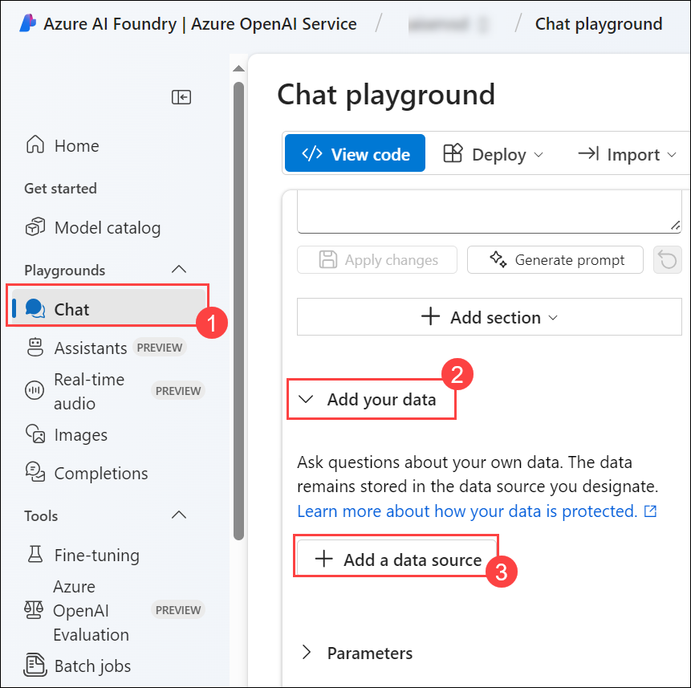
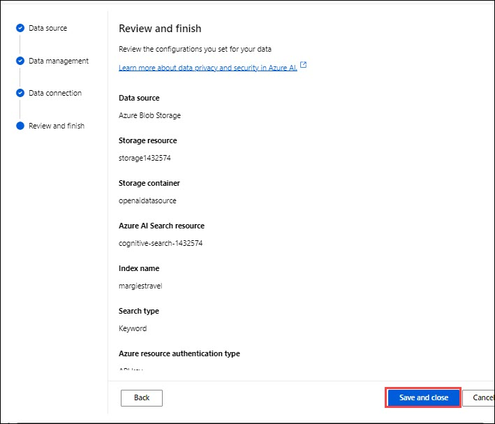

# ラボ 06: Azure OpenAI サービスを使用して RAG にデータを追加する

## ラボのシナリオ
Azure OpenAI サービスを使用すると、基礎となる LLM の知性を活用して独自のデータを使用できます。モデルを特定のトピックについてのみデータを使用するように制限したり、事前学習済みモデルの結果と組み合わせたりすることができます。

## ラボの目的
このラボでは、次のタスクを完了します：

- タスク 1: 独自のデータを追加せずに通常のチャット動作を観察する
- タスク 2: チャットプレイグラウンドにデータを接続する
- タスク 3: 独自のデータに基づいたモデルでチャットする
- タスク 4: Cloud Shell にアプリケーションをセットアップする
- タスク 5: アプリケーションを構成する
- タスク 6: アプリケーションを実行する

## 推定時間: 60 分

### タスク 1: 独自のデータを追加せずに通常のチャット動作を観察する

Azure OpenAI を独自のデータに接続する前に、基礎モデルがデータなしでクエリにどのように応答するかを観察します。

1. **Playground** セクションで、**Chat** ページを選択します。**Chat** プレイグラウンドページは、次の3つの主要セクションで構成されています：

   - **Setup** - モデルの応答のコンテキストを設定するために使用されます。
   - **Chat session** - チャットメッセージを送信し、応答を表示するために使用されます。

2. **deployment** セクションで、モデルのデプロイメント **my-gpt-model** が選択されていることを確認します。

3. **Setup** エリアでは、デフォルトのシステムメッセージが *You are an AI assistant that helps people find information* に設定されています。

4. In the **Chat session**, submit the following queries, and review the responses:

    ```
    I'd like to take a trip to New York. Where should I stay?
    ```
    ```
     ニューヨークに旅行したいのですが、どこに泊まるべきでしょうか？
    ```
    ```
    What are some facts about New York?
    ```
    ```
    ニューヨークについてのいくつかの事実を教えてください。
    ```


# ラボ 06: Azure OpenAI サービスを使用して RAG にデータを追加する

## ラボのシナリオ
Azure OpenAI サービスを使用すると、基礎となる LLM の知性を活用して独自のデータを使用できます。モデルを特定のトピックについてのみデータを使用するように制限したり、事前学習済みモデルの結果と組み合わせたりすることができます。

## ラボの目的
このラボでは、次のタスクを完了します：

- タスク 1: 独自のデータを追加せずに通常のチャット動作を観察する
- タスク 2: チャットプレイグラウンドにデータを接続する
- タスク 3: 独自のデータに基づいたモデルでチャットする
- タスク 4: Cloud Shell にアプリケーションをセットアップする
- タスク 5: アプリケーションを構成する
- タスク 6: アプリケーションを実行する

## 推定時間: 60 分

### タスク 1: 独自のデータを追加せずに通常のチャット動作を観察する

Azure OpenAI を独自のデータに接続する前に、基礎モデルがデータなしでクエリにどのように応答するかを観察します。

1. **Playground** セクションで、**Chat** ページを選択します。**Chat** プレイグラウンドページは、次の3つの主要セクションで構成されています：

   - **Setup** - モデルの応答のコンテキストを設定するために使用されます。
   - **Chat session** - チャットメッセージを送信し、応答を表示するために使用されます。

2. **deployment** セクションで、モデルのデプロイメント **my-gpt-model** が選択されていることを確認します。

3. **Setup** エリアでは、デフォルトのシステムメッセージが *You are an AI assistant that helps people find information* に設定されています。

### タスク 2: チャットプレイグラウンドにデータを接続する

このタスクでは、Azure OpenAI を独自のデータに接続する前に、基礎モデルがデータなしでクエリにどのように応答するかを観察します。

1. URL (https://aka.ms/own-data-brochures) をコピーしてブラウザに貼り付けます。ダウンロードされた `.zip` の PDF を抽出します。
   
2. **Azure ポータル**で、**Storage Account** を検索し、**Storage Account** を選択します。

   

3. **Storage Account** ページで、**Create** をクリックします。

   

4. 次の設定で**Storage Account**リソースを作成します：

    - **Subscription**: デフォルト - 事前割り当て済みサブスクリプション
    - **Resource group**: openai-<inject key="DeploymentID" enableCopy="false"></inject>
    - **Storage account name**: storage1<inject key="DeploymentID" enableCopy="false"></inject>
    - **Region**: <inject key="Region" enableCopy="false" /> を選択
    - **Redundancy**: Locally-redundant storage (LRS)
  
      

    - **Allow enable anonymous access on individual containers**: 詳細セクションでボックスにチェックを入れて有効にします。**Review + Create** をクリックし、その後 **Create** をクリックします。

      

5. ストレージアカウントが作成されるまで待ち、次のタスクに進む前に1分ほどかかります。

6. デプロイメントブレードで、**Go to resource** をクリックします。

    

7. **Storage Account | Container** ブレードで、**Create** をクリックします。

     

8. **openaidatasource** という名前のコンテナを作成し、コンテナの匿名アクセスレベルを有効にします。

      

9. タスク4の最初のステップでダウンロードおよび抽出されたすべてのファイルをコンテナにアップロードします。

      

10. **Azure ポータル**で、**Azure AI search** を検索し、**Azure AI search** を選択します。

11.  **Azure AI services | AI search** ブレードで、**Create** をクリックします。

     

12. 次の設定で **AI Search** リソースを作成し、**Review + Create** をクリックしてから **Create** をクリックします。

    - **Subscription**: デフォルト - 事前割り当て済みサブスクリプション
    - **Resource group**: openai-<inject key="DeploymentID" enableCopy="false"></inject>
    - **Service name**: cognitive-search-<inject key="DeploymentID" enableCopy="false"></inject>
    - **Location**: <inject key="Region" enableCopy="false" /> を選択
    - **Pricing tier**: **Basic** に変更

      

13. 検索リソースがデプロイされるまで待ちます。

14. **cognitive-search-<inject key="DeploymentID" enableCopy="false"></inject>** に移動し、概要ページでURLをコピーして、後で使用するためにメモ帳などのテキストエディタに貼り付けます。

       

15. 左のナビゲーションペインから**Keys** をクリックし、プライマリキーまたはセカンダリキーをコピーして、後で使用するためにメモ帳に貼り付けます。

      

16. **Azure AI Foundry ポータル**で、**Chat** プレイグラウンドに移動し、セットアップペインで *Add your data* を選択し、**+ Add a data source** をクリックします。

    
   
17. **Add data** で次の値をデータソースに入力し、**Next** をクリックします。

    - **Select data source**: Azure Blob Storage
    - **Select Azure Blob storage resouce**: 作成したストレージリソースを選択
    - **Select Storage container**: openaidatasource
    - **Select Azure AI Search resource**: 作成した検索リソースを選択
    - **Enter the index name**: margiestravel
    - **Indexer schedule**: Once
   
       

18. 次に進むには、"Data Management" をクリックします。
   
19. **Data management** ページで、ドロップダウンから **Keyword** 検索タイプを選択し、**Next** を選択します。

      

20. **Data connection** ページで **API key** を選択し、**Next** をクリックします。

       
   
22. **Review and finish** ページで **Save and close** を選択してデータを追加します。これには数分かかる場合があります。その間、ウィンドウを開いたままにしておく必要があります。完了したら、**Assistant setup** ペインの **Add your data(preview)** タブに、指定されたデータソース、検索リソース、およびインデックス **margiestravel** が存在することを確認します。

       

### タスク 3: 独自のデータに基づいたモデルでチャットする

このタスクでは、データを追加した後、以前と同じ質問を行い、応答がどのように異なるかを観察します。

```
I'd like to take a trip to New York. Where should I stay?
```
    
```
 ニューヨークに旅行したいのですが、どこに泊まるべきでしょうか？
```
    
   ```
   What are some facts about New York?
   ```
    
   ```
   ニューヨークについてのいくつかの事実を教えてください。
   ```

今回は、特定のホテルやMargie's Travelについての言及、情報源の参照など、非常に異なる応答が得られることに気づくでしょう。応答に記載されているPDF参照を開くと、モデルが提供したのと同じホテルが記載されているのがわかります。

接地データに含まれている他の都市、例えばドバイ、ラスベガス、ロンドン、サンフランシスコについても質問してみてください。

> **注意**: **Add your data** はまだプレビュー段階にあり、この機能の期待通りに動作しないことがあります。例えば、接地データに含まれていない都市の誤った参照を提供することがあります。

### タスク 4: Cloud Shell にアプリケーションをセットアップする

このタスクでは、Azure の Cloud Shell 上で実行される短いコマンドラインアプリケーションを使用して、Azure OpenAI モデルとの統合を実演します。Cloud Shell にアクセスするために新しいブラウザタブを開きます。

1. [Azure ポータル](https://portal.azure.com?azure-portal=true)で、検索ボックスの右側にある **[>_]** (*Cloud Shell*) ボタンを選択します。ポータルの下部に Cloud Shell ペインが開きます。

   

2. Cloud Shell ペインの左上に表示されるシェルの種類が *Bash* に切り替わっていることを確認します。*PowerShell* になっている場合は、ドロップダウンメニューを使用して *Bash* に切り替えます。

3. ターミナルが開いたら、**設定** をクリックし、**クラシック バージョンに戻す** を選択します。

   

4. ターミナルが起動したら、次のコマンドを入力してサンプルアプリケーションをダウンロードし、`azure-openai` というフォルダーに保存します。

    ```bash
   rm -r azure-openai -f
   git clone https://github.com/MicrosoftLearning/mslearn-openai azure-openai
    ```

5. ファイルは **azure-openai** という名前のフォルダーにダウンロードされます。この演習のラボファイルに移動するには、次のコマンドを使用します。

    ```bash
   cd azure-openai/Labfiles/06-use-own-data
    ```

     使用するコードファイルはC#とPythonの両方が提供されており、このラボで使用するサンプルコードも含まれています。

6. 組み込みのコードエディタを開いて、`sample-code` 内のコードファイルを確認できます。次のコマンドを使用して、コードエディタでラボファイルを開きます。

    ```bash
   code .
    ```

### タスク 5: アプリケーションを構成する

このタスクでは、Azure OpenAI リソースを使用できるようにアプリケーションの重要な部分を完成させます。

1. コードエディタで、希望する言語のフォルダーを展開します。

2. 言語の設定ファイルを開きます。

    - **C#**: `appsettings.json`
    - **Python**: `.env`

3. 次の設定値を更新します：
   - 作成した Azure OpenAI リソースからの **エンドポイント** と **キー**（前のタスクでコピーしたか、Azure ポータルの **Keys and Endpoint** ページで利用可能）
   - モデルデプロイメントのために指定した **デプロイメント名**（Azure AI Foundry ポータルの **Deployments** ページで利用可能な **my-gpt-model**）。
   - AI 検索サービスのエンドポイント（前のタスクでコピーしたか、Azure ポータルの AI 検索リソースの概要ページの **Url** 値で利用可能）。
   - 検索リソースの **キー**（Azure ポータルの AI 検索リソースの **Keys** ページで利用可能な管理者キーのいずれかを使用）。
   - 検索インデックスの名前（`margiestravel` である必要があります）。

   

4. 使用する言語のフォルダーに移動し、必要なパッケージをインストールします。

     **C#**:

    ```
    cd CSharp
    dotnet add package Azure.AI.OpenAI --version 1.0.0-beta.14
    ```

    **Python**:

    ```
    cd Python
    pip install python-dotenv
    pip install openai==1.56.2
    ```

5. 使用する言語のコードファイルを開き、コメント ***Configure your data source*** を Azure OpenAI SDK ライブラリを追加するコードに置き換えます。

    **C#**: ownData.cs

    ```csharp
    // Configure your data source
    AzureSearchChatExtensionConfiguration ownDataConfig = new()
    {
            SearchEndpoint = new Uri(azureSearchEndpoint),
            Authentication = new OnYourDataApiKeyAuthenticationOptions(azureSearchKey),
            IndexName = azureSearchIndex
    };
    ```

    **Python**: ownData.py

    ```python
    # Configure your data source
    extension_config = dict(dataSources = [  
            { 
                "type": "AzureCognitiveSearch", 
                "parameters": { 
                    "endpoint":azure_search_endpoint, 
                    "key": azure_search_key, 
                    "indexName": azure_search_index,
                }
            }]
        )
    ```

6. 残りのコードを確認し、データソース設定に関する情報を提供するために使用されるリクエスト本文の *拡張* の使用に注目します。

7. コードファイルに加えた変更を保存します。

## タスク 6: アプリケーションを実行する

このタスクでは、構成されたアプリケーションを実行してモデルにリクエストを送信し、応答を観察します。オプション間の唯一の違いはプロンプトの内容であり、その他のパラメータ（トークン数や温度など）は一貫しています。

このタスクでは、レビューされたコードを実行していくつかの画像を生成します。

1. Cloud Shell bash ターミナルで、希望する言語のフォルダーに移動します。

2. **C#** 言語を使用している場合は、**CSharp.csproj** ファイルを開き、次のコードに置き換えてファイルを保存します。

    ```
      <Project Sdk="Microsoft.NET.Sdk">
   
             <PropertyGroup>
             <OutputType>Exe</OutputType>
             <TargetFramework>net8.0</TargetFramework>
             <ImplicitUsings>enable</ImplicitUsings>
             <Nullable>enable</Nullable>
             </PropertyGroup>
   
              <ItemGroup>
              <PackageReference Include="Azure.AI.OpenAI" Version="1.0.0-beta.14" />
              <PackageReference Include="Microsoft.Extensions.Configuration" Version="8.0.*" />
              <PackageReference Include="Microsoft.Extensions.Configuration.Json" Version="8.0.*" />
              </ItemGroup>
   
              <ItemGroup>
                <None Update="appsettings.json">
                  <CopyToOutputDirectory>PreserveNewest</CopyToOutputDirectory>
                 </None>
               </ItemGroup>
   
      </Project>
    ```

2. 対話型ターミナルペインで、フォルダーコンテキストが希望する言語のフォルダーであることを確認します。次に、アプリケーションを実行するために以下のコマンドを入力します。

   - **C#**: `dotnet run`
   - **Python**: `python ownData.py`

   > **ヒント**: ターミナルツールバーの **パネルサイズの最大化** (**^**) アイコンを使用して、コンソールのテキストをより多く表示できます。

3. プロンプト `Tell me about London`(`ロンドンについて教えてください`) の応答を確認します。これは、回答とともに、検索サービスから取得したデータを使用してプロンプトを基づかせた詳細を含む必要があります。

## まとめ

このラボでは、次のことを達成しました：

- OpenAI モデルの力を使用して、カスタムで取り込まれたデータに限定された応答を生成しました。

### ラボを正常に完了しました。
