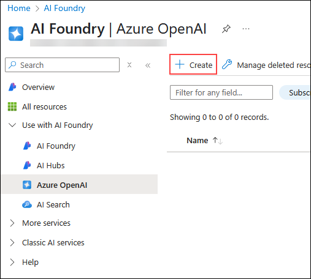
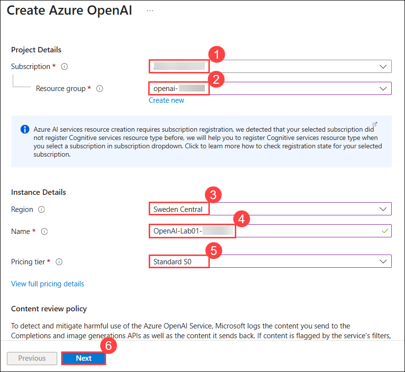
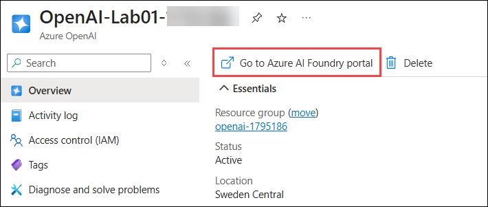
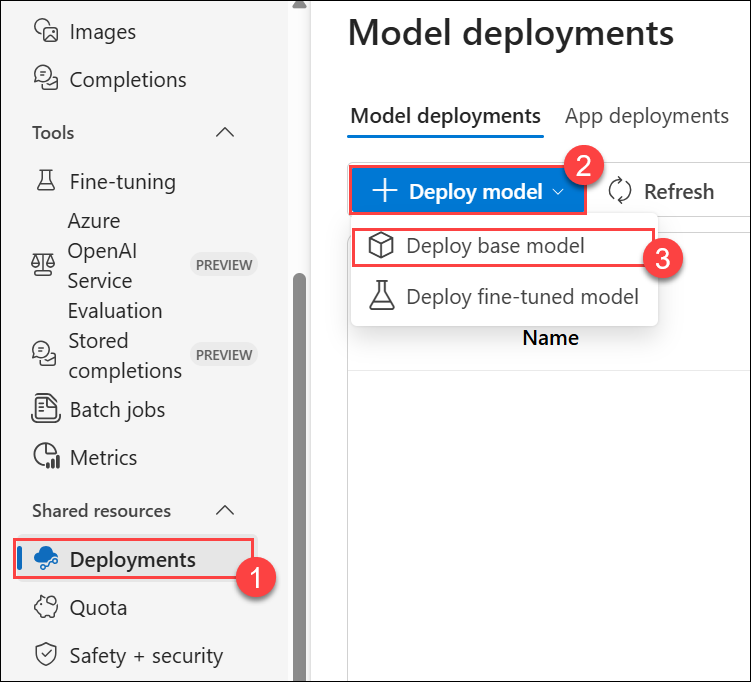
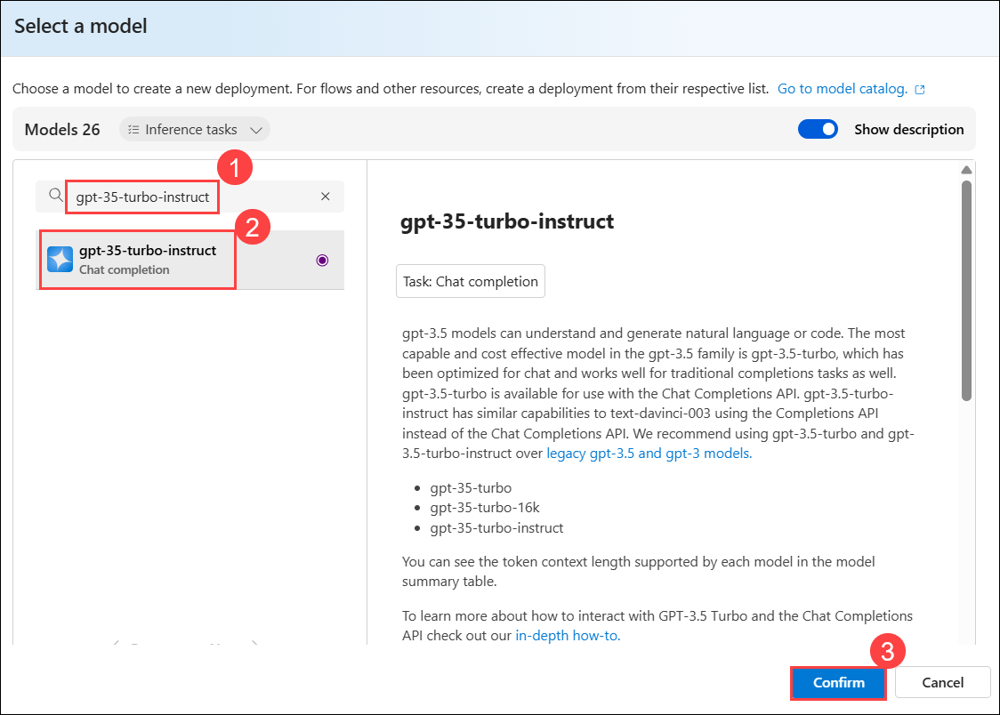
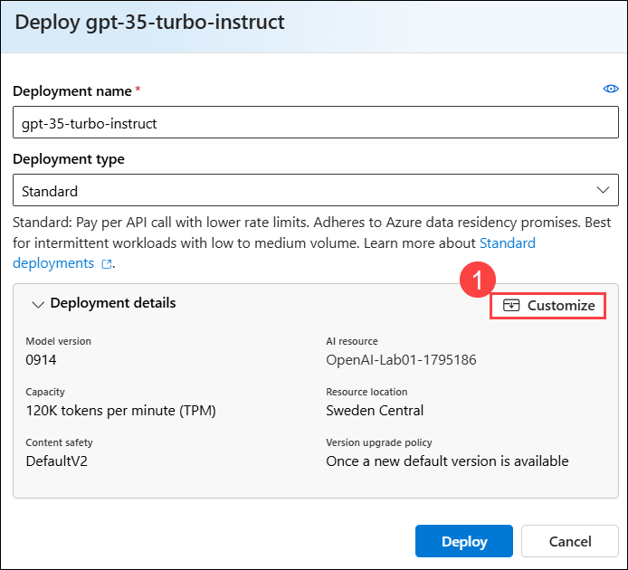
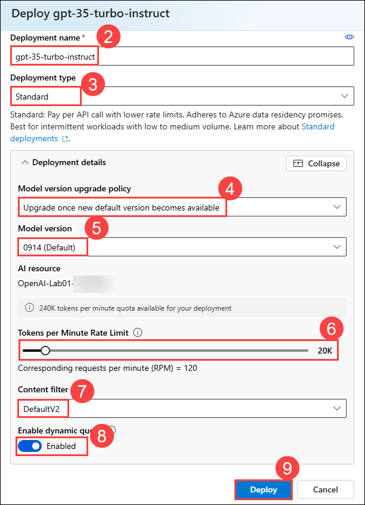

# Lab 04: Generate and improve code with Azure OpenAI Service

## Estimated Duration: 60 Minutes

## Lab Overview
In this lab, you will learn how to use Azure OpenAI Service to generate, explain, and improve code using natural language prompts. You will explore code generation in the chat playground and integrate OpenAI into your app to automate code tasks. This will help you enhance productivity by simplifying coding and debugging processes.

The Azure OpenAI Service models can generate code for you using natural language prompts, fixing bugs in completed code, and providing code comments. These models can also explain and simplify existing code to help you understand what it does and how to improve it.

## Lab Objectives
In this lab, you will complete the following tasks:

- Task 1: Provision an Azure OpenAI resource
- Task 2: Deploy a model
- Task 3: Generate code in the chat playground
- Task 4: Set up an application in Cloud Shell
- Task 5: Configure your application
- Task 6: Run your application

## Task 1: Provision an Azure OpenAI resource

In this task, you'll create an Azure resource in the Azure portal, selecting the OpenAI service and configuring settings such as region and pricing tier. This setup allows you to integrate OpenAI's advanced language models into your applications.

1. In the **Azure portal**, search for **Azure OpenAI (1)** and select **Azure OpenAI (2)**.

   

1. On **AI Foundry | Azure OpenAI** page, click on **+ Create**.

   

1. Create an **Azure OpenAI** resource with the following settings:

   | Settings | Action |
   | -- | -- |
   | **Subscription (1)** | Default - Pre-assigned subscription. |
   | **Resource group (2)** | openai-<inject key="DeploymentID" enableCopy="false"></inject> |
   | **Region (3)** | **Swedencentral** |
   | **Name (4)** | OpenAI-Lab01-<inject key="DeploymentID" enableCopy="false"></inject> |
   | **Pricing tier (5)** | Standard S0 |

   

1. Click on **Next (6)** thrice and then click on **Create**.

1. Wait for the deployment to complete. Once it's finished, click the **Go to resource** button to navigate to the deployed Azure OpenAI resource in the Azure portal.

## Task 2: Deploy a model

In this task, you'll deploy a specific AI model instance within your Azure OpenAI resource to integrate advanced language capabilities into your applications.

1. In the Azure OpenAI Overview page, click on **Go to Azure AI Foundry portal**, which will navigate to the **Azure AI Foundry portal**.

   

1. On the **Azure AI Foundry portal** page, select **Deployments (1)** under **Shared resources** from the left pane. Then, click **+ Deploy model (2)** and choose **Deploy base model (3)**.

     

1. On the Select a model page, search for **gpt-35-turbo-instruct (1)** model, select **gpt-35-turbo-instruct (chat completion) (2)** model from the list, and then click on **Confirm (3)**.

     
   
1. On the **Deploy gpt-35-turbo-instruct** interface, click on **Customize (1)** and enter the details as mentioned below, then click on **Deploy (9)** :

   | Settings | Action |
   | -- | -- |
   | **Deployment name (2)** | gpt-35-turbo-instruct |
   | **Deployment type (3)** | Standard |
   | **Model version upgrade policy (4)** | Upgrade once new default version becomes available. |
   | **Model version (5)** | 0914 (Default) |
   | **Tokens per Minute Rate Limit (thousands) (6)** | 20K |
   | **Content Filter (7)** | DefaultV2 |
   | **Enable dynamic quota(8)** | Enabled |

      

      

1. These will deploy models that you can experiment with for both chat and completion tasks as you go along.

      > **Note:** You can ignore any error related to the assignment of roles to view the quota limits.
   

## Task 3: Generate code in chat playground

In this task, you will examine how Azure OpenAI can generate and explain code in the Chat playground before using it in your app.

1. In [Azure AI Foundry portal](https://oai.azure.com/?azure-portal=true), navigate to the **Chat (1)** playground in the left pane and make sure that **my-gpt-model (2)** is selected.

   
   
1. Scroll down and in the **Chat session** section, enter the following prompt and press *Enter*.

    ```code
    Write a function in Python that takes a character and a string as input, and returns how many times that character appears in the string
    ```
    
1. The model will likely respond with a function, with some explanation of what the function does and how to call it.

1. Next, send the prompt:
   ```
   Do the same thing, but this time write it in C#.
   ```

1. Observe the output. The model likely responded very similarly as the first time, but this time coding in C#. You can ask it again for a different language of your choice, or a function to complete a different task, such as reversing the input string.

1. Next, let's explore using AI to understand code with this example of a random function you saw written in Ruby. Send the following prompt as the user query.

    ```code
    What does the following function do?  
    ---  
    def random_func(n)
      start = [0, 1]
      (n - 2).times do
        start << start[-1] + start[-2]
      end
      start.shuffle.each do |num|
        puts num
      end
    end
    ```

8. Observe the output, which explains what the function does in natural language.

9. Submit the following prompt to get a simpler version of the function.

   ```
   Can you simplify the function?
   ```   

10. Submit the below-mentioned prompt to add comments to the code.

      ```
      Add some comments to the function.
      ```
    
## Task 4: Set up an application in Cloud Shell

In this task, you will use a short command-line application running in Cloud Shell on Azure to demonstrate how to integrate with an Azure OpenAI model. Open a new browser tab to access Cloud Shell.

1. In the [Azure portal](https://portal.azure.com?azure-portal=true), select the **[>_]** (*Cloud Shell*) button at the top of the page to the right of the search box. A Cloud Shell pane will open at the bottom of the portal.

    

2. If you see the previously opened shell, click on the top right 'x' button to close it and open Cloudshell again.

   

3. Once the terminal opens, click on **Settings** and select **Go to Classic Version**.

   

5. The files are downloaded to a folder named **mslearn-openai**. Navigate to the lab files for this task using the following command.

    ```bash
    cd mslearn-openai/Labfiles/04-code-generation
    ```

   > **Note:** Applications for both C# and Python have been provided, as well as sample code we'll be using in this lab.

6. Open the built-in code editor, and you can observe the code files we'll be using in `sample-code`. Use the following command to open the lab files in the code editor.

      ```bash
     code .
      ```

## Task 5: Configure your application

In this task, you will complete key parts of the application to enable it to use your Azure OpenAI resource.

1. In the code editor, expand the language folder for your preferred language.

1. Open the configuration file for your language.

    - **C#:** `appsettings.json`
    - **Python:** `.env`

1. Update the configuration values to include the **endpoint** and **key** from the Azure OpenAI resource you created, as well as the name of your deployment, `my-gpt-model`. Then save the file by right-clicking on the file from the left pane and hit **Save**.

    

    

1. Navigate to the folder for your preferred language and install the necessary packages. Enter the below-mentioned command to add the `Azure.AI.OpenAI` package to your project, which is necessary for integrating with Azure OpenAI services.

   For **C#:** 

    ```
    cd CSharp
    dotnet add package Azure.AI.OpenAI --version 1.0.0-beta.5
    ```
    
    For **Python:**

      ```bash
    cd Python
    pip install openai==1.65.2
    ```
      
   
      > **Note:** If you receive a permission error after executing the installation command as shown in the above image, please run the command below for installation/
      > ```bash
      > pip install --user openai==1.65.2
      > ```

1. Open the application code file of your preferred language and briefly observe the code. 

    - **C#:** `Program.cs`
    - **Python:** `code-generation.py`

## Task 6: Run your application

In this task, you will run your configured app to generate code for each use case, which is numbered in the app and can be executed in any order.

> **Note:** Some users may experience rate limiting if calling the model too frequently. If you hit an error about a token rate limit, wait for a minute then try again.

1. In the code editor, expand the `sample-code` folder and briefly observe the function and the app for your language. The OpenAI tool will use these files to generate the responses. 
   
1. In the Cloud Shell bash terminal, navigate to the folder for your preferred language.

1. Run the application.

    - **C#:** `dotnet run`
    - **Python:** `python code-generation.py`

      >**Note:** If you encounter any errors after running the Python script, try upgrading the OpenAI package by running the following command: `pip install --user --upgrade openai`

1. Choose option **1** to add comments to your code. Note, the response might take a few seconds for each of these tasks.

1. In the response, you will see that OpenAI has added comments to your sample code provided from the function file. 

1. Next, choose option **2** to write unit tests for that same function.

1. In the response, you will notice that the unit tests are added to your sample code.

1. Next, choose option **3** to fix bugs in an app for playing Go Fish. 

1. This time, OpenAI would use the go fish file and fix the code in it and respond with the updated code. 

1. The results will replace what was in `result/app.txt`, and should have very similar code with a few things corrected.

    - **C#:** Fixes are made on lines 30 and 59
    - **Python:** Fixes are made on lines 18 and 31

        >**Note:** Click on Ctrl+C to stop the project.

10. To check the results, paste the following code in the terminal:

    ```
    cd result
    ```

11. Copy the below command in the terminal to see the contents of the app.txt file.

     ```
     cat app.txt
     ```

The app for Go Fish in `sample-code` can be run if you replace the lines with bugs with the response from Azure OpenAI. If you run it without the fixes, it will not work correctly.

It's important to note that even though the code for this Go Fish app was corrected for some syntax, it's not a strictly accurate representation of the game. If you look closely, there are issues with not checking if the deck is empty when drawing cards, not removing pairs from the player's hand when they get a pair, and a few other bugs that require an understanding of card games to realize. This is a great example of how useful generative AI models can be to assist with code generation, but they can't be trusted as correct and need to be verified by the developer.

If you would like to see the full response from Azure OpenAI, you can set the `printFullResponse` variable to `True` and rerun the app.

## Summary

In this lab, you have accomplished the following:
-   Use the functionalities of the Azure OpenAI to generate and improvise code for your production applications.

### Congratulations on successfully completing the lab! Click Next >> to continue to the next lab.


