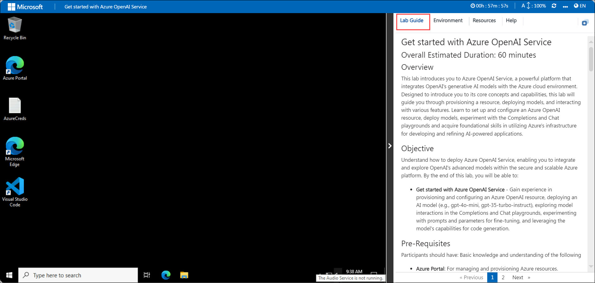
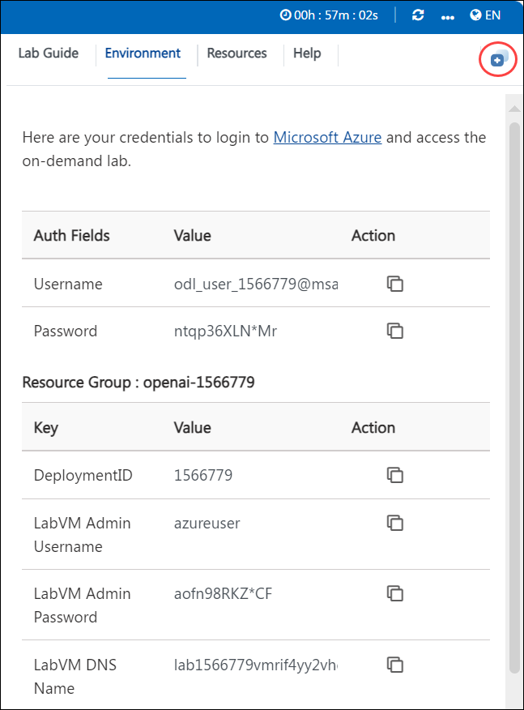

# Get started with Azure OpenAI Service

## Overall Estimated Duration: 60 minutes

## Overview

This lab introduces you to Azure OpenAI Service, a powerful platform that integrates OpenAI's generative AI models with the Azure cloud environment. Designed to introduce you to its core concepts and capabilities, this lab will guide you through provisioning a resource, deploying models, and interacting with various features. Learn to set up and configure an Azure OpenAI resource, deploy models, experiment with the Completions and Chat playgrounds and acquire foundational skills in utilizing Azure's infrastructure for developing and refining AI-powered applications.

## Objective

Understand how to deploy Azure OpenAI Service, enabling you to integrate and explore OpenAI's advanced models within the secure and scalable Azure platform. By the end of this lab, you will be able to:

- **Get started with Azure OpenAI Service** - Gain experience in provisioning and configuring an Azure OpenAI resource, deploying an AI model (e.g., gpt-4o-mini, gpt-35-turbo-instruct), exploring model interactions in the Completions and Chat playgrounds, experimenting with prompts and parameters for fine-tuning, and leveraging the model's capabilities for code generation.

## Pre-Requisites

Participants should have: Basic knowledge and understanding of the following

- **Azure Portal**: For managing and provisioning Azure resources.
- **Azure AI Foundry**: For deploying models and experimenting with their capabilities, including features such as the Completions and Chat playgrounds.

## Architecture

This architecture allows users to leverage Azure's cloud infrastructure to deploy and interact with advanced AI models. Through the Azure Portal, users manage their resources, while Azure AI Foundry provides the tools needed to deploy and test these models. The Completions and Chat playgrounds within Azure AI Foundry enable hands-on experimentation and refinement, facilitating the development of robust AI-powered applications.

## Architecture Diagram:

## Explanation of Components

- **Azure Portal**: Central interface for provisioning and managing Azure OpenAI resources, including model deployment settings and resource configuration.

- **Azure OpenAI Service**: Hosts and manages OpenAI models like GPT-35-Turbo, providing scalable access for tasks such as text completion and code generation.

- **Azure AI Foundry**: Interactive environment for deploying and experimenting with AI models. It includes the Completions Playground for generating text and the Chat Playground for simulating conversational interactions.

## Getting Started with the Lab

Welcome to your Get started with Azure OpenAI Service Workshop! We've prepared a seamless environment for you to explore and learn about Azure services. Let's begin by making the most of this experience.
 
## Accessing Your Lab Environment
 
Once you're ready to dive in, your virtual machine and lab guide will be right at your fingertips within your web browser.
 

### Virtual Machine & Lab Guide
 
Your virtual machine is your workhorse throughout the workshop. The lab guide is your roadmap to success.
 
## Exploring Your Lab Resources
 
To get a better understanding of your lab resources and credentials, navigate to the **Environment Details** tab.
 

 
## Utilizing the Split Window Feature
 
For convenience, you can open the lab guide in a separate window by selecting the **Split Window** button from the Top right corner.
 

 
## Managing Your Virtual Machine
 
Feel free to start, stop, or restart your virtual machine as needed from the **Resources** tab. Your experience is in your hands!
 

## Lab Guide Zoom In/Zoom Out

1. To adjust the zoom level for the environment page, click the **A↕ : 100%** icon located next to the timer in the lab environment.

   

## Let's Get Started with Azure Portal
 
1. On your virtual machine, click on the Azure Portal icon as shown below:

 
      .png)
   
 
2. You'll see the **Sign into Microsoft Azure** tab. Here, enter your credentials:
 
   - **Email/Username:** <inject key="AzureAdUserEmail"></inject>
 
       
 
3. Next, provide your password:
 
   - **Password:** <inject key="AzureAdUserPassword"></inject>
 
       
 
4. If prompted to stay signed in, you can click "No."
 
5. If a **Welcome to Microsoft Azure** pop-up window appears, simply click "Maybe Later" to skip the tour.
 
## Support Contact

The CloudLabs support team is available 24/7, 365 days a year, via email and live chat to ensure seamless assistance at any time. We offer dedicated support channels tailored specifically for both learners and instructors, ensuring that all your needs are promptly and efficiently addressed.

Learner Support Contacts:

- Email Support: cloudlabs-support@spektrasystems.com

- Live Chat Support: https://cloudlabs.ai/labs-support

Now, click on Next from the lower right corner to move on to the next page.

.png)

### Happy Learning!!
