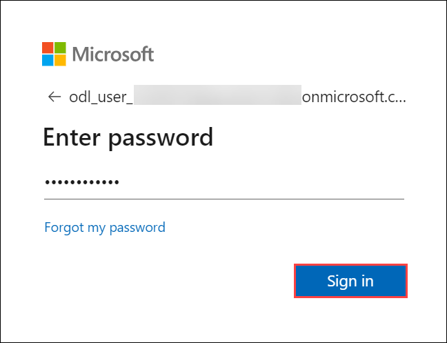

# Getting Started with Your Generate images with a DALL-E model

### Overall Estimated Duration: 60 minutes

## Overview

In this hands-on-lab, you will explore the capabilities of Azure OpenAI Service models  you will gain an understanding of how these models can explain and simplify complex code, making it easier to comprehend and improve. The lab will also introduce you to the DALL-E model, where you will practice generating original images by submitting natural language prompts, focusing on the creative potential of AI in visual content creation.

## Objective 

- **Generate images with a DALL-E model**: The goal of this hands-on activity is to produce and alter images using the DALL-E model. To attain the intended visual results, you will develop and alter images using the DALL-E model.

## Prerequisites

1. **Development Skills**: Basic programming knowledge and experience with APIs and SDKs.
2. **AI Concepts**: Understanding prompt engineering, code development, and image generation using models such as DALL-E.
3. **Content Management**: Understanding data integration for RAG and content filtering techniques.

## Architecture

In this hands-on lab, you will follow an architecture flow that begins with exploring Azure OpenAI Service models, where you'll use natural language prompts to generate and enhance code. The flow progresses through stages of code generation, bug fixing, and detailed commenting, leveraging AI to simplify and explain complex code. The final stage introduces the DALL-E model, where you'll practice generating original images from natural language prompts, highlighting the creative potential of AI in visual content creation. This flow seamlessly integrates AI-driven coding and creative image generation, providing a comprehensive understanding of Azure OpenAI's capabilities.

## Architecture Diagram

## Explanation of Components

- **Azure OpenAI**: Integrates your data with massive language models, allowing for personalized and secure interactions.Allows for fine-tuning of AI models with your own datasets, resulting in specialized and relevant outputs for your business needs.
- **Azure OpenAI Models**: Provides pre-trained and customisable big language models for a variety of AI applications, including text generation, sentiment analysis, and language translation, with the option to tailor models to specific use cases.
- **Azure CloudShell**: Offers an online, browser-based shell for managing Azure resources and running scripts.Allows you to deploy, manage, and automate Azure services directly from your web browser, eliminating the need for local installations.
- **DALL-E**: DALL-E uses artificial intelligence technology to generate visuals from written descriptions.Enhances creativity by translating word inputs into distinct and coherent pictures.

## Getting Started with the Lab

Once the environment is provisioned, a virtual machine (JumpVM) and lab guide will get loaded in your browser. Use this virtual machine throughout the workshop to perform the lab. You can see the number on the bottom of the Lab guide to switch to different exercises of the lab guide.
 
## Accessing Your Lab Environment
 
Once you're ready to dive in, your virtual machine and lab guide will be right at your fingertips within your web browser.
 

### Virtual Machine & Lab Guide
 
Your virtual machine is your workhorse throughout the workshop. The lab guide is your roadmap to success.
 
## Exploring Your Lab Resources
 
To get a better understanding of your lab resources and credentials, navigate to the **Environment Details** tab.
 

 
## Utilizing the Split Window Feature
 
For convenience, you can open the lab guide in a separate window by selecting the **Split Window** button from the Top right corner.
 

 
## Managing Your Virtual Machine
 
Feel free to start, stop, or restart your virtual machine as needed from the **Resources** tab. Your experience is in your hands!
 

## Lab Validation

1. After completing the task, hit the **Validate** button under Validation tab integrated within your lab guide. If you receive a success message, you can proceed to the next task, if not, carefully read the error message and retry the step, following the instructions in the lab guide.

   

1. You can also validate the task by navigating to the **Lab Validation** tab, from the upper right corner in the lab guide section.

   

1. If you need any assistance, please contact us at labs-support@spektrasystems.com.

## Let's Get Started with Azure Portal
 
1. On your virtual machine, click on the Azure Portal icon as shown below:
 
   .png)
 
2. You'll see the **Sign into Microsoft Azure** tab. Here, enter your credentials:
 
   - **Email/Username:** <inject key="AzureAdUserEmail"></inject>
 
       
 
3. Next, provide your password:
 
   - **Password:** <inject key="AzureAdUserPassword"></inject>
 
       
 
4. If prompted to stay signed in, you can click "No."
 
5. If a **Welcome to Microsoft Azure** pop-up window appears, simply click "Maybe Later" to skip the tour.
 
6. Click "Next" from the bottom right corner to embark on your Lab journey!
 
     .png)

## Support Contact

The CloudLabs support team is available 24/7, 365 days a year, via email and live chat to ensure seamless assistance at any time. We offer dedicated support channels tailored specifically for both learners and instructors, ensuring that all your needs are promptly and efficiently addressed.

Learner Support Contacts:

- Email Support: labs-support@spektrasystems.com

- Live Chat Support: https://cloudlabs.ai/labs-support

Now, click on Next from the lower right corner to move on to the next page.

### Happy Learning!!

