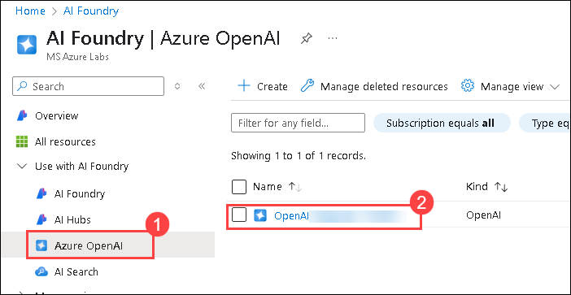
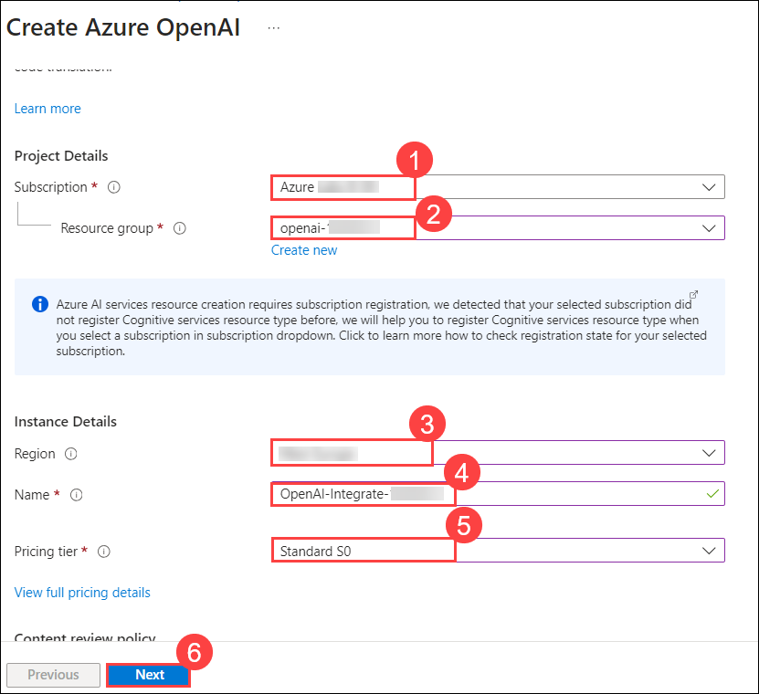
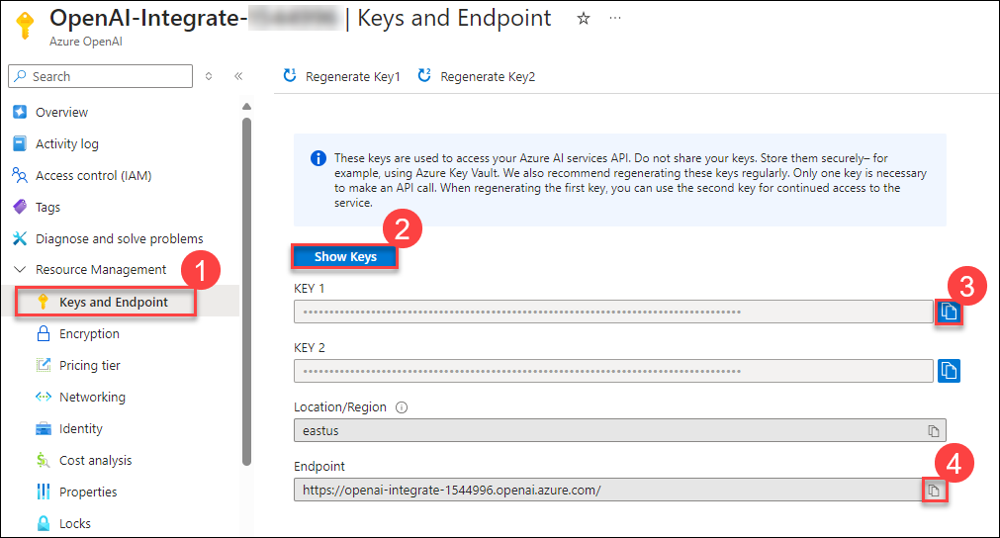
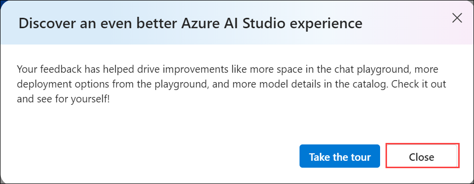
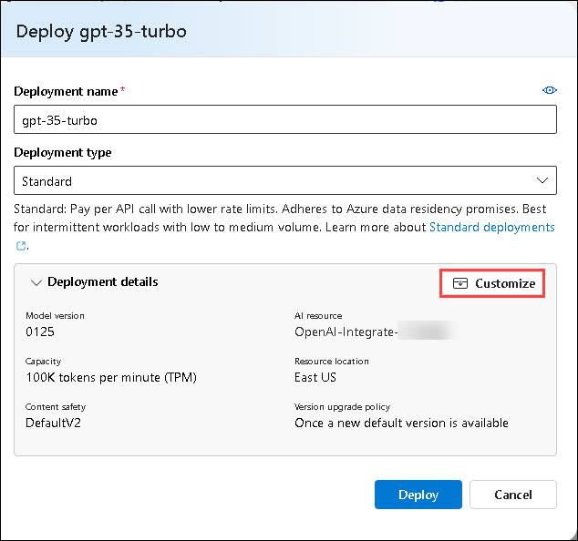
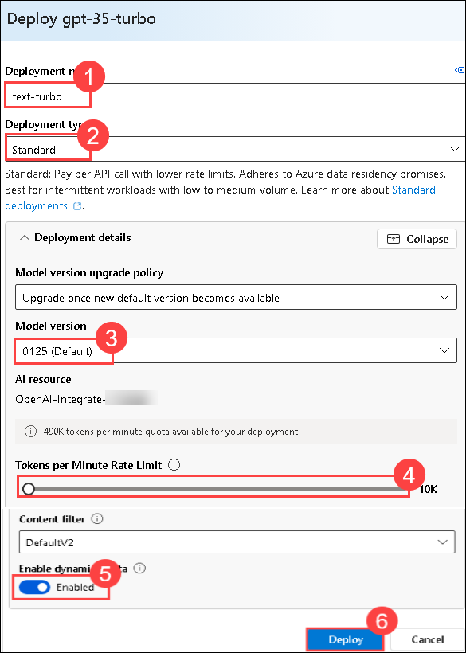
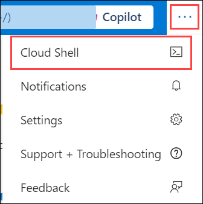
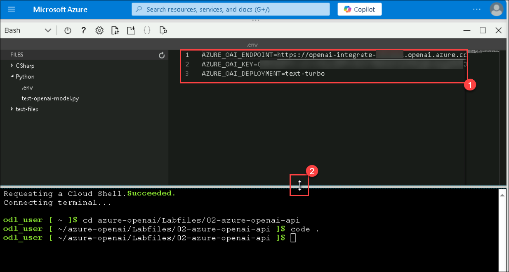

# Hands-On Lab: Use Azure OpenAI SDKs in your App

## Estimated time: 60 minutes

With the Azure OpenAI Service, developers can create chatbots, language models, and other applications that excel at understanding natural human language. The Azure OpenAI provides access to pre-trained AI models, as well as a suite of APIs and tools for customizing and fine-tuning these models to meet the specific requirements of your application. In this exercise, you'll learn how to deploy a model in Azure OpenAI and use it in your own application.

In the scenario for this exercise, you will perform the role of a software developer who has been tasked to implement an app that can use generative AI to help provide hiking recommendations. The techniques used in the exercise can be applied to any app that wants to use Azure OpenAI APIs.

## Lab objectives
In this lab, you will complete the following tasks:

- Task 1: Provision an Azure OpenAI resource
- Task 2: Deploy a model
- Task 3: Set up an application in Cloud Shell
- Task 4: Configure your application
- Task 5: Test your application
- Task 6: Maintain conversation history

## Task 1: Provision an Azure OpenAI resource

In this task, you'll create an Azure resource in the Azure portal, selecting the OpenAI service and configuring settings such as region and pricing tier. This setup allows you to integrate OpenAI's advanced language models into your applications.

1. In the **Azure portal**, search for **OpenAI (1)** and select **Azure OpenAI (2)**.

   

2. On the **AI Foundry** page, select **Azure OpenAI (1)** from the menu on the left, then click **+ Create (2)**.

   

3. Create an **Azure OpenAI** resource with the following settings 

    - **Subscription (1)**: Default - Pre-assigned subscription
    
    - **Resource group (2)**: Select **openai-<inject key="DeploymentID" enableCopy="false"></inject>** from the drop-down.
    
    - **Region (3)**: Select <inject key="Region" enableCopy="false" />
    
    - **Name (4)**: OpenAI-Integrate-<inject key="DeploymentID" enableCopy="false"></inject>
    
    - **Pricing tier (5)**: Standard S0
    
    -  Click on **Next (6)** thrice
  
       

4. Click on **Create**.

5. Once the deployment is completed, click on **Go to resource** to access the deployed Azure OpenAI resource in the Azure portal.

   > **Note:** If prompted to the **openai-<inject key="DeploymentID" enableCopy="false"></inject>** RG, scroll down & select the **OpenAI-Integrate-<inject key="DeploymentID" enableCopy="false"></inject>** resource from the Resources section.

6. In the **OpenAI-Integrate-<inject key="DeploymentID" enableCopy="false"></inject>**, blade to capture the Keys and Endpoint values:

   - Navigate to **Keys and Endpoint (1)** under **Resource Management** from the menu on left.  
   
   - Click **Show Keys (2)** and copy **Key 1 (3)**. Save it in a text editor like **Notepad**.  
   
   - Copy the **Endpoint (4)** and save it in Notepad for future reference.

        

### Validation

<validation step="7c4e3561-5bcf-4427-a50e-bdb11b1f5113" />

> **Congratulations** on completing the task! Now, it's time to validate it. Here are the steps:
> - Hit the Validate button for the corresponding task. If you receive a success message, you can proceed to the next task. 
> - If not, carefully read the error message and retry the step, following the instructions in the lab guide.
> - If you need any assistance, please contact us at cloudlabs-support@spektrasystems.com. We are available 24/7 to help you out.

## Task 2: Deploy a model

In this task, you'll deploy a specific AI model instance within your Azure OpenAI resource to integrate advanced language capabilities into your applications.

1. From the left navigation pane, click on **Overview (1)** and click on **Go to Azure AI Foundry portal (2)**. 

   

1. If prompted, **Discover an even better Azure AI Studio experience**, click **Close**.

      

1. From the left navigation pane, select **Deployments (1)** under Shared resources, click on **+ Deploy model (2)**, Choose **Deploy base model (3)**.

    

1. On the **Select a Model** pane, search for **gpt-35-turbo (1)**, select it from the results **(2)**, and click **Confirm (3)** to proceed.

    

    >**Note** : If the **GPT-35-Turbo** model isn't available, choose **GPT-35-Turbo-16k** or select **GPT-4o-mini**, and follow the below steps. 

7. Within the **Deploy model** pop-up interface, click on **Customize** and enter the following details:

    
   
    - **Deployment name (1)**: text-turbo
    
    - **Deployment type (2)**: Standard
    
    - **Model version (3)**: Choose **0125 (Default)** from the dropdown.
    
    - **Tokens per Minute Rate Limit (thousands) (4)**: 10K
    
    - **Enable dynamic quota (5)**: Enabled
    
    - Click on **Deploy (6)**

        

9. This will deploy a model that you will be playing around with as you proceed.

   > **Note**: You can ignore the **Failed to fetch deployments quota information** notification.
   
   > **Note**: Each Azure OpenAI model is optimized for a different balance of capabilities and performance. We'll use the **3.5 Turbo** model series in the **GPT-3** model family in this exercise, which is highly capable of language understanding. This exercise only uses a single model, however, deployment and usage of other models you deploy will work in the same way.

### Validation

<validation step="64adeae3-05e0-4fbd-84bb-176e70a4b3ce" />

> **Congratulations** on completing the task! Now, it's time to validate it. Here are the steps:
> - Hit the Validate button for the corresponding task. If you receive a success message, you can proceed to the next task. 
> - If not, carefully read the error message and retry the step, following the instructions in the lab guide.
> - If you need any assistance, please contact us at cloudlabs-support@spektrasystems.com. We are available 24/7 to help you out.

## Task 3: Set up an application in Cloud Shell

In this task, you will integrate with an Azure OpenAI model by using a short command-line application running in Cloud Shell on Azure. Open a new browser tab to work with Cloud Shell.

1. In the [Azure portal](https://portal.azure.com?azure-portal=true), select the **[>_]** (*Cloud Shell*) button at the top of the page to the right of the search box. A Cloud Shell pane will open at the bottom of the portal.

    

    >**Note:** If you don't see the Cloud Shell icon, click on the **ellipsis (...)** button and select **Cloud Shell**.

    

1. The first time you open the Cloud Shell, you may be prompted to choose the type of shell you want to use (*Bash* or *PowerShell*). Select **Bash**. If you don't see this option, skip the step.

   

1. Within the Getting Started pane, select **Mount storage account (1)**, select your **Storage account subscription (2)** from the dropdown and click **Apply (3)**.

   

1. Within the **Mount storage account** pane, select **I want to create a storage account (1)** and click **Next (2)**.

   

1. Within the **Create Storage account** pane, enter the following details:

    - **Subscription (1)**: Default- Choose the only existing subscription assigned for this lab
    
    - **Resource group (2)**: Select **openai-<inject key="DeploymentID" enableCopy="false"></inject>**
        
    - **Region (3)**: **<inject key="Region" enableCopy="false" />**
    
    - **Storage account name (4)**: Enter **storage<inject key="DeploymentID" enableCopy="false"></inject>**
    
    - **File share (5)**: Create a new file share named **none**
    
    - Click on **Create (6)**

       

1. Note that you can resize the cloud shell by dragging the separator bar at the top of the page, or by using the **&#8212;**, **&#9723;**, and **X** icons at the top right of the page to minimize, maximize, and close the pane. For more information about using the Azure Cloud Shell, see the [Azure Cloud Shell documentation](https://docs.microsoft.com/azure/cloud-shell/overview). 

1. Once the terminal opens, click on **Settings** and select **Go to Classic Version**.

   

1. Once the terminal starts, enter the following command to download the sample application and save it to a folder called `azure-openai`.

    ```bash
    rm -r azure-openai -f
    ```
    
    ```bash
    git clone https://github.com/MicrosoftLearning/mslearn-openai azure-openai
    ```
  
1. The files are downloaded to a folder named **azure-openai**. Navigate to the lab files for this exercise using the following command.

    ```bash
    cd azure-openai/Labfiles/01-app-develop
    ```

   Applications for both C# and Python have been provided, as well as a sample text file you'll use to test the summarization. Both apps feature the same functionality.

1. Open the built-in code editor using the following command to view the lab files, including the CSharp and Python folders, which contain the application code for each language:

      ```bash
      code .
      ```

            
 
   💡 Use the left pane in the editor to explore the CSharp and Python folders. You will be updating configuration files and application logic in these directories in the upcoming steps.  

### Validation

<validation step="a9ae28f4-8e25-42f3-b7bd-5372ab99091f" />

> **Congratulations** on completing the task! Now, it's time to validate it. Here are the steps:
> - Hit the Validate button for the corresponding task. If you receive a success message, you can proceed to the next task. 
> - If not, carefully read the error message and retry the step, following the instructions in the lab guide.
> - If you need any assistance, please contact us at cloudlabs-support@spektrasystems.com. We are available 24/7 to help you out.


## Task 4: Configure your application

In this task, you will complete key parts of the application to enable it to use your Azure OpenAI resource.

  >**Note**: Due to time constraints, please proceed with either the CSharp or Python subtask based on your preference. If time allows, you are encouraged to explore the other option as well.

### Subtask 4.1: Configure the CSharp application

1. In the **code editor**, expand the **CSharp** folder.

2. Open the `appsettings.json` file and update the configuration values to include the **Endpoint**, **Key**, and the **model name** `text-turbo` from the Azure OpenAI resource created and saved in Task 1. Save the file by right-clicking it in the left pane and selecting **Save or CTRL+S**.

3. Open the `CSharp.csproj` file, delete the existing code, and replace it with the following:

   ```xml
   <Project Sdk="Microsoft.NET.Sdk">

   <PropertyGroup>
   <OutputType>Exe</OutputType>
   <TargetFramework>net8.0</TargetFramework>
   <ImplicitUsings>enable</ImplicitUsings>
   <Nullable>enable</Nullable>
   </PropertyGroup>

    <ItemGroup>
    <PackageReference Include="Azure.AI.OpenAI" Version="1.0.0-beta.14" />
    <PackageReference Include="Microsoft.Extensions.Configuration" Version="8.0.404" />
    <PackageReference Include="Microsoft.Extensions.Configuration.Json" Version="8.0.404" />
    </ItemGroup>

    <ItemGroup>
      <None Update="appsettings.json">
        <CopyToOutputDirectory>PreserveNewest</CopyToOutputDirectory>
       </None>
    </ItemGroup>

   </Project>
   ```

   > 

4. In the **Azure Cloud Shell**, run the following commands to set up the local .NET SDK:

   ```bash
   cd CSharp
   export DOTNET_ROOT=$HOME/.dotnet
   export PATH=$DOTNET_ROOT:$PATH
   mkdir -p $DOTNET_ROOT
   wget https://dotnet.microsoft.com/download/dotnet/scripts/v1/dotnet-install.sh
   chmod +x dotnet-install.sh
   ./dotnet-install.sh --version 8.0.404 --install-dir $DOTNET_ROOT
   ```

5. Restore the workload:

   ```bash
   dotnet workload restore
   ```

6. Add the required NuGet package:

   ```bash
   dotnet add package Azure.AI.OpenAI --version 1.0.0-beta.14
   ```

7. Open `Program.cs`, and replace the comment `// Add Azure OpenAI package` with the following:

   ```csharp
   using Azure.AI.OpenAI;
   ```

8. Replace the comment `// Initialize the Azure OpenAI client...` with the following code:

   ```csharp
   OpenAIClient client = new OpenAIClient(new Uri(oaiEndpoint), new AzureKeyCredential(oaiKey));

   string systemMessage = "I am a hiking enthusiast named Forest who helps people discover hikes in their area. If no area is specified, I will default to near Rainier National Park. I will then provide three suggestions for nearby hikes that vary in length. I will also share an interesting fact about the local nature of the hikes when making a recommendation.";
   ```

9. Replace the comment `// Add code to send request...` with:

   ```csharp
   ChatCompletionsOptions chatCompletionsOptions = new ChatCompletionsOptions()
   {
       Messages =
       {
           new ChatRequestSystemMessage(systemMessage),
           new ChatRequestUserMessage(inputText),
       },
       MaxTokens = 400,
       Temperature = 0.7f,
       DeploymentName = oaiDeploymentName
   };

   ChatCompletions response = client.GetChatCompletions(chatCompletionsOptions);
   string completion = response.Choices[0].Message.Content;
   Console.WriteLine("Response: " + completion + "\n");
   ```

10. Save your changes by right-clicking on the file and selecting **Save**.

### Subtask 4.2: Configure the Python application

1. In the **code editor**, expand the **Python** folder.

2. Open the `.env` file and update the configuration values with the **Endpoint**, **Key**, and **model name** `text-turbo` from Task 1. Save the file by right-clicking it in the left pane and selecting **Save**.

   > 💡 You can use the ↕ icon to minimize the lab files in the code editor.
   > 

3. In the **Azure Cloud Shell**, run the following commands to install necessary packages:

   ```bash
   cd ~/azure-openai/Labfiles/01-app-develop
   cd Python
   pip install --user python-dotenv
   pip install --user openai==1.56.2
   ```

4. Open `application.py` and replace the comment `# Add Azure OpenAI package` with:

   ```python
   from openai import AzureOpenAI
   ```

5. Replace the comment `# Configure the Azure OpenAI client...` with:

   ```python
   client = AzureOpenAI(
       azure_endpoint=azure_oai_endpoint,
       api_key=azure_oai_key,
       api_version="2024-02-15-preview"
   )

   system_message = """I am a hiking enthusiast named Forest who helps people discover hikes in their area. 
       If no area is specified, I will default to near Rainier National Park. 
       I will then provide three suggestions for nearby hikes that vary in length. 
       I will also share an interesting fact about the local nature on the hikes when making a recommendation."""
   ```

6. Replace the comment `# Format and send the request to the model...` with:

   ```python
   response = client.chat.completions.create(
       model=azure_oai_deployment,
       temperature=0.7,
       max_tokens=400,
       messages=[
           {"role": "system", "content": system_message},
           {"role": "user", "content": input_text}
       ]
   )
   generated_text = response.choices[0].message.content
   print("Response: " + generated_text + "\n")
   ```

7. Save your changes by right-clicking on the file and selecting **Save**.

## Task 5: Test your application

In this task, you will run your configured app to send a request to your model and observe the response.

1. In the Cloud Shell bash terminal, navigate to the folder for your preferred language.
   
1. In the interactive terminal pane, ensure the folder context is the folder for your preferred language. Then enter the following command to run the application.

    - **C#:**
      ```bash
      cd ~/azure-openai/Labfiles/01-app-develop
      cd CSharp
      ```
      
      ` dotnet run`

          
    
    - **Python:**
      ```bash
      cd ~/azure-openai/Labfiles/01-app-develop
      cd Python
      ```
      `python application.py`

          

       > **Tip**: You can use the **Maximize panel size** (**^**) icon in the terminal toolbar to see more of the console text.

         

        > **Note:** The above image shows the example for the Python.  

1. When prompted, enter the text `What hike should I do near Rainier?` and click on `Enter`.

    - **C#**:

       

    - **Python**:

             

1. Observe the output, taking note that the response follows the guidelines provided in the system message you added to the *messages* array.

1. Provide the prompt `Where should I hike near Boise? I'm looking for something of easy difficulty, between 2 to 3 miles, with moderate elevation gain.` and observe the output.

7. In the code file for your preferred language, change the *temperature* parameter value in your request to **1.0** and Save the file.

   - **C#:** Program.cs
   
   - **Python:** application.py

8. Run the application again using the prompts above, and observe the output.

Increasing the temperature often causes the response to vary, even when provided the same text, due to the increased randomness. You can run it several times to see how the output may change. Try using different values for your temperature with the same input.

## Task 6: Maintain conversation history

In this task, you will provide a history of the conversation in your prompt to enable the Azure OpenAI model to reference past messages, enhancing the realism of interactions despite the API's stateless design.

1. Run the app again and provide the prompt `Where is a good hike near Boise?`.

1. Observe the output, and then prompt `How difficult is the second hike you suggested?`.

1. The response from the model will likely indicate can't understand the hike you're referring to. To fix that, we can enable the model to have past conversation messages for reference.

1. In your application, we need to add the previous prompt and response to the future prompt we are sending. Below the definition of the **System message**, add the following code.

    **C#**: Program.cs

    ```csharp
    // Initialize messages list
    var messagesList = new List<ChatRequestMessage>()
    {
        new ChatRequestSystemMessage(systemMessage),
    };
    ```

    .png)

    **Python**: application.py

    ```python
    # Initialize messages array
    messages_array = [{"role": "system", "content": system_message}]
    ```

    .png)

1. Under the comment ***Add code to send request...***, replace all the code from the comment until the **while** loop command at the end for C# and until the **except** command in Python with the following code then save the file. The code is mostly the same, but now the messages array stores the conversation history.

    **C#**: Program.cs

    ```csharp
    // Add code to send request...
    // Build completion options object
    messagesList.Add(new ChatRequestUserMessage(inputText));

    ChatCompletionsOptions chatCompletionsOptions = new ChatCompletionsOptions()
    {
        MaxTokens = 1200,
        Temperature = 0.7f,
        DeploymentName = oaiDeploymentName
    };

    // Add messages to the completion options
    foreach (ChatRequestMessage chatMessage in messagesList)
    {
        chatCompletionsOptions.Messages.Add(chatMessage);
    }

    // Send request to Azure OpenAI model
    ChatCompletions response = client.GetChatCompletions(chatCompletionsOptions);

    // Return the response
    string completion = response.Choices[0].Message.Content;

    // Add generated text to messages list
    messagesList.Add(new ChatRequestAssistantMessage(completion));

    Console.WriteLine("Response: " + completion + "\n");
    ```

    **Python**: application.py

    ```python
    # Add code to send request...
    # Send request to Azure OpenAI model
    messages_array.append({"role": "user", "content": input_text})

    response = client.chat.completions.create(
        model=azure_oai_deployment,
        temperature=0.7,
        max_tokens=1200,
        messages=messages_array
    )
    generated_text = response.choices[0].message.content
    # Add generated text to messages array
    messages_array.append({"role": "system", "content": generated_text})

    # Print generated text
    print("Summary: " + generated_text + "\n")
    ```

    >**Note**: Make sure to indent the code by eliminating any extra white spaces after pasting it into the code editor.

1. The final code should look like as shown below:

   **C#**: Program.cs

   ```csharp
   // Implicit using statements are included
      using System.Text;
      using System.Text.Json;
      using Microsoft.Extensions.Configuration;
      using Microsoft.Extensions.Configuration.Json;
      using Azure;
      
      // Add Azure OpenAI package
      using Azure.AI.OpenAI;
      
      // Build a config object and retrieve user settings.
      IConfiguration config = new ConfigurationBuilder()
          .AddJsonFile("appsettings.json")
          .Build();
      string? oaiEndpoint = config["AzureOAIEndpoint"];
      string? oaiKey = config["AzureOAIKey"];
      string? oaiDeploymentName = config["AzureOAIDeploymentName"];
      
      if(string.IsNullOrEmpty(oaiEndpoint) || string.IsNullOrEmpty(oaiKey) || string.IsNullOrEmpty(oaiDeploymentName) )
      {
          Console.WriteLine("Please check your appsettings.json file for missing or incorrect values.");
          return;
      }
      
      // Initialize the Azure OpenAI client...
      // Initialize the Azure OpenAI client
         OpenAIClient client = new OpenAIClient(new Uri(oaiEndpoint), new AzureKeyCredential(oaiKey));
      
      // System message to provide context to the model
      string systemMessage = "I am a hiking enthusiast named Forest who helps people discover hikes in their area. If no area is specified, I will default to near Rainier National Park. I will then provide three suggestions for nearby hikes that vary in length. I will also share an interesting fact about the local nature on the hikes when making a recommendation.";
      
      // Initialize messages list
      var messagesList = new List<ChatRequestMessage>()
      {
          new ChatRequestSystemMessage(systemMessage),
      };
      
      
      do {
          Console.WriteLine("Enter your prompt text (or type 'quit' to exit): ");
          string? inputText = Console.ReadLine();
          if (inputText == "quit") break;
      
          // Generate summary from Azure OpenAI
          if (inputText == null) {
              Console.WriteLine("Please enter a prompt.");
              continue;
          }
          
          Console.WriteLine("\nSending request for summary to Azure OpenAI endpoint...\n\n");
      
        // Add code to send request...
        // Add code to send request...
        // Build completion options object
          messagesList.Add(new ChatRequestUserMessage(inputText));
      
          ChatCompletionsOptions chatCompletionsOptions = new ChatCompletionsOptions()
          {
              MaxTokens = 1200,
              Temperature = 0.7f,
              DeploymentName = oaiDeploymentName
          };
      
          // Add messages to the completion options
          foreach (ChatRequestMessage chatMessage in messagesList)
          {
              chatCompletionsOptions.Messages.Add(chatMessage);
          }
      
          // Send request to Azure OpenAI model
          ChatCompletions response = client.GetChatCompletions(chatCompletionsOptions);
      
          // Return the response
          string completion = response.Choices[0].Message.Content;
      
          // Add generated text to messages list
          messagesList.Add(new ChatRequestAssistantMessage(completion));
      
          Console.WriteLine("Response: " + completion + "\n");  
      
      } while (true);
      ```

    **Python**: application.py

   ```python
   # Import modules
   import os
   from dotenv import load_dotenv
   
   # Add Azure OpenAI package
   from openai import AzureOpenAI
   
   def main(): 
           
       try: 
       
           # Get configuration settings 
           load_dotenv()
           azure_oai_endpoint = os.getenv("AZURE_OAI_ENDPOINT")
           azure_oai_key = os.getenv("AZURE_OAI_KEY")
           azure_oai_deployment = os.getenv("AZURE_OAI_DEPLOYMENT")
           
           # Initialize the Azure OpenAI client...
           # Initialize the Azure OpenAI client
           client = AzureOpenAI(
               azure_endpoint=azure_oai_endpoint, 
               api_key=azure_oai_key,  
               api_version="2024-02-15-preview"
           )
       
           # Create a system message
           system_message = """I am a hiking enthusiast named Forest who helps people discover hikes in their area. 
           If no area is specified, I will default to near Rainier National Park. 
           I will then provide three suggestions for nearby hikes that vary in length. 
           I will also share an interesting fact about the local nature on the hikes when making a recommendation.
           """
           # Initialize messages array
           messages_array = [{"role": "system", "content": system_message}]
           
           while True:
               # Get input text
               input_text = input("Enter the prompt (or type 'quit' to exit): ")
               if input_text.lower() == "quit":
                   break
               if len(input_text) == 0:
                   print("Please enter a prompt.")
                   continue
   
               print("\nSending request for summary to Azure OpenAI endpoint...\n\n")
               
               # Add code to send request...
               # Add code to send request...
               # Send request to Azure OpenAI model
               messages_array.append({"role": "user", "content": input_text})
   
               response = client.chat.completions.create(
                   model=azure_oai_deployment,
                   temperature=0.7,
                   max_tokens=1200,
                   messages=messages_array
               )
               generated_text = response.choices[0].message.content
               # Add generated text to messages array
               messages_array.append({"role": "system", "content": generated_text})
   
               # Print generated text
               print("Summary: " + generated_text + "\n")
               
       except Exception as ex:
           print(ex)
   
   if __name__ == '__main__': 
       main()
   ```

7. Save the file. In the code you added, notice we now append the previous input and response to the prompt array which allows the model to understand the history of our conversation.

8. In the terminal pane, enter the following command to run the application.

    - **C#:** `dotnet run`
    
    - **Python:** `python application.py`

9. Run the app again and provide the prompt `Where is a good hike near Boise?`.

10. Observe the output, and then prompt `How difficult is the second hike you suggested?`.

11. You'll likely get a response about the second hike the model suggested, which provides a much more realistic conversation. You can ask additional follow-up questions referencing previous answers, and each time the history provides context for the model to answer.

    > **Note:** If the response from the model still indicates that it can't understand the hike you're referring to, go to the given below language files and replace the entire code with the one provided in Task 6, Step 6.
       
    - **Python:** application.py and 

    - **C#:** Program.cs

    > **Tip:** The token count is only set to 1200, so if the conversation continues too long the application will run out of available tokens, resulting in an incomplete prompt. In production uses, limiting the length of the history to the most recent inputs and responses will help control the number of required tokens.

## Summary

In this lab, you have accomplished the following:

- Provisioned an Azure OpenAI resource
- Deployed an OpenAI model within the Azure OpenAI studio
- Integrated Azure OpenAI models into your applications

### You have successfully completed the lab.
