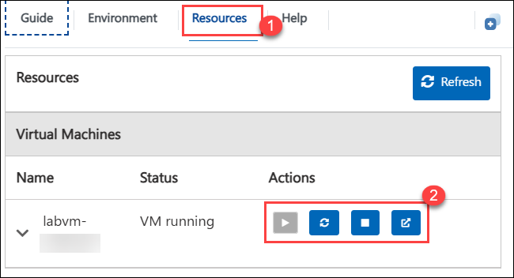
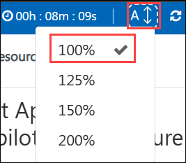

# Get started with Azure OpenAI Service

## Estimated Duration: 2 Hours

## Overview

This hands-on lab introduces Azure OpenAI Service and demonstrates how to deploy and explore OpenAI models on Azure using the Microsoft Foundry portal, while leveraging Azure’s security, scalability, and enterprise integration capabilities.

## Objective 

This lab is aimed at giving learners hands-on experience with Azure OpenAI resources, deploying and exploring models using the Completions and Chat playgrounds, and experimenting with prompts, parameters, and code generation. By completing this lab

Participants will learn:

- **Get started with the Azure OpenAI Service:** This hands-on exercise aims to teach you the fundamentals of using Azure OpenAI Service to integrate advanced AI models into your apps. Participants will set up and begin utilizing the Azure OpenAI Service to integrate AI models into their applications.

## Prerequisites

Participants should have:

- **Development Skills:** Basic programming knowledge and experience with APIs and SDKs.
- **AI Concepts:** Understanding prompt engineering, code development, and image generation using models such as DALL-E.
- **Content Management:** Understanding data integration for RAG and content filtering techniques.
   
## Architecture

The architecture leverages Azure OpenAI Service to deploy and explore OpenAI models. An Azure resource is provisioned, and the Chat playground are used for interactive exploration. Prompts, parameters, and code generation are optimized to create efficient AI-driven solutions with Azure's scalability and security.

## Architecture Diagram

## Explanation of Components

The architecture for this lab involves the following key components:

- **Azure OpenAI Resource:** Provision an Azure OpenAI resource to enable access to OpenAI's generative AI capabilities on the Azure platform.

- **Model Deployment:** Deploy a selected OpenAI model to make it accessible for testing and integration.

- **Chat Playground:** Use the Chat playground to interact with the model in a conversational manner, leveraging its natural language understanding capabilities.

- **Code Generation:** Explore the model's ability to generate code snippets and other structured outputs, showcasing its utility in development scenarios.

# Getting Started with the lab environment
 
We've prepared a seamless environment for you to explore and learn about the connection between artificial intelligence (AI), Responsible AI, and text, code, and image generation. Let's begin by making the most of this experience:
 
## Accessing Your Lab Environment
 
Once you're ready to dive in, your virtual machine and **Guide** will be right at your fingertips within your web browser.

   

## Virtual Machine & Lab Guide
 
Your virtual machine is your workhorse throughout the workshop. The lab guide is your roadmap to success.
 
## Exploring Your Lab Resources
 
To get a better understanding of your lab resources and credentials, navigate to the **Environment** tab.
 
   
 
## Utilizing the Split Window Feature
 
For convenience, you can open the lab guide in a separate window by selecting the **Split Window** button from the Top right corner.
 
 
 
## Managing Your Virtual Machine
 
Feel free to **Start, Stop, or Restart (2)** your virtual machine as needed from the **Resources (1)** tab. Your experience is in your hands!
 

## Lab Guide Zoom In/Zoom Out

To adjust the zoom level for the environment page, click the **A↕: 100%** icon located next to the timer in the lab environment.

   

## Let's Get Started with Azure Portal

1. On your virtual machine, click on the **Azure Portal** icon as shown below:

   
   
1. You'll see the **Sign into Microsoft Azure** tab. Here, enter your credentials:
 
   - **Email/Username:** <inject key="AzureAdUserEmail"></inject>
 
       
 
1. Next, provide your password:
 
   - **Password:** <inject key="AzureAdUserPassword"></inject>
 
       

1. If you see the pop-up **Stay Signed in?**, select **No**.
 
          

1. If a **Welcome to Microsoft Azure** pop-up window appears, simply click **Cancel** to skip the tour.

   

## Support Contact

The CloudLabs support team is available 24/7, 365 days a year, via email and live chat to ensure seamless assistance at any time. We offer dedicated support channels tailored specifically for both learners and instructors, ensuring that all your needs are promptly and efficiently addressed.
 
Learner Support Contacts:
 
- Email Support: cloudlabs-support@spektrasystems.com
- Live Chat Support: https://cloudlabs.ai/labs-support

Now, click on **Next** from the lower right corner to move on to the next page.

 
### Happy learning!