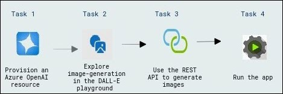
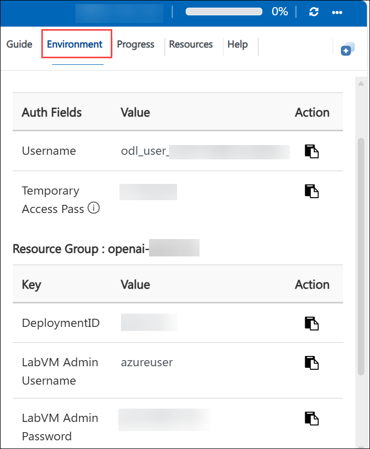
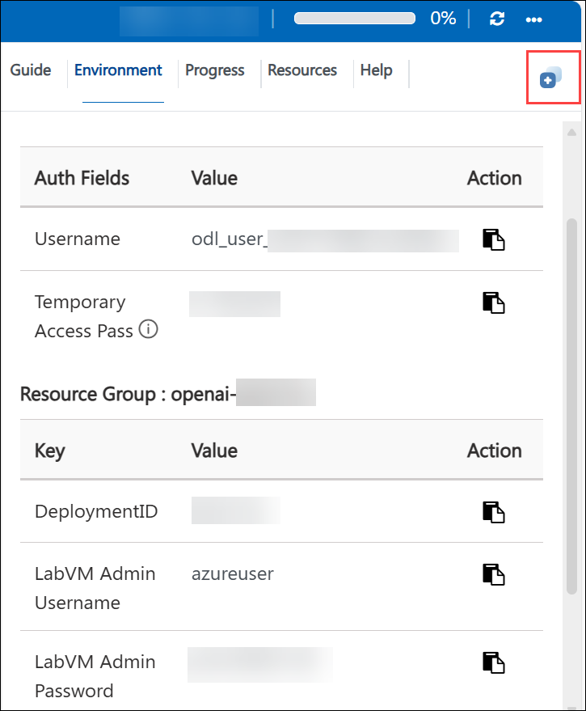
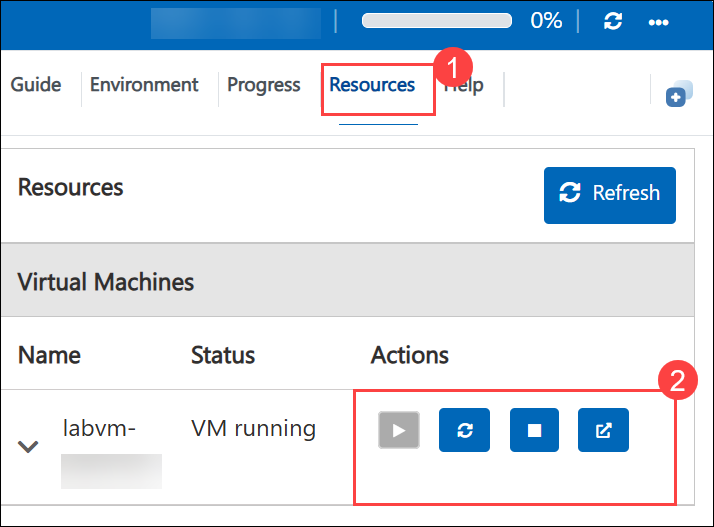
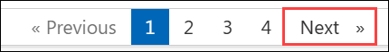

# Develop Generative AI solutions with Azure OpenAI Service

### Overall Estimated Duration: 2 Hours

## Overview

This lab explores the Azure OpenAI Service by guiding you through provisioning an Azure OpenAI resource, deploying models, and working with both text and image generation capabilities. You will generate natural language responses, create images using the DALL-E playground and REST API, and interact with models grounded in your own data through the chat playground. You will also set up, configure, and run an application to see these capabilities in action, strengthening your ability to build end-to-end AI-driven applications using Azure OpenAI.

## Objective

In this lab, you will gain hands-on experience with Azure OpenAI resources. You will provision resources and deploy models, explore image generation using the DALL·E playground and the REST API, connect and interact with your own data in the chat playground, set up, configure, and run applications using Cloud Shell, and finally generate natural language responses while applying content filtering to manage and regulate AI-generated outputs. By the end of this lab, you will be able to:

- **Generate images with a DALL-E model:** The goal of this hands-on activity is to produce and alter images using the DALL-E model. To attain the intended visual results, participants will develop and alter images using the DALL-E model.

- **Add your data for RAG using Azure OpenAI Service:** This hands-on exercise will help you integrate your data with the Azure OpenAI Service for Retrieval-Augmented Generation (RAG) to improve AI responses. Participants will integrate data into the Azure OpenAI Service to boost AI-powered retrieval and generation.

- **Explore content filters in Azure OpenAI:** This hands-on exercise demonstrates how to construct and maintain content filters in Azure OpenAI to control and refine generated outputs. Participants will learn about and implement content filters in Azure OpenAI to control and refine created material.

## Pre-requisites

- **Development Skills:** Basic programming knowledge and experience with APIs and SDKs.

- **AI Concepts:** Understanding prompt engineering, code development, and image generation using models such as DALL-E.

- **Content Management:** Understanding data integration for RAG and content filtering techniques.

## Architecture

The architecture utilizes Azure OpenAI Service to provision resources, deploy models, and configure an application in Cloud Shell. It involves setting up, testing, and running the application, enabling AI-driven solutions powered by Azure's scalability and security.

## Architecture Diagram

 

## Explanation of Components

The architecture for this lab involves the following key components:

- **Azure OpenAI Resource:** Provision an Azure OpenAI resource to access OpenAI’s advanced AI models, enabling integration with custom applications.

- **DALL-E Playground:** Explore image generation capabilities using the DALL-E playground to create custom images based on text prompts.

- **REST API for Image Generation:** Use the REST API to generate images programmatically, integrating image generation into your application.

- **Run the Application:** Execute the application to validate the image generation functionality and confirm proper interaction with the deployed model.

## Getting Started with Lab

Once the environment is provisioned, a virtual machine (JumpVM) and lab guide will get loaded in your browser. Use this virtual machine throughout the workshop to perform the lab. You can see the number on the lab guide bottom area to switch to different exercises of the lab guide.

## Accessing Your Lab Environment

1. Once you're ready to dive in, your virtual machine and the **Guide** will be right at your fingertips within your web browser.

   

## Virtual Machine & Lab Guide
 
Your virtual machine is your workhorse throughout the workshop. The lab guide is your roadmap to success.

## Lab Guide Zoom In/Zoom Out

1. To adjust the zoom level for the environment page, click the **A↕ : 100%** icon located next to the timer in the lab environment.

   

## Exploring Your Lab Resources
 
To get a better understanding of your lab resources and credentials, navigate to the **Environment** tab.

   

## Utilizing the Split Window Feature
 
For your convenience, you can open the lab guide in a separate window by selecting the **Split Window** button from the top right corner.

  
## Managing Your Virtual Machine
 
Feel free to **Start, Restart, or Stop (2)** your virtual machine as needed from the **Resources (1)** tab. Your experience is in your hands!
 

## Let's Get Started with Azure Portal
 
1. On your virtual machine, click on the **Azure Portal** icon as shown below:
 
      .png)
    
2. You'll see the **Sign in to continue to Microsoft Azure** tab. Here, enter your credentials:
 
   - **Email/Username:** <inject key="AzureAdUserEmail"></inject>
 
       
 
3. Next, provide your password:
 
   - **Password:** <inject key="AzureAdUserPassword"></inject>
 
       
 
4. In the **Stay signed in?** pop-up, click **No**.

   
 
## Support Contact

The CloudLabs support team is available 24/7, 365 days a year, via email and live chat to ensure seamless assistance at any time. We offer dedicated support channels tailored specifically for both learners and instructors, ensuring that all your needs are promptly and efficiently addressed.

Learner Support Contacts:

- Email Support: cloudlabs-support@spektrasystems.com

- Live Chat Support: https://cloudlabs.ai/labs-support

Now, click on **Next** from the lower right corner to move on to the next page.

## Happy Learning!!
