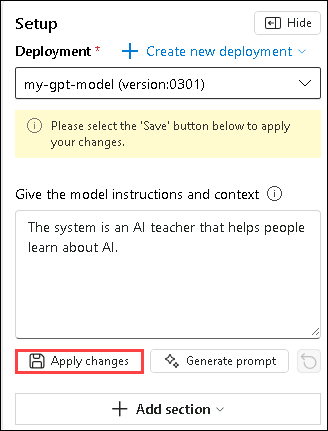

# Integrate Azure OpenAI into your app

### Overall Estimated Duration: 1 hour 30 minutes

## Overview

This lab explores the Azure OpenAI Service, enabling integration of OpenAI's advanced AI models into applications. You'll provision the service, deploy a model, configure an application in Cloud Shell, test its functionality, and manage conversation history for improved user interactions.

## Objective

This lab provides hands-on experience with Azure OpenAI resources, including provisioning a resource, deploying a model, setting up and configuring an application in Cloud Shell, testing its functionality, and maintaining conversation history. By the end of this lab, you will be able to:

- **Use Azure OpenAI SDKs in your app:** This hands-on exercise demonstrates how to integrate Azure OpenAI SDKs into your application to improve AI capabilities. Participants will integrate and use Azure OpenAI SDKs within their application.

## Pre-requisites

- **Development Skills:** Basic programming knowledge and experience with APIs and SDKs.

- **AI Concepts:** Understanding prompt engineering, code development, and image generation using models such as DALL-E.

- **Content Management:** Understanding data integration for RAG and content filtering techniques.

## Architecture

The architecture leverages Azure OpenAI Service to provision a resource, deploy models, and set up an application in Cloud Shell. The workflow involves configuring, testing, and maintaining the application, enabling efficient AI-driven solutions with Azure’s scalability and secure infrastructure.

## Architecture Diagram

 

## Explanation of Components

The architecture for this lab involves the following key components:

- **Azure OpenAI Resource:** Provision an Azure OpenAI resource to access OpenAI’s advanced AI models and integrate them into custom applications.

- **Model Deployment:** Deploy an OpenAI model to enable functionality for testing and application use cases.

- **Application Setup:** Set up an application in Cloud Shell to interact with the deployed model and test its capabilities.

- **Application Configuration:** Configure the application to meet specific requirements, ensuring seamless integration with Azure OpenAI services.

- **Application Testing:** Test the application to validate its performance, ensuring it interacts effectively with the deployed model.

## Getting Started with Lab

1. Once the environment is provisioned, a virtual machine (JumpVM) and lab guide will get loaded in your browser. Use this virtual machine throughout the workshop to perform the lab. You can see the number on the lab guide bottom area to switch to different exercises of the lab guide.

   
   
1. To get the lab environment details, you can select the **Environment Details** tab. Additionally, the credentials will also be emailed to your email address provided during registration. You can start, stop, and restart virtual machines from the **Resources** tab.

   

## Lab Guide Zoom In/Zoom Out

1. To adjust the zoom level for the environment page, click the **A↕ : 100%** icon located next to the timer in the lab environment.

   

## Login to Azure Portal
1. In the JumpVM, click on Azure portal shortcut of Microsoft Edge browser which is created on desktop.

   
   
1. On **Sign into Microsoft Azure** tab you will see login screen, in that enter following email/username and then click on **Next**. 
   * Email/Username: <inject key="AzureAdUserEmail"></inject>
   
     
     
1. Now enter the following password and click on **Sign in**.
   * Password: <inject key="AzureAdUserPassword"></inject>
   
     
     
1. If you see the pop-up **Action Required**, click **Ask Later**.

     
     
    > If you are getting popup **save password**, then select **Save & Turn on** option.
       
1. If you see the pop-up **Stay Signed in?**, click **No**.

1. If you see the pop-up **You have free Azure Advisor recommendations!**, close the window to continue the lab.

1. If a **Welcome to Microsoft Azure** popup window appears, click **Maybe Later** to skip the tour.

1. Now you will see Azure Portal Dashboard, click on **Resource groups** from the Navigate panel to see the resource groups.

     

1. Confirm you have a resource group **openai-<inject key="Deployment-id" enableCopy="false"/>** present as shown in the below screenshot. You need to use the **openai-<inject key="Deployment-id" enableCopy="false"/>** resource group throughout the entire process of lab execution.

     
   
1. Use **Next** button from lower right corner to move on to the next page.

   

This hands-on lab empowers participants to master Azure OpenAI Service by guiding them through setup, SDK integration, and prompt engineering. It also covers code generation, image creation with DALL-E, RAG data integration, and content filtering for comprehensive learning.
 
## Support Contact
 
The CloudLabs support team is available 24/7, 365 days a year, via email and live chat to ensure seamless assistance at any time. We offer dedicated support channels tailored specifically for both learners and instructors, ensuring that all your needs are promptly and efficiently addressed.

Learner Support Contacts:
- Email Support: cloudlabs-support@spektrasystems.com
- Live Chat Support: https://cloudlabs.ai/labs-support

Now, click on **Next** from the lower right corner to move on to the next page.

  

### Happy Learning!!
