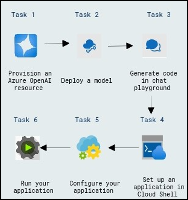
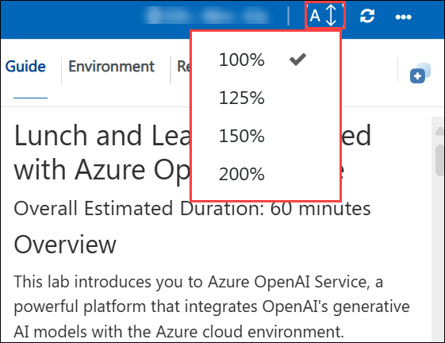
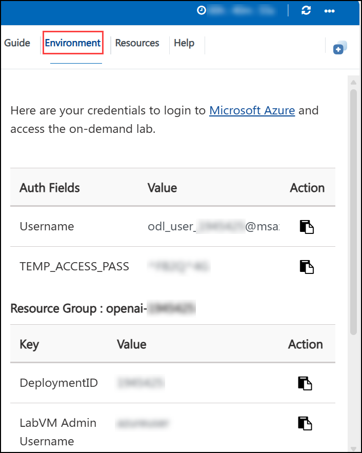
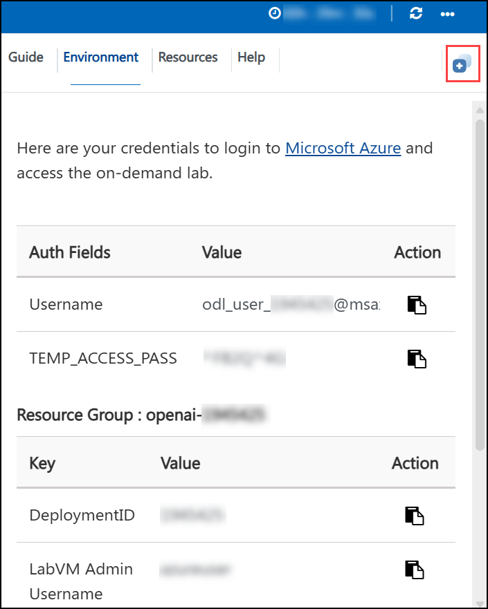
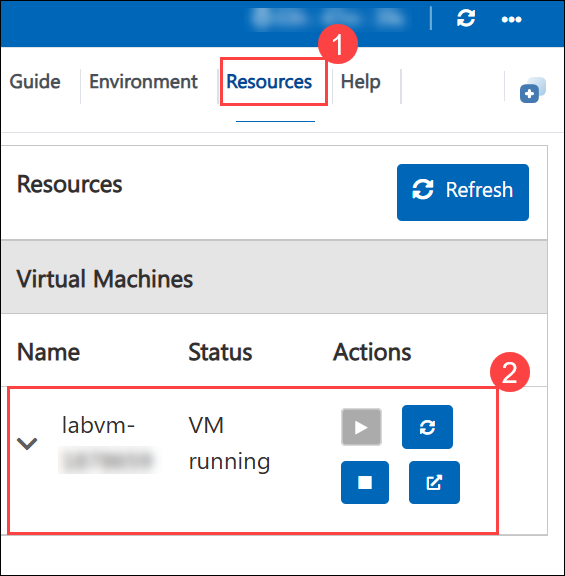
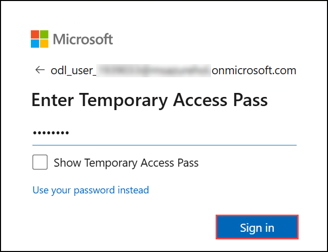

# Generate and improve code with Azure OpenAI Service

### Overall Estimated Duration: 1 hour
## Overview

This lab explores the Azure OpenAI Service, where you'll provision the service, deploy a model, generate code using the Chat playground, configure and run an application in Cloud Shell, and enhance user interactions.

## Objective

This lab provides hands-on experience with Azure OpenAI resources, covering tasks such as provisioning a resource, deploying a model, generating code in the Chat playground, setting up and configuring an application in Cloud Shell, and running the application. By the end of this lab, you will be able to:

- **Generate and improve code with Azure OpenAI Service:** The goal of this hands-on exercise is to demonstrate how to effectively generate and refine code using Azure OpenAI. Participants will improve their abilities to create and refine code with Azure OpenAI Service tools and approaches.

## Pre-requisites

- **Development Skills:** Basic programming knowledge and experience with APIs and SDKs.

- **AI Concepts:** Understanding prompt engineering, code development, and image generation using models such as DALL-E.

- **Content Management:** Understanding data integration for RAG and content filtering techniques.

## Architecture

The architecture leverages Azure OpenAI Service to provision resources, deploy models, and set up an application in Cloud Shell. It includes configuring, testing, and running the application, enabling AI-driven solutions with Azure's scalability and security.

## Architecture Diagram

 

## Explanation of Components

The architecture for this lab involves the following key components:

- **Azure OpenAI Resource:** Provision an Azure OpenAI resource to access OpenAI’s advanced AI models and integrate them into custom applications.

- **Model Deployment:** Deploy an OpenAI model to enable functionality for testing and application use cases.

- **Code Generation:** Generate code in the Chat playground to enhance the model’s capabilities and assist with development tasks.

- **Application Setup:** Set up an application in Cloud Shell to interact with the deployed model and test its capabilities.

- **Application Configuration:** Configure the application to meet specific requirements, ensuring seamless integration with Azure OpenAI services.

- **Run the Application:** Run the application to validate its functionality and ensure effective interaction with the deployed model.

## Getting Started with Lab

1. Once the environment is provisioned, a virtual machine (JumpVM) and lab guide will get loaded in your browser. Use this virtual machine throughout the workshop to perform the lab. You can see the number on the lab guide bottom area to switch to different exercises of the lab guide.

## Accessing Your Lab Environment

1. Once you're ready to dive in, your virtual machine and the **Guide** will be right at your fingertips within your web browser.

   

## Virtual Machine & Lab Guide
 
Your virtual machine is your workhorse throughout the workshop. The lab guide is your roadmap to success.

## Lab Guide Zoom In/Zoom Out

1. To adjust the zoom level for the environment page, click the **A↕ : 100%** icon located next to the timer in the lab environment.

   

## Exploring Your Lab Resources
 
To get a better understanding of your lab resources and credentials, navigate to the **Environment** tab.

   

## Utilizing the Split Window Feature
 
For your convenience, you can open the lab guide in a separate window by selecting the **Split Window** button from the top right corner.

  
## Managing Your Virtual Machine
 
Feel free to **Start, Restart, or Stop (2)** your virtual machine as needed from the **Resources (1)** tab. Your experience is in your hands!
 

## Let's Get Started with Azure Portal
 
1. On your virtual machine, click on the **Azure Portal** icon as shown below:
 
      .png)
    
2. You'll see the **Sign in to continue to Microsoft Azure** tab. Here, enter your credentials:
 
   - **Email/Username:** <inject key="AzureAdUserEmail"></inject>
 
       
 
3. Next, provide your password:
 
   - **Password:** <inject key="AzureAdUserPassword"></inject>
 
       
 
4. In the **Stay signed in?** pop-up, click **No**.
 
## Support Contact

The CloudLabs support team is available 24/7, 365 days a year, via email and live chat to ensure seamless assistance at any time. We offer dedicated support channels tailored specifically for both learners and instructors, ensuring that all your needs are promptly and efficiently addressed.

Learner Support Contacts:

- Email Support: cloudlabs-support@spektrasystems.com

- Live Chat Support: https://cloudlabs.ai/labs-support

Now, click on **Next** from the lower right corner to move on to the next page.

## Happy Learning!!