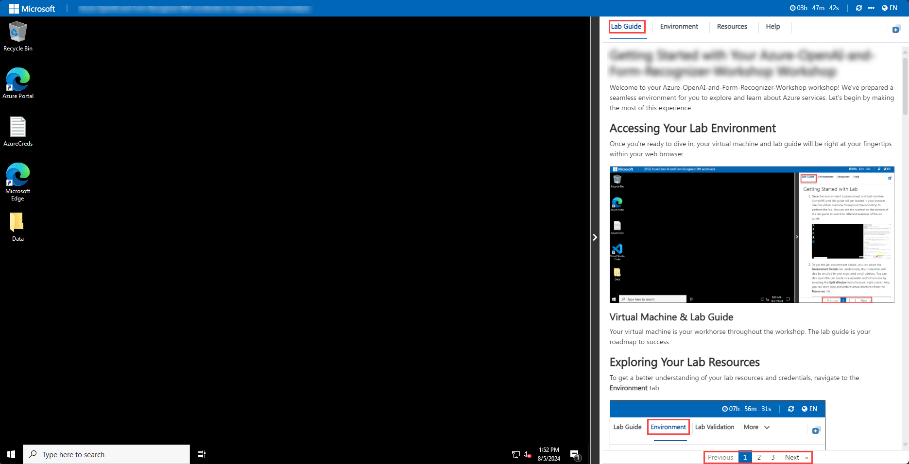

# Generate images with a DALL-E model

### Overall Estimated Duration: 1 hour

## Overview

This lab explores the Azure OpenAI Service, where you'll provision the service, explore image-generation in the DALL-E playground, use the REST API to generate images, configure and run an application, and enhance your ability to create AI-driven applications.

## Objective

This lab provides hands-on experience with Azure OpenAI resources, covering tasks such as provisioning a resource, deploying a model, exploring image generation in the DALL-E playground, using the REST API to generate images, setting up and configuring an application in Cloud Shell, and running the application. By the end of this lab, you will be able to:

- **Generate images with a DALL-E model:** The goal of this hands-on activity is to produce and alter images using the DALL-E model. To attain the intended visual results, participants will develop and alter images using the DALL-E model.

## Pre-requisites

- **Development Skills:** Basic programming knowledge and experience with APIs and SDKs.

- **AI Concepts:** Understanding prompt engineering, code development, and image generation using models such as DALL-E.

- **Content Management:** Understanding data integration for RAG and content filtering techniques.

## Architecture

The architecture utilizes Azure OpenAI Service to provision resources, deploy models, and configure an application in Cloud Shell. It involves setting up, testing, and running the application, enabling AI-driven solutions powered by Azure's scalability and security.

## Architecture Diagram

 

## Explanation of Components

The architecture for this lab involves the following key components:

- **Azure OpenAI Resource:** Provision an Azure OpenAI resource to access OpenAI’s advanced AI models, enabling integration with custom applications.

- **DALL-E Playground:** Explore image generation capabilities using the DALL-E playground to create custom images based on text prompts.

- **REST API for Image Generation:** Use the REST API to generate images programmatically, integrating image generation into your application.

- **Run the Application:** Execute the application to validate the image generation functionality and confirm proper interaction with the deployed model.

## Getting Started with Lab

1. Once the environment is provisioned, a virtual machine (JumpVM) and lab guide will get loaded in your browser. Use this virtual machine throughout the workshop to perform the lab. You can see the number on the bottom of the lab guide to switch to different exercises of the lab guide.

   

## Exploring Your Lab Resources

To get a better understanding of your lab resources and credentials, navigate to the **Environment** tab.

## Utilizing the Split Window Feature

For convenience, you can open the lab guide in a separate window by selecting the Split Window button from the top right corner.

## Lab Guide Zoom In/Zoom Out
 
To adjust the zoom level for the environment page, click the **A↕ : 100%** icon located next to the timer in the lab environment.

  

## Managing Your Virtual Machine

Feel free to start, stop, or restart your virtual machine as needed from the **Resources** tab. Your experience is in your hands!

    
    
## Login to Azure Portal and verify the pre-deployed resources

1. Open Azure Portal from the desktop by double-clicking on it.
    
   
   
1. On the **Sign into Microsoft Azure** tab, you will see the login screen, enter the following username, and, then click on **Next**.

   * **Email/Username**: <inject key="AzureAdUserEmail"></inject>

     
   
1. Now enter the following password and click on **Sign in**.
   
   * **Password**: <inject key="AzureAdUserPassword"></inject>
   
     

1. If you see the pop-up Action Required, click **Ask Later**.

    .png)

   >**NOTE:** Do not enable MFA, select **Ask Later**.

1. If you see the pop-up **Stay Signed in?**, click on **No**.

1. If you see the pop-up **You have free Azure Advisor recommendations!**, close the window to continue the lab.

1. If a **Welcome to Microsoft Azure** popup window appears, click **Cancel** to skip the tour.

1. Now you can see Azure Portal Dashboard, click on **Resource groups** from the Navigate panel to see the resource groups.

   
 
1. We have already pre-deployed all the required resources, which you will be using throughout the lab.
 
## Support Contact
 
The CloudLabs support team is available 24/7, 365 days a year, via email and live chat to ensure seamless assistance at any time. We offer dedicated support channels tailored specifically for both learners and instructors, ensuring that all your needs are promptly and efficiently addressed.

Learner Support Contacts:
- Email Support: cloudlabs-support@spektrasystems.com
- Live Chat Support: https://cloudlabs.ai/labs-support

Now, click on **Next** from the lower right corner to move on to the next page.

  

### Happy Learning!!