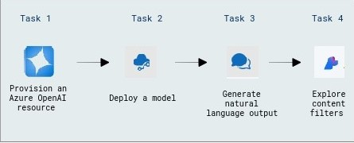

# Add your data for RAG with Azure OpenAI Service

### Overall Estimated Duration: 1 hour

## Overview

This lab explores the Azure OpenAI Service, where you'll provision the service, deploy a model, generate natural language output, and interact with the model using your own data. You'll also set up, configure, and run an application. By the end of this lab, you'll enhance your ability to create AI-driven applications with Azure.

## Objective

This lab provides hands-on experience with Azure OpenAI resources, including provisioning a resource, deploying a model, generating natural language output, and setting up, configuring, and running an application. By the end of this lab, you will be able to:

- **Explore content filters in Azure OpenAI:** This hands-on exercise demonstrates how to construct and maintain content filters in Azure OpenAI to control and refine generated outputs. Participants will learn about and implement content filters in Azure OpenAI to control and refine created material.

## Pre-requisites

- **Development Skills:** Basic programming knowledge and experience with APIs and SDKs.

- **AI Concepts:** Understanding prompt engineering, code development, and image generation using models such as DALL-E.

- **Content Management:** Understanding data integration for RAG and content filtering techniques.

## Architecture

The architecture leverages Azure OpenAI Service to provision resources, deploy models, and generate natural language output. It includes setting up, configuring, testing, and running an application, enabling AI-driven solutions with Azure’s scalability and security.

## Architecture Diagram

 

## Explanation of Components

The architecture for this lab involves the following key components:

- **Azure OpenAI Resource:** Provision an Azure OpenAI resource to access OpenAI’s advanced AI models, enabling integration with custom applications.

- **Model Deployment:** Deploy an OpenAI model to access and utilize its functionality for testing and application use cases.

- **Natural Language Output Generation:** Generate natural language output using the deployed model to process and understand data, enhancing the application’s capabilities.

## Getting Started with Lab

Once the environment is provisioned, a virtual machine (JumpVM) and lab guide will get loaded in your browser. Use this virtual machine throughout the workshop to perform the lab. You can see the number on the lab guide bottom area to switch to different exercises of the lab guide.

## Accessing Your Lab Environment

1. Once you're ready to dive in, your virtual machine and the **Guide** will be right at your fingertips within your web browser.

   

## Virtual Machine & Lab Guide
 
Your virtual machine is your workhorse throughout the workshop. The lab guide is your roadmap to success.

## Lab Guide Zoom In/Zoom Out

1. To adjust the zoom level for the environment page, click the **A↕ : 100%** icon located next to the timer in the lab environment.

   

## Exploring Your Lab Resources
 
To get a better understanding of your lab resources and credentials, navigate to the **Environment** tab.

   

## Utilizing the Split Window Feature
 
For your convenience, you can open the lab guide in a separate window by selecting the **Split Window** button from the top right corner.

  
## Managing Your Virtual Machine
 
Feel free to **Start, Restart, or Stop (2)** your virtual machine as needed from the **Resources (1)** tab. Your experience is in your hands!
 

## Let's Get Started with Azure Portal
 
1. On your virtual machine, click on the **Azure Portal** icon as shown below:
 
      .png)
    
2. You'll see the **Sign in to continue to Microsoft Azure** tab. Here, enter your credentials:
 
   - **Email/Username:** <inject key="AzureAdUserEmail"></inject>
 
       
 
3. Next, provide your password:
 
   - **Password:** <inject key="AzureAdUserPassword"></inject>
 
       
 
4. In the **Stay signed in?** pop-up, click **No**.

   .png)
 
## Support Contact

The CloudLabs support team is available 24/7, 365 days a year, via email and live chat to ensure seamless assistance at any time. We offer dedicated support channels tailored specifically for both learners and instructors, ensuring that all your needs are promptly and efficiently addressed.

Learner Support Contacts:

- Email Support: cloudlabs-support@spektrasystems.com

- Live Chat Support: https://cloudlabs.ai/labs-support

Now, click on **Next** from the lower right corner to move on to the next page.

## Happy Learning!!