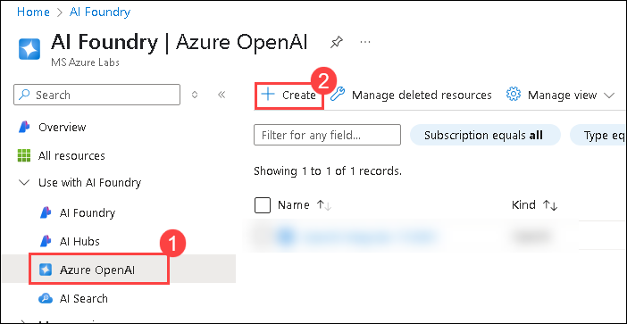
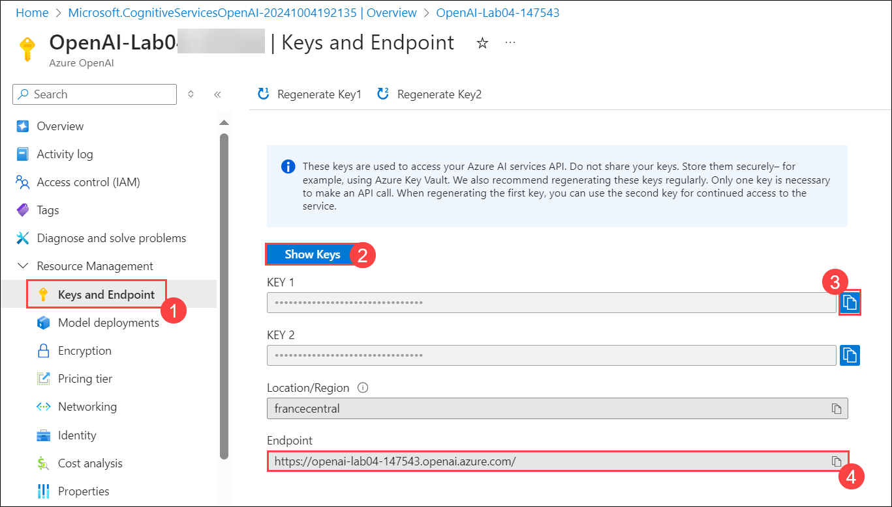
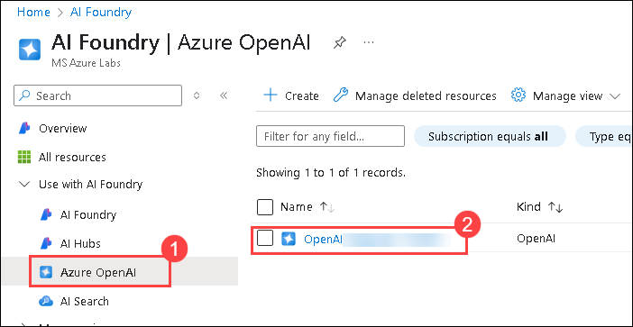
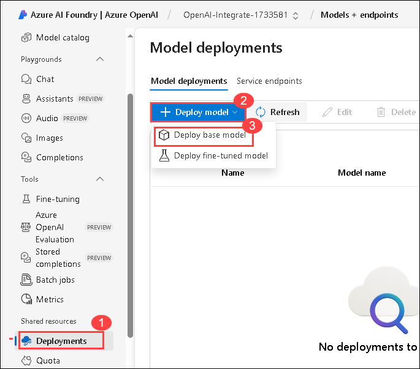
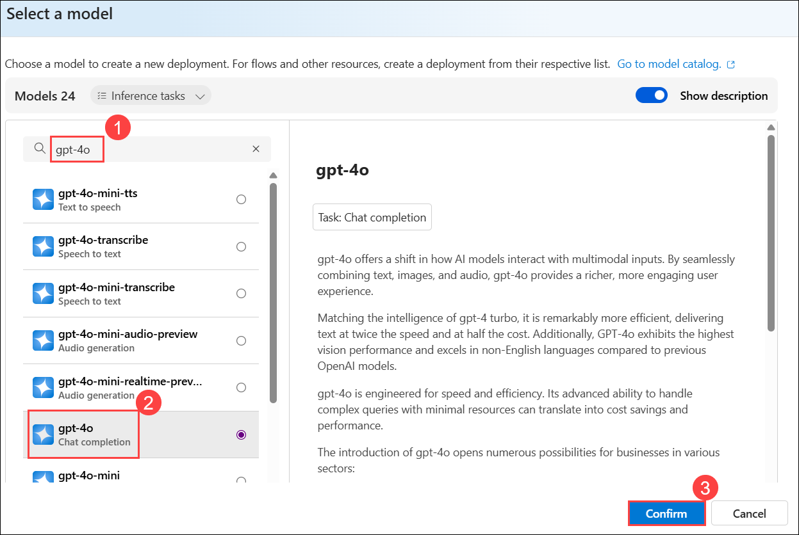
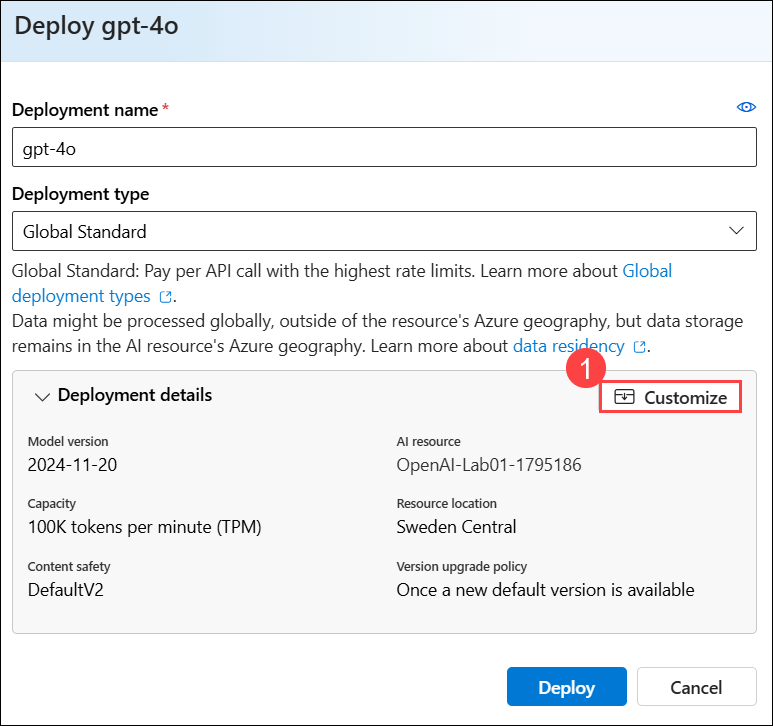
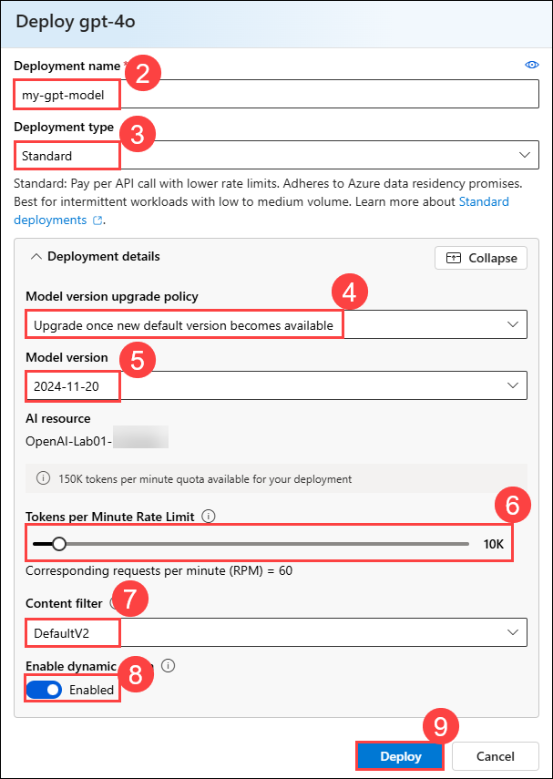
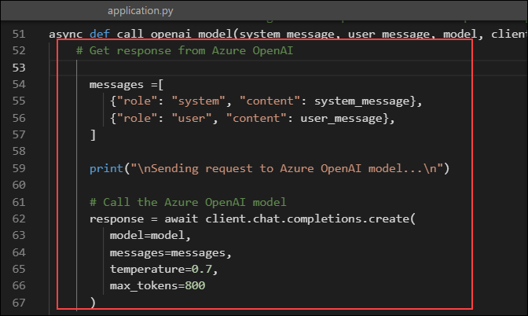

# Lab 02: Use Azure OpenAI SDKs in your app

## Lab scenario
With the Azure OpenAI Service, developers can create chatbots, language models, and other applications that excel at understanding natural human language. The Azure OpenAI provides access to pre-trained AI models, as well as a suite of APIs and tools for customizing and fine-tuning these models to meet the specific requirements of your application. In this exercise, you'll learn how to deploy a model in Azure OpenAI and use it in your own application.

In the scenario for this exercise, you will perform the role of a software developer who has been tasked to implement an app that can use generative AI to help provide hiking recommendations. The techniques used in the exercise can be applied to any app that wants to use Azure OpenAI APIs.

## Lab objectives
In this lab, you will complete the following tasks:

- Task 1: Provision an Azure OpenAI resource
- Task 2: Deploy a model
- Task 3: Set up an application in Cloud Shell
- Task 4: Configure your application
- Task 5: Test your application
- Task 6: Maintain conversation history

## Estimated time: 40 minutes

### Task 1: Provision an Azure OpenAI resource

In this task, you'll create an Azure resource in the Azure portal, selecting the OpenAI service and configuring settings such as region and pricing tier. This setup allows you to integrate OpenAI's advanced language models into your applications.

1. In the **Azure portal**, search for **OpenAI** and select **Azure OpenAI**.

    

1. On the **AI Foundry** page, select **Azure OpenAI (1)** from the menu on the left, then click **+ Create (2)**.

    

1. Create an **Azure OpenAI** resource with the following settings 

    - **Subscription**: Default - Pre-assigned subscription (1).
    - **Resource group**: openai-<inject key="DeploymentID" enableCopy="false"></inject> (2)
    - **Region**: Select <inject key="Region" enableCopy="false" /> (3)
    - **Name**: OpenAI-Lab02-<inject key="DeploymentID" enableCopy="false"></inject> (4)
    - **Pricing tier**: Standard S0 (5)
    -  Click on **Next** (6)
  
        

1. Click on **Next** again and subsequently click on **Create** 

1. Wait for deployment to complete. Then go to the deployed Azure OpenAI resource in the Azure portal.

1. To capture the Keys and Endpoints values, on **openai-<inject key="DeploymentID" enableCopy="false"></inject>** blade:
    - Select **Keys and Endpoint (1)** under **Resource Management**.
    - Click on **Show Keys (2)**.
    - Copy **Key 1 (3)** and ensure to paste it in a text editor such as notepad for future reference.
    - Finally copy the **Endpoint (4)** API URL by clicking on copy to clipboard. Paste it in a text editor such as notepad for later use.

        

     

> **Congratulations** on completing the task! Now, it's time to validate it. Here are the steps:
> - Hit the Validate button for the corresponding task.
> - If you receive a success message, you can proceed to the next task.
> - If not, carefully read the error message and retry the step, following the instructions in the lab guide. 
> - If you need any assistance, please contact us at cloudlabs-support@spektrasystems.com. We are available 24/7 to help you out.

<validation step="7c4e3561-5bcf-4427-a50e-bdb11b1f5113" />

### Task 2: Deploy a model

In this task, you'll deploy a specific AI model instance within your Azure OpenAI resource to integrate advanced language capabilities into your applications.

1. In the **Azure portal**, search for **OpenAI** and select **Azure OpenAI**.

    

1. On **AI Foundry | Azure OpenAI (1)** blade, select **OpenAI-Lab02-<inject key="DeploymentID" enableCopy="false"></inject>**

    

1. In the Azure OpenAI resource pane, click on **Go to Azure OpenAI Studio** it will navigate to **Azure AI Studio**.

   

1. From the left navigation pane, select **Deployments (1)** under Shared resources, click on **+ Deploy model (2)**, Choose **Deploy base model (3)**.

   

1. On the Select a model page, search for **gpt-4o (1)** model, select **gpt-4o (chat completion) (2)** model from the list, and then click on **Confirm (3)**.

   

1. On the **Deploy gpt-4o** interface, click on **Customize (1)** and enter the details as mentioned below, then click on **Deploy (9):**

    | Settings | Action |
    | -- | -- |
    | **Deployment name (2)** | my-gpt-model |
    | **Deployment type (3)** | Standard |
    | **Model version upgrade policy (4)** | Upgrade once new default version becomes available. |
    | **Model version (5)** | 2024-11-20 |
    | **Tokens per Minute Rate Limit (thousands) (6)** | 10K |
    | **Content Filter (7)** | DefaultV2 |
    | **Enable dynamic quota(8)** | Enabled |

    

    

    > **Note:** gpt-4o is supported only for chat completions, and it is not supported for the completions API.

> **Congratulations** on completing the task! Now, it's time to validate it. Here are the steps:
> - Hit the Validate button for the corresponding task.
> - If you receive a success message, you can proceed to the next task.
> - If not, carefully read the error message and retry the step, following the instructions in the lab guide. 
> - If you need any assistance, please contact us at cloudlabs-support@spektrasystems.com. We are available 24/7 to help you out.

<validation step="64adeae3-05e0-4fbd-84bb-176e70a4b3ce" />
   
## Task 3: Set up an application in Cloud Shell

In this task, you will integrate with an Azure OpenAI model by using a short command-line application running in Cloud Shell on Azure. Open a new browser tab to work with Cloud Shell.

1. In the [Azure portal](https://portal.azure.com?azure-portal=true), select the **[>_]** (*Cloud Shell*) button at the top of the page to the right of the search box. A Cloud Shell pane will open at the bottom of the portal.

   

1. The first time you open the Cloud Shell, you may be prompted to choose the type of shell you want to use (*Bash* or *PowerShell*). Select **Bash**. If you don't see this option, skip the step.

1. Within the Getting Started pane, select **Mount storage account**, select your **Storage account subscription** from the dropdown and click **Apply**.

   

1. Within the **Mount storage account** pane, select **I want to create a storage account** and click **Next**.

   

1. Within the **Advanced settings** pane, enter the following details:

   - **Subscription**: Default- Choose the only existing subscription assigned for this lab (1).
   - **CloudShell region**: <inject key="Region" enableCopy="false" /> (2)
   - **Resource group**: Select openai-<inject key="DeploymentID" enableCopy="false"></inject>(3)
   - **Storage Account Name**: storage<inject key="DeploymentID" enableCopy="false"></inject>(4)
   - **File share**: Create a new file share named **none** (5)
   - Click **Create Storage** (6)

     

1. Make sure the type of shell indicated on the top left of the Cloud Shell pane is switched to *Bash*. If it's *PowerShell*, switch to *Bash* by using the drop-down menu.

1. Note that you can resize the cloud shell by dragging the separator bar at the top of the pane, or by using the **&#8212;**, **&#9723;**, and **X** icons at the top right of the pane to minimize, maximize, and close the pane. For more information about using the Azure Cloud Shell, see the [Azure Cloud Shell documentation](https://docs.microsoft.com/azure/cloud-shell/overview). 

1. Once the terminal starts, enter the following command to download the sample application and save it to a folder called `azure-openai`.

   ```bash
    rm -r mslearn-openai -f
    git clone https://github.com/microsoftlearning/mslearn-openai mslearn-openai
    ```

1. The files are downloaded to a folder named **azure-openai**. Navigate to the lab files for this exercise using the following command.

   ```bash
    cd mslearn-openai/Labfiles/01-app-develop
    ```

    Applications for both C# and Python have been provided, as well as a sample text file you'll use to test the summarization. Both apps feature the same functionality.
   
    Open the built-in code editor, and observe the text file that you'll be summarizing with your model located at `text-files/sample-text.txt`. Use the following command to open the lab     files in the code editor.
   
   ```bash
    code .
    ```

    > **NOTE:** If you're prompted to **Switch to Classic Cloud Shell** after running the **code .** command, click on **Confirm**.

     

 
> **Congratulations** on completing the task! Now, it's time to validate it. Here are the steps:
> - Hit the Validate button for the corresponding task.
> - If you receive a success message, you can proceed to the next task.
> - If not, carefully read the error message and retry the step, following the instructions in the lab guide. 
> - If you need any assistance, please contact us at cloudlabs-support@spektrasystems.com. We are available 24/7 to help you out.

<validation step="a9ae28f4-8e25-42f3-b7bd-5372ab99091f" />


## Task 4: Configure your application

For this task, you'll complete some key parts of the application to enable using your Azure OpenAI resource.

1. In the code editor, expand the **CSharp** or **Python** folder, depending on your language preference.

1. If you are using the **C#** language, kindly open the **CSharp.csproj** file and replace it with the following code and save the file.

   ```
   <Project Sdk="Microsoft.NET.Sdk">
   
   <PropertyGroup>
   <OutputType>Exe</OutputType>
   <TargetFramework>net9.0</TargetFramework>
   <ImplicitUsings>enable</ImplicitUsings>
   <Nullable>enable</Nullable>
   </PropertyGroup>
   
    <ItemGroup>
    <PackageReference Include="Azure.AI.OpenAI" Version="2.1.0" />
    <PackageReference Include="Microsoft.Extensions.Configuration" Version="8.0.*" />
    <PackageReference Include="Microsoft.Extensions.Configuration.Json" Version="8.0.*" />
    </ItemGroup>
   
    <ItemGroup>
      <None Update="appsettings.json">
        <CopyToOutputDirectory>PreserveNewest</CopyToOutputDirectory>
       </None>
     </ItemGroup>
   
    </Project> 
   ```

1. Open the configuration file for your language

    - C#: `appsettings.json`
    
    - Python: `.env`
    
1. Update the configuration values to include the **endpoint** and **key** from the Azure OpenAI resource you created, as well as the model name that you deployed, `my-gpt-model`. Then save the file by right-clicking on the blank space in the file text editor and hit **Save**.

    - **C#:**
     
           

    - **Python:**
     
         

    > **Note:** You can get the Azure OpenAI endpoint and key values from the Azure OpenAI resource's **Key and Endpoint** section under **Resource Management**.

1. Navigate back to the Cloudshell and install the necessary packages for your preferred language:

    **C#:** 

    ```bash
    cd CSharp
    dotnet add package Azure.AI.OpenAI --version 2.1.0
    ```

    **Python:**

    ```bash
    cd Python
    python -m venv labenv
    source ./labenv/bin/activate
    pip install python-dotenv openai==1.65.2 --user
    ```

1. Navigate to your preferred language folder, replace the comment **Add Azure OpenAI package** with code to add the Azure OpenAI SDK library:

    **C#:** Program.cs

    ```csharp
    // Add Azure OpenAI packages
    using Azure.AI.OpenAI;
    using OpenAI.Chat;
    ```

     

    **Python:** application.py

    ```python
    # Add Azure OpenAI package
    from openai import AsyncAzureOpenAI
    ```

          

1.  In the application code for your language, find the comment **Configure the Azure OpenAI client**, and add code to configure the Azure OpenAI client:

    **C#:** Program.cs

    ```csharp
    // Configure the Azure OpenAI client
    AzureOpenAIClient azureClient = new (new Uri(oaiEndpoint), new ApiKeyCredential(oaiKey));
    ChatClient chatClient = azureClient.GetChatClient(oaiDeploymentName);
    ```

      

    **Python:** application.py

    ```python
    # Configure the Azure OpenAI client
    client = AsyncAzureOpenAI(
       azure_endpoint = azure_oai_endpoint, 
       api_key=azure_oai_key,  
       api_version="2024-02-15-preview"
      )
    ```

       

    >**Note:** Make sure to indent the code by eliminating any extra white spaces after pasting it into the code editor.
    
1. In the function that calls the **Azure OpenAI model**, under the comment **Get response from Azure OpenAI**, add the code to format and send the request to the model.

    **C#:** Program.cs

    ```csharp
      // Get response from Azure OpenAI
      ChatCompletionOptions chatCompletionOptions = new ChatCompletionOptions()
      {
         Temperature = 0.7f,
         MaxOutputTokenCount = 800
      };
      
      ChatCompletion completion = chatClient.CompleteChat(
         [
             new SystemChatMessage(systemMessage),
             new UserChatMessage(userMessage)
         ],
         chatCompletionOptions
      );
      
      Console.WriteLine($"{completion.Role}: {completion.Content[0].Text}");
    ```

          

    **Python:** application.py

    ```python
    # Get response from Azure OpenAI
      messages =[
         {"role": "system", "content": system_message},
         {"role": "user", "content": user_message},
      ]
      
      print("\nSending request to Azure OpenAI model...\n")
      
      # Call the Azure OpenAI model
      response = await client.chat.completions.create(
         model=model,
         messages=messages,
         temperature=0.7,
         max_tokens=800
      )
    ```

      

1. Before you can save the file, please make sure your code looks similar to the code provided below.

    **C#:** Program.cs
      
      ```CSharp
      // Implicit using statements are included
      using System.Text;
      using System.ClientModel;
      using System.Text.Json;
      using Microsoft.Extensions.Configuration;
      using Microsoft.Extensions.Configuration.Json;
      using Azure;
      
      // Add Azure OpenAI packages
          using Azure.AI.OpenAI;
          using OpenAI.Chat;
      
      // Build a config object and retrieve user settings.
      class ChatMessageLab
      {
      
      static string? oaiEndpoint;
      static string? oaiKey;
      static string? oaiDeploymentName;
          static void Main(string[] args)
      {
      IConfiguration config = new ConfigurationBuilder()
          .AddJsonFile("appsettings.json")
          .Build();
      
      oaiEndpoint = config["AzureOAIEndpoint"];
      oaiKey = config["AzureOAIKey"];
      oaiDeploymentName = config["AzureOAIDeploymentName"];
      
      //Initialize messages list
      
      do {
          // Pause for system message update
          Console.WriteLine("-----------\nPausing the app to allow you to change the system prompt.\nPress any key to continue...");
          Console.ReadKey();
          
          Console.WriteLine("\nUsing system message from system.txt");
          string systemMessage = System.IO.File.ReadAllText("system.txt"); 
          systemMessage = systemMessage.Trim();
      
          Console.WriteLine("\nEnter user message or type 'quit' to exit:");
          string userMessage = Console.ReadLine() ?? "";
          userMessage = userMessage.Trim();
          
          if (systemMessage.ToLower() == "quit" || userMessage.ToLower() == "quit")
          {
              break;
          }
          else if (string.IsNullOrEmpty(systemMessage) || string.IsNullOrEmpty(userMessage))
          {
              Console.WriteLine("Please enter a system and user message.");
              continue;
          }
          else
          {
              // Format and send the request to the model
      
              GetResponseFromOpenAI(systemMessage, userMessage);
          }
      } while (true);
      
      }
      
      // Define the function that gets the response from Azure OpenAI endpoint
      private static void GetResponseFromOpenAI(string systemMessage, string userMessage)  
      {   
          Console.WriteLine("\nSending prompt to Azure OpenAI endpoint...\n\n");
      
          if(string.IsNullOrEmpty(oaiEndpoint) || string.IsNullOrEmpty(oaiKey) || string.IsNullOrEmpty(oaiDeploymentName) )
          {
              Console.WriteLine("Please check your appsettings.json file for missing or incorrect values.");
              return;
          }
      
      // Configure the Azure OpenAI client
      AzureOpenAIClient azureClient = new (new Uri(oaiEndpoint), new ApiKeyCredential(oaiKey));
      ChatClient chatClient = azureClient.GetChatClient(oaiDeploymentName);
      
      
      // Get response from Azure OpenAI
      
      ChatCompletionOptions chatCompletionOptions = new ChatCompletionOptions()
      {
         Temperature = 0.7f,
         MaxOutputTokenCount = 800
      };
      
      ChatCompletion completion = chatClient.CompleteChat(
         [
             new SystemChatMessage(systemMessage),
             new UserChatMessage(userMessage)
         ],
         chatCompletionOptions
      );
      
      Console.WriteLine($"{completion.Role}: {completion.Content[0].Text}");
      
      
      
      }
      
      }
      ```
    
    **Python:** application.py

      ```Python
      import os
      import asyncio
      from dotenv import load_dotenv
      
      # Add Azure OpenAI package
      from openai import AsyncAzureOpenAI
      
      async def main(): 
          try: 
              # Get configuration settings 
              load_dotenv()
              azure_oai_endpoint = os.getenv("AZURE_OAI_ENDPOINT")
              azure_oai_key = os.getenv("AZURE_OAI_KEY")
              azure_oai_deployment = os.getenv("AZURE_OAI_DEPLOYMENT")
              
              # Configure the Azure OpenAI client
              client = AsyncAzureOpenAI(
                  azure_endpoint=azure_oai_endpoint, 
                  api_key=azure_oai_key,  
                  api_version="2024-02-15-preview"
              )
      
              while True:
                  # Pause the app to allow the user to enter the system prompt
                  print("------------------\nPausing the app to allow you to change the system prompt.\nPress enter to continue...")
                  input()
      
                  # Read in system message and prompt for user message
                  system_text = open(file="system.txt", encoding="utf8").read().strip()
                  user_text = input("Enter user message, or 'quit' to exit: ")
                  if user_text.lower() == 'quit' or system_text.lower() == 'quit':
                      print('Exiting program...')
                      break
      
                  # Format and send the request to the model
                  await call_openai_model(
                      system_message=system_text, 
                      user_message=user_text, 
                      model=azure_oai_deployment, 
                      client=client
                  )
      
          except Exception as ex:
              print(ex)
      
      # Define the function that will get the response from Azure OpenAI endpoint
      async def call_openai_model(system_message, user_message, model, client):
          # Get response from Azure OpenAI
          messages = [
              {"role": "system", "content": system_message},
              {"role": "user", "content": user_message},
          ]
          
          print("\nSending request to Azure OpenAI model...\n")
          
          # Call the Azure OpenAI model
          response = await client.chat.completions.create(
              model=model,
              messages=messages,
              temperature=0.7,
              max_tokens=800
          )
      
          print("Response:\n" + response.choices[0].message.content + "\n")
      
      if __name__ == '__main__': 
          asyncio.run(main())
      ```
    
1. To save the changes made to the file, right-click on the blank space in the file text editor and hit **Save**

    >**Note:** Make sure to indent the code by eliminating any extra white spaces after pasting it into the code editor.

## Task 5: Test your application

Now that your app has been set up, you can just run it to send your request to your model and observe the response. You'll notice the only difference between the different options is the content of the prompt; all other parameters (such as token count and temperature) remain the same for each request.

1. In the folder of your preferred language, open the **system.txt** file. For each of the interactions, you'll enter the **System message** in this file and save it. Each iteration will pause first for you to change the system message.

1. In the interactive terminal pane, ensure the folder context is the folder for your preferred language. Then, enter the following command to run the application.

    - **C#:** `dotnet run`
    
    - **Python:** `python application.py`

    > **Tip:** You can use the **Maximize panel size** (**^**) icon in the terminal toolbar to see more of the console text.

1. For the first iteration, enter the following prompts:

   **System message:**
   ```
   You are an AI assistant
   ```
   
   **User message:**
   ```
   Write an intro for a new wildlife Rescue 
   ```

1. Observe the output. The AI model will likely produce a good generic introduction to a wildlife rescue.

1. Next, enter the following prompts, which specify a format for the response:

   **System message:**
   ```
   You are an AI assistant helping to write emails
   ```

   **User message:**
   ```
   Write a promotional email for a new wildlife rescue, including the following:-Rescue name is Contoso - It specializes in elephants - Call for donations to be given at our website
   ```

1. Observe the output. This time, you'll likely see the format of an email with the specific animals included, as well as the call for donations.

1. Next, enter the following prompts that additionally specify the content:

   **System message:**
   ```
   You are an AI assistant helping to write emails
   ```

   **User message:**
   ```
   Write a promotional email for a new wildlife rescue, including the following: - Rescue name is Contoso - It specializes in elephants, as well as zebras and giraffes - Call for donations to be given at our website - Include a list of the current animals we have at our rescue after the signature, in the form of a table. These animals include elephants, zebras, gorillas, lizards, and jackrabbits.
   ```
   
1. Observe the output, and see how the email has changed based on your clear instructions.   

1. Next, enter the following prompts where we add details about tone to the system message:

   **System message:**
   ```
   You are an AI assistant that helps write promotional emails to generate interest in a new business. Your tone is light, chit-chat oriented, and you always include at least two jokes.
   ```

   **User message:**
   ```
   Write a promotional email for a new wildlife rescue, including the following: - Rescue name is Contoso - It specializes in elephants, as well as zebras and giraffes - Call for donations to be given at our website - Include a list of the current animals we have at our rescue after the signature, in the form of a table. These animals include elephants, zebras, gorillas, lizards, and jackrabbits.
   ```

1. Observe the output. This time, you'll likely see the email in a similar format, but with a much more informal tone. You'll likely even see jokes included!

### Task 6: Maintain conversation history

In this task, you will provide a history of the conversation in your prompt to enable the Azure OpenAI model to reference past messages, enhancing the realism of interactions despite the API's stateless design.

1. Run the app again and provide the prompt `Where is a good hike near Boise?`.

1. Observe the output, and then prompt `How difficult is the second hike you suggested?`.

1. The response from the model will likely indicate can't understand the hike you're referring to. To fix that, we can enable the model to have the past conversation messages for reference.

1. In your application, we need to add the previous prompt and response to the future prompt we are sending. Below the definition of the **system message**, add the following code.

    **C#**: Program.cs

    ```csharp
    // Initialize messages list
    var messagesList = new List<ChatRequestMessage>()
    {
        new ChatRequestSystemMessage(systemMessage),
    };
    ```

    **Python**: test-openai-model.py

    ```python
    # Initialize messages array
    messages_array = [{"role": "system", "content": system_message}]
    ```

1. Under the comment ***Add code to send request...***, replace all the code from the comment until the  **while** loop command at the end for C# and until the **except** command in python with the following code then save the file. The code is mostly the same, but now using the messages array to store the conversation history.

    **C#**: Program.cs

    ```csharp
    // Add code to send request...
    // Build completion options object
    messagesList.Add(new ChatRequestUserMessage(inputText));

    ChatCompletionsOptions chatCompletionsOptions = new ChatCompletionsOptions()
    {
        MaxTokens = 1200,
        Temperature = 0.7f,
        DeploymentName = oaiDeploymentName
    };

    // Add messages to the completion options
    foreach (ChatRequestMessage chatMessage in messagesList)
    {
        chatCompletionsOptions.Messages.Add(chatMessage);
    }

    // Send request to Azure OpenAI model
    ChatCompletions response = client.GetChatCompletions(chatCompletionsOptions);

    // Return the response
    string completion = response.Choices[0].Message.Content;

    // Add generated text to messages list
    messagesList.Add(new ChatRequestAssistantMessage(completion));

    Console.WriteLine("Response: " + completion + "\n");
    ```

    **Python**: test-openai-model.py

    ```python
    # Add code to send request...
    # Send request to Azure OpenAI model
    messages_array.append({"role": "user", "content": input_text})

    response = client.chat.completions.create(
        model=azure_oai_deployment,
        temperature=0.7,
        max_tokens=1200,
        messages=messages_array
    )
    generated_text = response.choices[0].message.content
    # Add generated text to messages array
    messages_array.append({"role": "system", "content": generated_text})

    # Print generated text
    print("Summary: " + generated_text + "\n")
    ```

1. The final code should look like as shown below:

   **C#**: Program.cs

    ```csharp
    // Implicit using statements are included
    using System.Text;
    using System.Text.Json;
    using Microsoft.Extensions.Configuration;
    using Microsoft.Extensions.Configuration.Json;
    using Azure;
      
    // Add Azure OpenAI package
    using Azure.AI.OpenAI;
      
      // Build a config object and retrieve user settings.
      IConfiguration config = new ConfigurationBuilder()
        .AddJsonFile("appsettings.json")
        .Build();
    string? oaiEndpoint = config["AzureOAIEndpoint"];
    string? oaiKey = config["AzureOAIKey"];
    string? oaiDeploymentName = config["AzureOAIDeploymentName"];
      
    if(string.IsNullOrEmpty(oaiEndpoint) || string.IsNullOrEmpty(oaiKey) || string.IsNullOrEmpty(oaiDeploymentName) )
    {
        Console.WriteLine("Please check your appsettings.json file for missing or incorrect values.");
        return;
    }
      
    // Initialize the Azure OpenAI client...
    // Initialize the Azure OpenAI client
        OpenAIClient client = new OpenAIClient(new Uri(oaiEndpoint), new AzureKeyCredential(oaiKey));
      
    // System message to provide context to the model
    string systemMessage = "I am a hiking enthusiast named Forest who helps people discover hikes in their area. If no area is specified, I will default to near Rainier National Park. I will then provide three suggestions for nearby hikes that vary in length. I will also share an interesting fact about the local nature on the hikes when making a recommendation.";
      
    // Initialize messages list
    var messagesList = new List<ChatRequestMessage>()
    {
        new ChatRequestSystemMessage(systemMessage),
    };
      
      
    do {
        Console.WriteLine("Enter your prompt text (or type 'quit' to exit): ");
        string? inputText = Console.ReadLine();
        if (inputText == "quit") break;
      
        // Generate summary from Azure OpenAI
        if (inputText == null) {
            Console.WriteLine("Please enter a prompt.");
            continue;
        }
          
        Console.WriteLine("\nSending request for summary to Azure OpenAI endpoint...\n\n");
      
        // Add code to send request...
        // Add code to send request...
        // Build completion options object
        messagesList.Add(new ChatRequestUserMessage(inputText));
      
        ChatCompletionsOptions chatCompletionsOptions = new ChatCompletionsOptions()
        {
            MaxTokens = 1200,
            Temperature = 0.7f,
            DeploymentName = oaiDeploymentName
        };
      
        // Add messages to the completion options
        foreach (ChatRequestMessage chatMessage in messagesList)
        {
            chatCompletionsOptions.Messages.Add(chatMessage);
        }
      
        // Send request to Azure OpenAI model
        ChatCompletions response = client.GetChatCompletions(chatCompletionsOptions);
      
        // Return the response
        string completion = response.Choices[0].Message.Content;
      
        // Add generated text to messages list
        messagesList.Add(new ChatRequestAssistantMessage(completion));
      
        Console.WriteLine("Response: " + completion + "\n");
      
      
    } while (true);
    ```

    **Python**: test-openai-model.py

   ```python
    import os
    from dotenv import load_dotenv
   
   # Add Azure OpenAI package
   from openai import AzureOpenAI
   
   def main(): 
           
       try: 
       
           # Get configuration settings 
           load_dotenv()
           azure_oai_endpoint = os.getenv("AZURE_OAI_ENDPOINT")
           azure_oai_key = os.getenv("AZURE_OAI_KEY")
           azure_oai_deployment = os.getenv("AZURE_OAI_DEPLOYMENT")
           
           # Initialize the Azure OpenAI client...
           # Initialize the Azure OpenAI client
           client = AzureOpenAI(
               azure_endpoint=azure_oai_endpoint, 
               api_key=azure_oai_key,  
               api_version="2024-02-15-preview"
           )
       
           # Create a system message
           system_message = """I am a hiking enthusiast named Forest who helps people discover hikes in their area. 
           If no area is specified, I will default to near Rainier National Park. 
           I will then provide three suggestions for nearby hikes that vary in length. 
           I will also share an interesting fact about the local nature on the hikes when making a recommendation.
           """
           # Initialize messages array
           messages_array = [{"role": "system", "content": system_message}]
           
           while True:
               # Get input text
               input_text = input("Enter the prompt (or type 'quit' to exit): ")
               if input_text.lower() == "quit":
                   break
               if len(input_text) == 0:
                   print("Please enter a prompt.")
                   continue
   
               print("\nSending request for summary to Azure OpenAI endpoint...\n\n")
               
               # Add code to send request...
               # Add code to send request...
               # Send request to Azure OpenAI model
               messages_array.append({"role": "user", "content": input_text})
   
               response = client.chat.completions.create(
                   model=azure_oai_deployment,
                   temperature=0.7,
                   max_tokens=1200,
                   messages=messages_array
               )
               generated_text = response.choices[0].message.content
               # Add generated text to messages array
               messages_array.append({"role": "system", "content": generated_text})
   
               # Print generated text
               print("Summary: " + generated_text + "\n")
               
   
       except Exception as ex:
           print(ex)
   
   if __name__ == '__main__': 
       main()
   ```

1. Save the file. In the code you added, notice we now append the previous input and response to the prompt array which allows the model to understand the history of our conversation.

1. In the terminal pane, enter the following command to run the application.

    - **C#**: `dotnet run`
    - **Python**: `python test-openai-model.py`

1. Run the app again and provide the prompt `Where is a good hike near Boise?`.

1. Observe the output, and then prompt `How difficult is the second hike you suggested?`.

1. You'll likely get a response about the second hike the model suggested, which provides a much more realistic conversation. You can ask additional follow up questions referencing previous answers, and each time the history provides context for the model to answer.

    > **Tip**: The token count is only set to 1200, so if the conversation continues too long the application will run out of available tokens, resulting in an incomplete prompt. In production uses, limiting the length of the history to the most recent inputs and responses will help control the number of required tokens.

## Summary

In this lab, you have accomplished the following:
-   Provision an Azure OpenAI resource
-   Deploy an OpenAI model within the Azure OpenAI studio
-   Integrate Azure OpenAI models into your applications

### You have successfully completed the lab.
